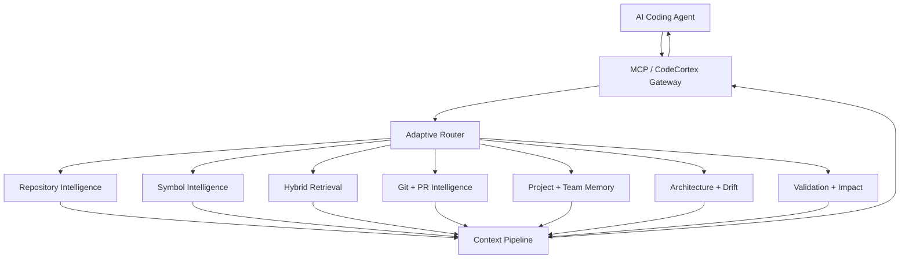
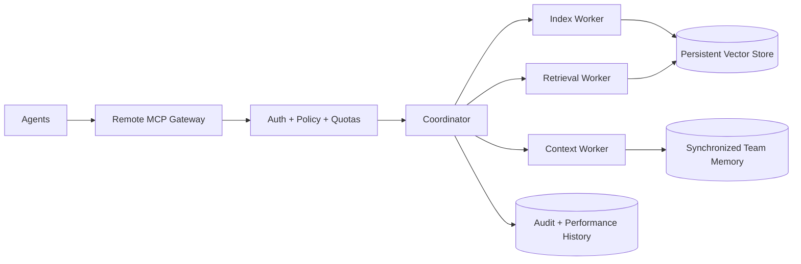

<div align="center">

# 🧠 CodeCortex Context Engine

### Context intelligence infrastructure for AI coding agents

[](https://github.com/BehnamJalaliCo/CodeCortex)

[](https://pypi.org/project/codecortex-context-engine/)
[](https://pypi.org/project/codecortex-context-engine/)
[](https://github.com/BehnamJalaliCo/CodeCortex/actions/workflows/ci.yml)
[](https://github.com/BehnamJalaliCo/CodeCortex/actions/workflows/codeql.yml)
[](https://codecov.io/gh/BehnamJalaliCo/CodeCortex)
[](https://www.bestpractices.dev/projects/14379)
[](https://securityscorecards.dev/viewer/?uri=github.com/BehnamJalaliCo/CodeCortex)
[](LICENSE)

**Map · Understand · Retrieve · Edit · Compress · Remember · Scale**

</div>

---

## Install from PyPI

CodeCortex supports Python 3.11, 3.12, and 3.13.

```bash
python -m pip install --upgrade codecortex-context-engine
cortex version
cortex init .
```

Optional language parser support:

```bash
python -m pip install "codecortex-context-engine[parsers]"
```

Optional local neural semantic embeddings:

```bash
python -m pip install "codecortex-context-engine[semantic]"
```

For development:

```bash
git clone https://github.com/BehnamJalaliCo/CodeCortex.git
cd CodeCortex
python -m pip install -e ".[dev]"
pytest -q
```

## Thirty-second start

Run CodeCortex inside a repository, build its local intelligence state, and expose the MCP surface to a coding agent.

```bash
cortex init .
cortex index
cortex doctor
cortex mcp --path .
```

A useful first exploration looks like this:

```bash
cortex architecture
cortex semantic "authentication and session lifecycle"
cortex impact AuthService
cortex workspace-search "payment retry policy"
```

CodeCortex is not another general-purpose chat interface. It is a context engine. Its job is to turn a repository into a query-specific evidence surface so an agent can spend its context window on the code, relationships, decisions, and constraints that matter to the current task.

## What CodeCortex changes

A coding agent normally starts each task with a cold repository. It searches filenames, opens broad slices of source, rediscovers architecture, guesses which symbols matter, and uses expensive model context to reconstruct relationships already present in the codebase. That works on small repositories but becomes increasingly inefficient and risky as repositories grow, languages multiply, ownership fragments, and changes cross service or package boundaries.

CodeCortex creates a durable intelligence layer between the repository and the agent. Repository structure, semantic symbols, references, dependency edges, Git history, ownership signals, architecture patterns, team memory, task traces, impact estimates, and compact retrieval are available through one coherent surface. The result is not a promise that an agent will always be correct. The result is a better evidence environment in which the agent can reason, verify, and edit.

The project follows a simple principle: **retrieve evidence before generating confidence**. If a metric is unavailable, it remains unavailable. If a benchmark did not record a value, CodeCortex does not invent one. If an external integration lacks credentials, the corresponding test is reported as skipped rather than silently treated as passed. Release claims are intended to stay tied to reproducible artifacts.

## Architecture at a glance



At distributed scale, the same model extends across authenticated remote MCP endpoints, synchronized memory, persistent vector stores, worker coordination, longitudinal performance history, and organization-level policy.



## Core surfaces

### Repository intelligence

The repository layer provides a structural map instead of forcing an agent to infer everything from raw file search. Incremental indexing keeps the local state aligned with code changes, while dependency and call relationships provide a graph for impact and retrieval. The graph is evidence, not a substitute for source inspection: callers can always move from summarized relationships back to the underlying files and symbols.

### Symbol intelligence and guarded editing

CodeCortex exposes symbols, references, language-aware structure, and guarded semantic edits. Python uses the standard AST; optional Tree-sitter parser providers cover additional languages. Editing commands perform semantic preflight reads and constrain paths to the project root.

```bash
cortex edit rename src/auth.py AuthService SessionService
cortex edit replace src/auth.py AuthService/refresh --body-file ./replacement.txt
cortex edit insert-before src/auth.py AuthService --body-file ./imports.txt
cortex edit insert-after src/auth.py AuthService --body-file ./helper.txt
```

### Hybrid retrieval and context compression

Retrieval combines lexical, structural, symbol, graph, and optional embedding signals. The context pipeline ranks, deduplicates, budgets, and compacts results for the task. A context engine should not maximize the number of retrieved tokens; it should maximize useful evidence per token while retaining enough surrounding structure for reliable reasoning.

### Git, PR, and change intelligence

History changes how code should be interpreted. A mature module with stable ownership and long-lived contracts deserves different treatment from a recently rewritten experimental package. Git-aware symbol history, blame, pull-request analysis, and impact estimation add change context to the static repository model.

### Memory

Project memory stores durable facts and decisions. Shared team memory adds revisions, history, synchronization, and conflict resolution. Memory is intentionally separate from source truth: it can provide rationale and prior decisions, while source and tests remain authoritative for executable behavior.

### Architecture and drift

Architecture inference summarizes observable structure with confidence and evidence. Drift compares current structure with a baseline so teams can detect architectural movement before it becomes invisible convention. The goal is not to enforce a single architecture style. The goal is to make architectural change inspectable.

### Distributed scale

Version 0.5 of the roadmap adds remote shared-memory synchronization, persistent vector database providers, hosted remote MCP with authentication/TLS/quotas/access policy, multi-node indexing and retrieval workers, scheduled longitudinal performance history, and organization-level workspace policy with retained audit evidence.

## One MCP surface

```bash
cortex mcp --path /path/to/repository
```

The MCP application exposes repository mapping, semantic search, symbols, references, dependencies, impact analysis, architecture inference, context construction, project and team memory, PR intelligence, traces, validation, and guarded editing through a consistent contract. The distributed transport can host these capabilities remotely while enforcing principal identity and tool policy.

## Remote operation

Use `cortex-remote` for the distributed service entry point. Remote deployments should terminate TLS with a valid certificate, issue separate bearer credentials per principal, keep tool allow-lists narrow, configure realistic quotas, retain audit records according to organizational policy, and avoid exposing internal indexing services directly to untrusted networks.

The transport validates the endpoint scheme, authenticates before dispatch, applies policy before charging request quota, constrains request body size, and can wrap the server socket with TLS 1.2 or later. Production operators should still place the service behind infrastructure appropriate for their threat model, availability requirements, secrets management, and observability standards.

## Persistent vector providers

The core includes a dependency-free SQLite vector store with exact cosine search for local or shared-volume deployments. A provider registry allows larger installations to bind another persistent service without changing retrieval callers. This makes the storage boundary explicit: small repositories can remain simple, while larger deployments can adopt a service designed for their scale and operational requirements.

## Multi-node workers

Distributed workers advertise capabilities and coordinate through leases. A coordinator can assign work, detect expired leases, and retry tasks. This model is deliberately narrower than pretending arbitrary machines share one Python process. State, ownership, failure, retry, and observability remain explicit, which is essential when indexing or retrieval spans nodes.

## Security model

Security controls are layered. CI runs dependency auditing and Bandit in addition to CodeQL and security-boundary tests. Release artifacts include checksums, CycloneDX SBOMs, Sigstore bundles, and GitHub build-provenance attestations. Remote transport adds authentication, TLS support, quotas, request limits, and per-principal policy. Organization policy adds role checks, workspace policy, and audit retention.

No single badge proves software is secure. These controls create auditable evidence and reduce classes of preventable mistakes. Consumers should evaluate the project against their own threat model and deployment context.

## Quality model

The repository enforces Ruff and tests across supported Python versions. The main CI coverage gate is 90 percent. A passing coverage number is treated as one quality signal, not as proof of correctness. High-value behavior still needs assertions that would fail for the wrong reason, security boundaries need adversarial tests, and benchmark claims need reproducible measurement.

## Benchmark philosophy

```bash
python scripts/run_production_benchmark.py
```

Production benchmark specifications are revision-pinned and designed to preserve missing values as missing. Longitudinal history records reproducible runs so trend discussion can be based on artifacts rather than memory. Regression gates can compare relevant measurements and stop a change when it crosses an explicit policy threshold.

## Observatory

```bash
cortex dashboard -p /path/to/repository
```

The local dashboard surfaces backend health, routing distribution, context usage, engine latency, graph hotspots, task traces, architecture drift, benchmark history, and pull-request risk. It binds to loopback by default. The dashboard is an observability surface, not an authorization boundary; remote exposure should be handled deliberately.

## Docker

```bash
docker build --target core -t codecortex:core .
docker build --target full -t codecortex:full .
docker compose up dashboard
```

The release pipeline also publishes container images with provenance attestations when a release is cut.

## Agent-oriented command map

```bash
cortex init .
cortex index
cortex semantic "authentication refresh"
cortex impact AuthService
cortex architecture
cortex architecture-drift
cortex symbol-history src/auth.py 10 80
cortex pr main --head HEAD
cortex workspace-add backend ../backend
cortex workspace-search "payment service"
cortex benchmark
cortex dashboard
cortex doctor
```

## Operating principles

1. **Evidence before confidence.** A summary should be traceable to repository, graph, Git, benchmark, policy, or test evidence.
2. **Smallest useful context.** Retrieval should focus on the task instead of flooding an agent with files.
3. **Explicit boundaries.** Local state, remote state, workers, vector stores, credentials, and organizational policy have clear contracts.
4. **Reproducibility over marketing.** Performance and release claims should map to repeatable workflows.
5. **Source remains source.** Memory and inference help interpretation but do not replace executable code and tests.
6. **Security is layered.** Authentication, policy, limits, static analysis, dependency auditing, tests, and signed release evidence address different failure classes.
7. **Scale through coordination.** Distributed scale is modeled as explicit services and leases rather than imaginary shared process state.

## Documentation map

- `docs/ARCHITECTURE.md` — architectural overview.
- `docs/DISTRIBUTED.md` — distributed-scale design and operation.
- `docs/ADVANCED_INTELLIGENCE.md` — advanced intelligence surfaces.
- `docs/INTEGRATIONS.md` — agent integrations.
- `docs/QUALITY.md` — measurable quality policy.
- `docs/TESTING.md` — test strategy.
- `docs/RELEASE.md` — release mechanics and evidence.
- `docs/LICENSING.md` — licensing model and third-party treatment.
- `THIRD_PARTY_NOTICES.md` — third-party notices.
- `SECURITY.md` — private vulnerability reporting.
- `CONTRIBUTING.md` — contribution workflow.
- `GOVERNANCE.md` — project decision model.
- `ROADMAP.md` — shipped capability milestones.

## Global engineering field guide

The remainder of this README is intentionally extensive. It is a field guide for applying a context engine to real engineering work rather than a list of feature slogans. Each playbook starts from a repository archetype and a mission, then describes how to build evidence, use CodeCortex surfaces, validate the result, and reason about distributed or organizational operation. The examples are patterns, not guarantees; adapt commands, policies, and tests to the repository in front of you.


## Python monolith playbooks


### 1. Onboarding — Python monolith

**Mission.** The objective is to build an accurate mental model before editing. In a Python monolith, the context engine must account for deep internal coupling, mature business rules, and a large historical surface. The dominant failure mode to keep visible is hidden cross-module impact. A useful agent prompt is not “understand everything.” Start with a bounded request such as: **“show the architecture, central symbols, ownership, and the safest starting points.”** That request gives routing and retrieval a concrete reason to include or exclude evidence.

**Build the evidence surface.** Begin with the symbol index to identify the relevant structural neighborhood, then use the dependency and call graph to find named program elements rather than relying only on textual coincidence. Add the hybrid semantic retrieval so the agent can see upstream and downstream relationships. Bring in the Git and ownership intelligence when history, prior decisions, or task-specific retrieval can disambiguate intent. Finally use the project and team memory to challenge the proposed change before editing. The sequence is deliberately evidence-first: source, relationships, history, and validation should narrow the hypothesis before a large model is asked to synthesize a solution.

**Practical sequence.** Initialize and refresh repository state with `cortex init .` and `cortex index`. Ask `cortex architecture` for the observable architecture, then run a semantic query focused on the mission. Use `cortex impact <target>` for a candidate symbol or module. When the task involves a change already represented in Git, use PR and symbol-history intelligence to inspect recent movement. If the repository participates in a multi-repository workspace, search the workspace before assuming a local reference is the end of the dependency chain. Record only durable decisions in memory; do not copy transient debugging guesses into long-lived team knowledge.

**Change discipline.** Prefer the smallest change that respects existing boundaries. For edits that can be expressed semantically, use the guarded edit surface so the operation receives a preflight read and project-root path constraints. If manual editing is more appropriate, retain the same reasoning discipline: identify the target, enumerate references, estimate impact, change behavior, and validate the affected contracts. A broad mechanical rewrite without dependency evidence can create a large diff while still missing the one dynamic path that matters.

**Validation.** Success means a new engineer can explain the main execution path and locate evidence without reading the whole repository. Run the repository's targeted tests first, then the broader test and lint gates required by the project. For security-sensitive paths, include negative cases and authorization boundaries rather than testing only the happy path. For performance work, compare reproducible measurements instead of using a single anecdotal run. For releases, tie conclusions to the exact commit that produced the artifacts. Code coverage is useful evidence, but a percentage cannot prove the assertions are meaningful.

**Scale and governance.** In a distributed deployment, keep worker ownership, leases, retry behavior, synchronized memory conflicts, persistent vector storage, and remote MCP policy explicit. Remote access should use separate principals, TLS, narrow tool permissions, realistic quotas, and retained audit evidence. If an organization policy denies a remote tool, changing the code path to bypass the policy is not a workaround; the policy itself must be reviewed by an authorized administrator. These controls matter especially in a Python monolith, where hidden cross-module impact can make an apparently local optimization or refactor operationally expensive.

**Review questions.** What source lines support the current hypothesis? Which references or dependency edges could invalidate the local view? What changed recently and who understands the area? Which test would fail if the proposed explanation were wrong? Which context was excluded and why? Is there a smaller change with the same outcome? If the answer depends on a missing metric or unavailable integration, is that uncertainty stated explicitly rather than converted into a confident claim? Those questions keep CodeCortex useful as infrastructure for reasoning instead of turning it into a source of decorative summaries.


### 2. Bug Investigation — Python monolith

**Mission.** The objective is to localize a defect and its real dependency neighborhood. In a Python monolith, the context engine must account for deep internal coupling, mature business rules, and a large historical surface. The dominant failure mode to keep visible is hidden cross-module impact. A useful agent prompt is not “understand everything.” Start with a bounded request such as: **“trace the failing behavior, references, callers, recent history, and likely impact.”** That request gives routing and retrieval a concrete reason to include or exclude evidence.

**Build the evidence surface.** Begin with the dependency and call graph to identify the relevant structural neighborhood, then use the hybrid semantic retrieval to find named program elements rather than relying only on textual coincidence. Add the Git and ownership intelligence so the agent can see upstream and downstream relationships. Bring in the project and team memory when history, prior decisions, or task-specific retrieval can disambiguate intent. Finally use the architecture inference and drift to challenge the proposed change before editing. The sequence is deliberately evidence-first: source, relationships, history, and validation should narrow the hypothesis before a large model is asked to synthesize a solution.

**Practical sequence.** Initialize and refresh repository state with `cortex init .` and `cortex index`. Ask `cortex architecture` for the observable architecture, then run a semantic query focused on the mission. Use `cortex impact <target>` for a candidate symbol or module. When the task involves a change already represented in Git, use PR and symbol-history intelligence to inspect recent movement. If the repository participates in a multi-repository workspace, search the workspace before assuming a local reference is the end of the dependency chain. Record only durable decisions in memory; do not copy transient debugging guesses into long-lived team knowledge.

**Change discipline.** Prefer the smallest change that respects existing boundaries. For edits that can be expressed semantically, use the guarded edit surface so the operation receives a preflight read and project-root path constraints. If manual editing is more appropriate, retain the same reasoning discipline: identify the target, enumerate references, estimate impact, change behavior, and validate the affected contracts. A broad mechanical rewrite without dependency evidence can create a large diff while still missing the one dynamic path that matters.

**Validation.** Success means the proposed fix addresses the causal path and targeted tests cover the affected behavior. Run the repository's targeted tests first, then the broader test and lint gates required by the project. For security-sensitive paths, include negative cases and authorization boundaries rather than testing only the happy path. For performance work, compare reproducible measurements instead of using a single anecdotal run. For releases, tie conclusions to the exact commit that produced the artifacts. Code coverage is useful evidence, but a percentage cannot prove the assertions are meaningful.

**Scale and governance.** In a distributed deployment, keep worker ownership, leases, retry behavior, synchronized memory conflicts, persistent vector storage, and remote MCP policy explicit. Remote access should use separate principals, TLS, narrow tool permissions, realistic quotas, and retained audit evidence. If an organization policy denies a remote tool, changing the code path to bypass the policy is not a workaround; the policy itself must be reviewed by an authorized administrator. These controls matter especially in a Python monolith, where hidden cross-module impact can make an apparently local optimization or refactor operationally expensive.

**Review questions.** What source lines support the current hypothesis? Which references or dependency edges could invalidate the local view? What changed recently and who understands the area? Which test would fail if the proposed explanation were wrong? Which context was excluded and why? Is there a smaller change with the same outcome? If the answer depends on a missing metric or unavailable integration, is that uncertainty stated explicitly rather than converted into a confident claim? Those questions keep CodeCortex useful as infrastructure for reasoning instead of turning it into a source of decorative summaries.


### 3. Feature Implementation — Python monolith

**Mission.** The objective is to find the smallest architecture-consistent change set. In a Python monolith, the context engine must account for deep internal coupling, mature business rules, and a large historical surface. The dominant failure mode to keep visible is hidden cross-module impact. A useful agent prompt is not “understand everything.” Start with a bounded request such as: **“map the existing feature pattern, related symbols, tests, and extension points.”** That request gives routing and retrieval a concrete reason to include or exclude evidence.

**Build the evidence surface.** Begin with the hybrid semantic retrieval to identify the relevant structural neighborhood, then use the Git and ownership intelligence to find named program elements rather than relying only on textual coincidence. Add the project and team memory so the agent can see upstream and downstream relationships. Bring in the architecture inference and drift when history, prior decisions, or task-specific retrieval can disambiguate intent. Finally use the impact analysis to challenge the proposed change before editing. The sequence is deliberately evidence-first: source, relationships, history, and validation should narrow the hypothesis before a large model is asked to synthesize a solution.

**Practical sequence.** Initialize and refresh repository state with `cortex init .` and `cortex index`. Ask `cortex architecture` for the observable architecture, then run a semantic query focused on the mission. Use `cortex impact <target>` for a candidate symbol or module. When the task involves a change already represented in Git, use PR and symbol-history intelligence to inspect recent movement. If the repository participates in a multi-repository workspace, search the workspace before assuming a local reference is the end of the dependency chain. Record only durable decisions in memory; do not copy transient debugging guesses into long-lived team knowledge.

**Change discipline.** Prefer the smallest change that respects existing boundaries. For edits that can be expressed semantically, use the guarded edit surface so the operation receives a preflight read and project-root path constraints. If manual editing is more appropriate, retain the same reasoning discipline: identify the target, enumerate references, estimate impact, change behavior, and validate the affected contracts. A broad mechanical rewrite without dependency evidence can create a large diff while still missing the one dynamic path that matters.

**Validation.** Success means the feature follows existing boundaries and adds evidence at the right test level. Run the repository's targeted tests first, then the broader test and lint gates required by the project. For security-sensitive paths, include negative cases and authorization boundaries rather than testing only the happy path. For performance work, compare reproducible measurements instead of using a single anecdotal run. For releases, tie conclusions to the exact commit that produced the artifacts. Code coverage is useful evidence, but a percentage cannot prove the assertions are meaningful.

**Scale and governance.** In a distributed deployment, keep worker ownership, leases, retry behavior, synchronized memory conflicts, persistent vector storage, and remote MCP policy explicit. Remote access should use separate principals, TLS, narrow tool permissions, realistic quotas, and retained audit evidence. If an organization policy denies a remote tool, changing the code path to bypass the policy is not a workaround; the policy itself must be reviewed by an authorized administrator. These controls matter especially in a Python monolith, where hidden cross-module impact can make an apparently local optimization or refactor operationally expensive.

**Review questions.** What source lines support the current hypothesis? Which references or dependency edges could invalidate the local view? What changed recently and who understands the area? Which test would fail if the proposed explanation were wrong? Which context was excluded and why? Is there a smaller change with the same outcome? If the answer depends on a missing metric or unavailable integration, is that uncertainty stated explicitly rather than converted into a confident claim? Those questions keep CodeCortex useful as infrastructure for reasoning instead of turning it into a source of decorative summaries.


### 4. Large Refactor — Python monolith

**Mission.** The objective is to change structure without losing behavior. In a Python monolith, the context engine must account for deep internal coupling, mature business rules, and a large historical surface. The dominant failure mode to keep visible is hidden cross-module impact. A useful agent prompt is not “understand everything.” Start with a bounded request such as: **“identify all references, dependency edges, ownership, tests, and migration order.”** That request gives routing and retrieval a concrete reason to include or exclude evidence.

**Build the evidence surface.** Begin with the Git and ownership intelligence to identify the relevant structural neighborhood, then use the project and team memory to find named program elements rather than relying only on textual coincidence. Add the architecture inference and drift so the agent can see upstream and downstream relationships. Bring in the impact analysis when history, prior decisions, or task-specific retrieval can disambiguate intent. Finally use the validation to challenge the proposed change before editing. The sequence is deliberately evidence-first: source, relationships, history, and validation should narrow the hypothesis before a large model is asked to synthesize a solution.

**Practical sequence.** Initialize and refresh repository state with `cortex init .` and `cortex index`. Ask `cortex architecture` for the observable architecture, then run a semantic query focused on the mission. Use `cortex impact <target>` for a candidate symbol or module. When the task involves a change already represented in Git, use PR and symbol-history intelligence to inspect recent movement. If the repository participates in a multi-repository workspace, search the workspace before assuming a local reference is the end of the dependency chain. Record only durable decisions in memory; do not copy transient debugging guesses into long-lived team knowledge.

**Change discipline.** Prefer the smallest change that respects existing boundaries. For edits that can be expressed semantically, use the guarded edit surface so the operation receives a preflight read and project-root path constraints. If manual editing is more appropriate, retain the same reasoning discipline: identify the target, enumerate references, estimate impact, change behavior, and validate the affected contracts. A broad mechanical rewrite without dependency evidence can create a large diff while still missing the one dynamic path that matters.

**Validation.** Success means semantic edits and tests show that contracts remain intact throughout staged changes. Run the repository's targeted tests first, then the broader test and lint gates required by the project. For security-sensitive paths, include negative cases and authorization boundaries rather than testing only the happy path. For performance work, compare reproducible measurements instead of using a single anecdotal run. For releases, tie conclusions to the exact commit that produced the artifacts. Code coverage is useful evidence, but a percentage cannot prove the assertions are meaningful.

**Scale and governance.** In a distributed deployment, keep worker ownership, leases, retry behavior, synchronized memory conflicts, persistent vector storage, and remote MCP policy explicit. Remote access should use separate principals, TLS, narrow tool permissions, realistic quotas, and retained audit evidence. If an organization policy denies a remote tool, changing the code path to bypass the policy is not a workaround; the policy itself must be reviewed by an authorized administrator. These controls matter especially in a Python monolith, where hidden cross-module impact can make an apparently local optimization or refactor operationally expensive.

**Review questions.** What source lines support the current hypothesis? Which references or dependency edges could invalidate the local view? What changed recently and who understands the area? Which test would fail if the proposed explanation were wrong? Which context was excluded and why? Is there a smaller change with the same outcome? If the answer depends on a missing metric or unavailable integration, is that uncertainty stated explicitly rather than converted into a confident claim? Those questions keep CodeCortex useful as infrastructure for reasoning instead of turning it into a source of decorative summaries.


### 5. Dependency Migration — Python monolith

**Mission.** The objective is to upgrade or replace a dependency with bounded risk. In a Python monolith, the context engine must account for deep internal coupling, mature business rules, and a large historical surface. The dominant failure mode to keep visible is hidden cross-module impact. A useful agent prompt is not “understand everything.” Start with a bounded request such as: **“find imports, wrappers, version assumptions, configuration, and affected tests.”** That request gives routing and retrieval a concrete reason to include or exclude evidence.

**Build the evidence surface.** Begin with the project and team memory to identify the relevant structural neighborhood, then use the architecture inference and drift to find named program elements rather than relying only on textual coincidence. Add the impact analysis so the agent can see upstream and downstream relationships. Bring in the validation when history, prior decisions, or task-specific retrieval can disambiguate intent. Finally use the task traces to challenge the proposed change before editing. The sequence is deliberately evidence-first: source, relationships, history, and validation should narrow the hypothesis before a large model is asked to synthesize a solution.

**Practical sequence.** Initialize and refresh repository state with `cortex init .` and `cortex index`. Ask `cortex architecture` for the observable architecture, then run a semantic query focused on the mission. Use `cortex impact <target>` for a candidate symbol or module. When the task involves a change already represented in Git, use PR and symbol-history intelligence to inspect recent movement. If the repository participates in a multi-repository workspace, search the workspace before assuming a local reference is the end of the dependency chain. Record only durable decisions in memory; do not copy transient debugging guesses into long-lived team knowledge.

**Change discipline.** Prefer the smallest change that respects existing boundaries. For edits that can be expressed semantically, use the guarded edit surface so the operation receives a preflight read and project-root path constraints. If manual editing is more appropriate, retain the same reasoning discipline: identify the target, enumerate references, estimate impact, change behavior, and validate the affected contracts. A broad mechanical rewrite without dependency evidence can create a large diff while still missing the one dynamic path that matters.

**Validation.** Success means old dependency usage is removed or intentionally isolated and compatibility checks pass. Run the repository's targeted tests first, then the broader test and lint gates required by the project. For security-sensitive paths, include negative cases and authorization boundaries rather than testing only the happy path. For performance work, compare reproducible measurements instead of using a single anecdotal run. For releases, tie conclusions to the exact commit that produced the artifacts. Code coverage is useful evidence, but a percentage cannot prove the assertions are meaningful.

**Scale and governance.** In a distributed deployment, keep worker ownership, leases, retry behavior, synchronized memory conflicts, persistent vector storage, and remote MCP policy explicit. Remote access should use separate principals, TLS, narrow tool permissions, realistic quotas, and retained audit evidence. If an organization policy denies a remote tool, changing the code path to bypass the policy is not a workaround; the policy itself must be reviewed by an authorized administrator. These controls matter especially in a Python monolith, where hidden cross-module impact can make an apparently local optimization or refactor operationally expensive.

**Review questions.** What source lines support the current hypothesis? Which references or dependency edges could invalidate the local view? What changed recently and who understands the area? Which test would fail if the proposed explanation were wrong? Which context was excluded and why? Is there a smaller change with the same outcome? If the answer depends on a missing metric or unavailable integration, is that uncertainty stated explicitly rather than converted into a confident claim? Those questions keep CodeCortex useful as infrastructure for reasoning instead of turning it into a source of decorative summaries.


### 6. Security Review — Python monolith

**Mission.** The objective is to reason about trust boundaries and dangerous data flows. In a Python monolith, the context engine must account for deep internal coupling, mature business rules, and a large historical surface. The dominant failure mode to keep visible is hidden cross-module impact. A useful agent prompt is not “understand everything.” Start with a bounded request such as: **“map authentication, authorization, input validation, secrets, and externally reachable paths.”** That request gives routing and retrieval a concrete reason to include or exclude evidence.

**Build the evidence surface.** Begin with the architecture inference and drift to identify the relevant structural neighborhood, then use the impact analysis to find named program elements rather than relying only on textual coincidence. Add the validation so the agent can see upstream and downstream relationships. Bring in the task traces when history, prior decisions, or task-specific retrieval can disambiguate intent. Finally use the repository map to challenge the proposed change before editing. The sequence is deliberately evidence-first: source, relationships, history, and validation should narrow the hypothesis before a large model is asked to synthesize a solution.

**Practical sequence.** Initialize and refresh repository state with `cortex init .` and `cortex index`. Ask `cortex architecture` for the observable architecture, then run a semantic query focused on the mission. Use `cortex impact <target>` for a candidate symbol or module. When the task involves a change already represented in Git, use PR and symbol-history intelligence to inspect recent movement. If the repository participates in a multi-repository workspace, search the workspace before assuming a local reference is the end of the dependency chain. Record only durable decisions in memory; do not copy transient debugging guesses into long-lived team knowledge.

**Change discipline.** Prefer the smallest change that respects existing boundaries. For edits that can be expressed semantically, use the guarded edit surface so the operation receives a preflight read and project-root path constraints. If manual editing is more appropriate, retain the same reasoning discipline: identify the target, enumerate references, estimate impact, change behavior, and validate the affected contracts. A broad mechanical rewrite without dependency evidence can create a large diff while still missing the one dynamic path that matters.

**Validation.** Success means findings are tied to concrete code paths and mitigations have regression tests. Run the repository's targeted tests first, then the broader test and lint gates required by the project. For security-sensitive paths, include negative cases and authorization boundaries rather than testing only the happy path. For performance work, compare reproducible measurements instead of using a single anecdotal run. For releases, tie conclusions to the exact commit that produced the artifacts. Code coverage is useful evidence, but a percentage cannot prove the assertions are meaningful.

**Scale and governance.** In a distributed deployment, keep worker ownership, leases, retry behavior, synchronized memory conflicts, persistent vector storage, and remote MCP policy explicit. Remote access should use separate principals, TLS, narrow tool permissions, realistic quotas, and retained audit evidence. If an organization policy denies a remote tool, changing the code path to bypass the policy is not a workaround; the policy itself must be reviewed by an authorized administrator. These controls matter especially in a Python monolith, where hidden cross-module impact can make an apparently local optimization or refactor operationally expensive.

**Review questions.** What source lines support the current hypothesis? Which references or dependency edges could invalidate the local view? What changed recently and who understands the area? Which test would fail if the proposed explanation were wrong? Which context was excluded and why? Is there a smaller change with the same outcome? If the answer depends on a missing metric or unavailable integration, is that uncertainty stated explicitly rather than converted into a confident claim? Those questions keep CodeCortex useful as infrastructure for reasoning instead of turning it into a source of decorative summaries.


### 7. Pull-Request Review — Python monolith

**Mission.** The objective is to evaluate a change by impact rather than diff size. In a Python monolith, the context engine must account for deep internal coupling, mature business rules, and a large historical surface. The dominant failure mode to keep visible is hidden cross-module impact. A useful agent prompt is not “understand everything.” Start with a bounded request such as: **“summarize changed symbols, downstream impact, missing tests, architecture drift, and risk.”** That request gives routing and retrieval a concrete reason to include or exclude evidence.

**Build the evidence surface.** Begin with the impact analysis to identify the relevant structural neighborhood, then use the validation to find named program elements rather than relying only on textual coincidence. Add the task traces so the agent can see upstream and downstream relationships. Bring in the repository map when history, prior decisions, or task-specific retrieval can disambiguate intent. Finally use the symbol index to challenge the proposed change before editing. The sequence is deliberately evidence-first: source, relationships, history, and validation should narrow the hypothesis before a large model is asked to synthesize a solution.

**Practical sequence.** Initialize and refresh repository state with `cortex init .` and `cortex index`. Ask `cortex architecture` for the observable architecture, then run a semantic query focused on the mission. Use `cortex impact <target>` for a candidate symbol or module. When the task involves a change already represented in Git, use PR and symbol-history intelligence to inspect recent movement. If the repository participates in a multi-repository workspace, search the workspace before assuming a local reference is the end of the dependency chain. Record only durable decisions in memory; do not copy transient debugging guesses into long-lived team knowledge.

**Change discipline.** Prefer the smallest change that respects existing boundaries. For edits that can be expressed semantically, use the guarded edit surface so the operation receives a preflight read and project-root path constraints. If manual editing is more appropriate, retain the same reasoning discipline: identify the target, enumerate references, estimate impact, change behavior, and validate the affected contracts. A broad mechanical rewrite without dependency evidence can create a large diff while still missing the one dynamic path that matters.

**Validation.** Success means review comments are evidence-backed and focus on behavior, contracts, and blast radius. Run the repository's targeted tests first, then the broader test and lint gates required by the project. For security-sensitive paths, include negative cases and authorization boundaries rather than testing only the happy path. For performance work, compare reproducible measurements instead of using a single anecdotal run. For releases, tie conclusions to the exact commit that produced the artifacts. Code coverage is useful evidence, but a percentage cannot prove the assertions are meaningful.

**Scale and governance.** In a distributed deployment, keep worker ownership, leases, retry behavior, synchronized memory conflicts, persistent vector storage, and remote MCP policy explicit. Remote access should use separate principals, TLS, narrow tool permissions, realistic quotas, and retained audit evidence. If an organization policy denies a remote tool, changing the code path to bypass the policy is not a workaround; the policy itself must be reviewed by an authorized administrator. These controls matter especially in a Python monolith, where hidden cross-module impact can make an apparently local optimization or refactor operationally expensive.

**Review questions.** What source lines support the current hypothesis? Which references or dependency edges could invalidate the local view? What changed recently and who understands the area? Which test would fail if the proposed explanation were wrong? Which context was excluded and why? Is there a smaller change with the same outcome? If the answer depends on a missing metric or unavailable integration, is that uncertainty stated explicitly rather than converted into a confident claim? Those questions keep CodeCortex useful as infrastructure for reasoning instead of turning it into a source of decorative summaries.


### 8. Performance Investigation — Python monolith

**Mission.** The objective is to connect latency or throughput symptoms to the responsible code path. In a Python monolith, the context engine must account for deep internal coupling, mature business rules, and a large historical surface. The dominant failure mode to keep visible is hidden cross-module impact. A useful agent prompt is not “understand everything.” Start with a bounded request such as: **“map hot paths, dependencies, repeated work, caching, and benchmark history.”** That request gives routing and retrieval a concrete reason to include or exclude evidence.

**Build the evidence surface.** Begin with the validation to identify the relevant structural neighborhood, then use the task traces to find named program elements rather than relying only on textual coincidence. Add the repository map so the agent can see upstream and downstream relationships. Bring in the symbol index when history, prior decisions, or task-specific retrieval can disambiguate intent. Finally use the dependency and call graph to challenge the proposed change before editing. The sequence is deliberately evidence-first: source, relationships, history, and validation should narrow the hypothesis before a large model is asked to synthesize a solution.

**Practical sequence.** Initialize and refresh repository state with `cortex init .` and `cortex index`. Ask `cortex architecture` for the observable architecture, then run a semantic query focused on the mission. Use `cortex impact <target>` for a candidate symbol or module. When the task involves a change already represented in Git, use PR and symbol-history intelligence to inspect recent movement. If the repository participates in a multi-repository workspace, search the workspace before assuming a local reference is the end of the dependency chain. Record only durable decisions in memory; do not copy transient debugging guesses into long-lived team knowledge.

**Change discipline.** Prefer the smallest change that respects existing boundaries. For edits that can be expressed semantically, use the guarded edit surface so the operation receives a preflight read and project-root path constraints. If manual editing is more appropriate, retain the same reasoning discipline: identify the target, enumerate references, estimate impact, change behavior, and validate the affected contracts. A broad mechanical rewrite without dependency evidence can create a large diff while still missing the one dynamic path that matters.

**Validation.** Success means the optimization is measured reproducibly and does not trade correctness for speed. Run the repository's targeted tests first, then the broader test and lint gates required by the project. For security-sensitive paths, include negative cases and authorization boundaries rather than testing only the happy path. For performance work, compare reproducible measurements instead of using a single anecdotal run. For releases, tie conclusions to the exact commit that produced the artifacts. Code coverage is useful evidence, but a percentage cannot prove the assertions are meaningful.

**Scale and governance.** In a distributed deployment, keep worker ownership, leases, retry behavior, synchronized memory conflicts, persistent vector storage, and remote MCP policy explicit. Remote access should use separate principals, TLS, narrow tool permissions, realistic quotas, and retained audit evidence. If an organization policy denies a remote tool, changing the code path to bypass the policy is not a workaround; the policy itself must be reviewed by an authorized administrator. These controls matter especially in a Python monolith, where hidden cross-module impact can make an apparently local optimization or refactor operationally expensive.

**Review questions.** What source lines support the current hypothesis? Which references or dependency edges could invalidate the local view? What changed recently and who understands the area? Which test would fail if the proposed explanation were wrong? Which context was excluded and why? Is there a smaller change with the same outcome? If the answer depends on a missing metric or unavailable integration, is that uncertainty stated explicitly rather than converted into a confident claim? Those questions keep CodeCortex useful as infrastructure for reasoning instead of turning it into a source of decorative summaries.


### 9. Architecture Evolution — Python monolith

**Mission.** The objective is to move toward a target architecture while preserving operational continuity. In a Python monolith, the context engine must account for deep internal coupling, mature business rules, and a large historical surface. The dominant failure mode to keep visible is hidden cross-module impact. A useful agent prompt is not “understand everything.” Start with a bounded request such as: **“compare current structure, inferred architecture, drift, coupling, and migration seams.”** That request gives routing and retrieval a concrete reason to include or exclude evidence.

**Build the evidence surface.** Begin with the task traces to identify the relevant structural neighborhood, then use the repository map to find named program elements rather than relying only on textual coincidence. Add the symbol index so the agent can see upstream and downstream relationships. Bring in the dependency and call graph when history, prior decisions, or task-specific retrieval can disambiguate intent. Finally use the hybrid semantic retrieval to challenge the proposed change before editing. The sequence is deliberately evidence-first: source, relationships, history, and validation should narrow the hypothesis before a large model is asked to synthesize a solution.

**Practical sequence.** Initialize and refresh repository state with `cortex init .` and `cortex index`. Ask `cortex architecture` for the observable architecture, then run a semantic query focused on the mission. Use `cortex impact <target>` for a candidate symbol or module. When the task involves a change already represented in Git, use PR and symbol-history intelligence to inspect recent movement. If the repository participates in a multi-repository workspace, search the workspace before assuming a local reference is the end of the dependency chain. Record only durable decisions in memory; do not copy transient debugging guesses into long-lived team knowledge.

**Change discipline.** Prefer the smallest change that respects existing boundaries. For edits that can be expressed semantically, use the guarded edit surface so the operation receives a preflight read and project-root path constraints. If manual editing is more appropriate, retain the same reasoning discipline: identify the target, enumerate references, estimate impact, change behavior, and validate the affected contracts. A broad mechanical rewrite without dependency evidence can create a large diff while still missing the one dynamic path that matters.

**Validation.** Success means each step has a reversible boundary and architecture evidence improves rather than merely moving files. Run the repository's targeted tests first, then the broader test and lint gates required by the project. For security-sensitive paths, include negative cases and authorization boundaries rather than testing only the happy path. For performance work, compare reproducible measurements instead of using a single anecdotal run. For releases, tie conclusions to the exact commit that produced the artifacts. Code coverage is useful evidence, but a percentage cannot prove the assertions are meaningful.

**Scale and governance.** In a distributed deployment, keep worker ownership, leases, retry behavior, synchronized memory conflicts, persistent vector storage, and remote MCP policy explicit. Remote access should use separate principals, TLS, narrow tool permissions, realistic quotas, and retained audit evidence. If an organization policy denies a remote tool, changing the code path to bypass the policy is not a workaround; the policy itself must be reviewed by an authorized administrator. These controls matter especially in a Python monolith, where hidden cross-module impact can make an apparently local optimization or refactor operationally expensive.

**Review questions.** What source lines support the current hypothesis? Which references or dependency edges could invalidate the local view? What changed recently and who understands the area? Which test would fail if the proposed explanation were wrong? Which context was excluded and why? Is there a smaller change with the same outcome? If the answer depends on a missing metric or unavailable integration, is that uncertainty stated explicitly rather than converted into a confident claim? Those questions keep CodeCortex useful as infrastructure for reasoning instead of turning it into a source of decorative summaries.


### 10. Incident Response — Python monolith

**Mission.** The objective is to reduce time to a reliable code-level hypothesis. In a Python monolith, the context engine must account for deep internal coupling, mature business rules, and a large historical surface. The dominant failure mode to keep visible is hidden cross-module impact. A useful agent prompt is not “understand everything.” Start with a bounded request such as: **“connect the symptom to owners, recent changes, dependency paths, configuration, and recovery options.”** That request gives routing and retrieval a concrete reason to include or exclude evidence.

**Build the evidence surface.** Begin with the repository map to identify the relevant structural neighborhood, then use the symbol index to find named program elements rather than relying only on textual coincidence. Add the dependency and call graph so the agent can see upstream and downstream relationships. Bring in the hybrid semantic retrieval when history, prior decisions, or task-specific retrieval can disambiguate intent. Finally use the Git and ownership intelligence to challenge the proposed change before editing. The sequence is deliberately evidence-first: source, relationships, history, and validation should narrow the hypothesis before a large model is asked to synthesize a solution.

**Practical sequence.** Initialize and refresh repository state with `cortex init .` and `cortex index`. Ask `cortex architecture` for the observable architecture, then run a semantic query focused on the mission. Use `cortex impact <target>` for a candidate symbol or module. When the task involves a change already represented in Git, use PR and symbol-history intelligence to inspect recent movement. If the repository participates in a multi-repository workspace, search the workspace before assuming a local reference is the end of the dependency chain. Record only durable decisions in memory; do not copy transient debugging guesses into long-lived team knowledge.

**Change discipline.** Prefer the smallest change that respects existing boundaries. For edits that can be expressed semantically, use the guarded edit surface so the operation receives a preflight read and project-root path constraints. If manual editing is more appropriate, retain the same reasoning discipline: identify the target, enumerate references, estimate impact, change behavior, and validate the affected contracts. A broad mechanical rewrite without dependency evidence can create a large diff while still missing the one dynamic path that matters.

**Validation.** Success means the response has an evidence trail, a bounded mitigation, and follow-up tests or monitors. Run the repository's targeted tests first, then the broader test and lint gates required by the project. For security-sensitive paths, include negative cases and authorization boundaries rather than testing only the happy path. For performance work, compare reproducible measurements instead of using a single anecdotal run. For releases, tie conclusions to the exact commit that produced the artifacts. Code coverage is useful evidence, but a percentage cannot prove the assertions are meaningful.

**Scale and governance.** In a distributed deployment, keep worker ownership, leases, retry behavior, synchronized memory conflicts, persistent vector storage, and remote MCP policy explicit. Remote access should use separate principals, TLS, narrow tool permissions, realistic quotas, and retained audit evidence. If an organization policy denies a remote tool, changing the code path to bypass the policy is not a workaround; the policy itself must be reviewed by an authorized administrator. These controls matter especially in a Python monolith, where hidden cross-module impact can make an apparently local optimization or refactor operationally expensive.

**Review questions.** What source lines support the current hypothesis? Which references or dependency edges could invalidate the local view? What changed recently and who understands the area? Which test would fail if the proposed explanation were wrong? Which context was excluded and why? Is there a smaller change with the same outcome? If the answer depends on a missing metric or unavailable integration, is that uncertainty stated explicitly rather than converted into a confident claim? Those questions keep CodeCortex useful as infrastructure for reasoning instead of turning it into a source of decorative summaries.


### 11. Release Readiness — Python monolith

**Mission.** The objective is to decide whether a revision is safe and reproducible to ship. In a Python monolith, the context engine must account for deep internal coupling, mature business rules, and a large historical surface. The dominant failure mode to keep visible is hidden cross-module impact. A useful agent prompt is not “understand everything.” Start with a bounded request such as: **“collect CI, security, benchmark, packaging, dependency, and change-impact evidence.”** That request gives routing and retrieval a concrete reason to include or exclude evidence.

**Build the evidence surface.** Begin with the symbol index to identify the relevant structural neighborhood, then use the dependency and call graph to find named program elements rather than relying only on textual coincidence. Add the hybrid semantic retrieval so the agent can see upstream and downstream relationships. Bring in the Git and ownership intelligence when history, prior decisions, or task-specific retrieval can disambiguate intent. Finally use the project and team memory to challenge the proposed change before editing. The sequence is deliberately evidence-first: source, relationships, history, and validation should narrow the hypothesis before a large model is asked to synthesize a solution.

**Practical sequence.** Initialize and refresh repository state with `cortex init .` and `cortex index`. Ask `cortex architecture` for the observable architecture, then run a semantic query focused on the mission. Use `cortex impact <target>` for a candidate symbol or module. When the task involves a change already represented in Git, use PR and symbol-history intelligence to inspect recent movement. If the repository participates in a multi-repository workspace, search the workspace before assuming a local reference is the end of the dependency chain. Record only durable decisions in memory; do not copy transient debugging guesses into long-lived team knowledge.

**Change discipline.** Prefer the smallest change that respects existing boundaries. For edits that can be expressed semantically, use the guarded edit surface so the operation receives a preflight read and project-root path constraints. If manual editing is more appropriate, retain the same reasoning discipline: identify the target, enumerate references, estimate impact, change behavior, and validate the affected contracts. A broad mechanical rewrite without dependency evidence can create a large diff while still missing the one dynamic path that matters.

**Validation.** Success means the exact release commit passes declared gates and artifacts can be independently verified. Run the repository's targeted tests first, then the broader test and lint gates required by the project. For security-sensitive paths, include negative cases and authorization boundaries rather than testing only the happy path. For performance work, compare reproducible measurements instead of using a single anecdotal run. For releases, tie conclusions to the exact commit that produced the artifacts. Code coverage is useful evidence, but a percentage cannot prove the assertions are meaningful.

**Scale and governance.** In a distributed deployment, keep worker ownership, leases, retry behavior, synchronized memory conflicts, persistent vector storage, and remote MCP policy explicit. Remote access should use separate principals, TLS, narrow tool permissions, realistic quotas, and retained audit evidence. If an organization policy denies a remote tool, changing the code path to bypass the policy is not a workaround; the policy itself must be reviewed by an authorized administrator. These controls matter especially in a Python monolith, where hidden cross-module impact can make an apparently local optimization or refactor operationally expensive.

**Review questions.** What source lines support the current hypothesis? Which references or dependency edges could invalidate the local view? What changed recently and who understands the area? Which test would fail if the proposed explanation were wrong? Which context was excluded and why? Is there a smaller change with the same outcome? If the answer depends on a missing metric or unavailable integration, is that uncertainty stated explicitly rather than converted into a confident claim? Those questions keep CodeCortex useful as infrastructure for reasoning instead of turning it into a source of decorative summaries.


## polyglot monorepo playbooks


### 12. Onboarding — polyglot monorepo

**Mission.** The objective is to build an accurate mental model before editing. In a polyglot monorepo, the context engine must account for multiple languages, build systems, ownership boundaries, and shared packages. The dominant failure mode to keep visible is cross-language dependency drift. A useful agent prompt is not “understand everything.” Start with a bounded request such as: **“show the architecture, central symbols, ownership, and the safest starting points.”** That request gives routing and retrieval a concrete reason to include or exclude evidence.

**Build the evidence surface.** Begin with the dependency and call graph to identify the relevant structural neighborhood, then use the hybrid semantic retrieval to find named program elements rather than relying only on textual coincidence. Add the Git and ownership intelligence so the agent can see upstream and downstream relationships. Bring in the project and team memory when history, prior decisions, or task-specific retrieval can disambiguate intent. Finally use the architecture inference and drift to challenge the proposed change before editing. The sequence is deliberately evidence-first: source, relationships, history, and validation should narrow the hypothesis before a large model is asked to synthesize a solution.

**Practical sequence.** Initialize and refresh repository state with `cortex init .` and `cortex index`. Ask `cortex architecture` for the observable architecture, then run a semantic query focused on the mission. Use `cortex impact <target>` for a candidate symbol or module. When the task involves a change already represented in Git, use PR and symbol-history intelligence to inspect recent movement. If the repository participates in a multi-repository workspace, search the workspace before assuming a local reference is the end of the dependency chain. Record only durable decisions in memory; do not copy transient debugging guesses into long-lived team knowledge.

**Change discipline.** Prefer the smallest change that respects existing boundaries. For edits that can be expressed semantically, use the guarded edit surface so the operation receives a preflight read and project-root path constraints. If manual editing is more appropriate, retain the same reasoning discipline: identify the target, enumerate references, estimate impact, change behavior, and validate the affected contracts. A broad mechanical rewrite without dependency evidence can create a large diff while still missing the one dynamic path that matters.

**Validation.** Success means a new engineer can explain the main execution path and locate evidence without reading the whole repository. Run the repository's targeted tests first, then the broader test and lint gates required by the project. For security-sensitive paths, include negative cases and authorization boundaries rather than testing only the happy path. For performance work, compare reproducible measurements instead of using a single anecdotal run. For releases, tie conclusions to the exact commit that produced the artifacts. Code coverage is useful evidence, but a percentage cannot prove the assertions are meaningful.

**Scale and governance.** In a distributed deployment, keep worker ownership, leases, retry behavior, synchronized memory conflicts, persistent vector storage, and remote MCP policy explicit. Remote access should use separate principals, TLS, narrow tool permissions, realistic quotas, and retained audit evidence. If an organization policy denies a remote tool, changing the code path to bypass the policy is not a workaround; the policy itself must be reviewed by an authorized administrator. These controls matter especially in a polyglot monorepo, where cross-language dependency drift can make an apparently local optimization or refactor operationally expensive.

**Review questions.** What source lines support the current hypothesis? Which references or dependency edges could invalidate the local view? What changed recently and who understands the area? Which test would fail if the proposed explanation were wrong? Which context was excluded and why? Is there a smaller change with the same outcome? If the answer depends on a missing metric or unavailable integration, is that uncertainty stated explicitly rather than converted into a confident claim? Those questions keep CodeCortex useful as infrastructure for reasoning instead of turning it into a source of decorative summaries.


### 13. Bug Investigation — polyglot monorepo

**Mission.** The objective is to localize a defect and its real dependency neighborhood. In a polyglot monorepo, the context engine must account for multiple languages, build systems, ownership boundaries, and shared packages. The dominant failure mode to keep visible is cross-language dependency drift. A useful agent prompt is not “understand everything.” Start with a bounded request such as: **“trace the failing behavior, references, callers, recent history, and likely impact.”** That request gives routing and retrieval a concrete reason to include or exclude evidence.

**Build the evidence surface.** Begin with the hybrid semantic retrieval to identify the relevant structural neighborhood, then use the Git and ownership intelligence to find named program elements rather than relying only on textual coincidence. Add the project and team memory so the agent can see upstream and downstream relationships. Bring in the architecture inference and drift when history, prior decisions, or task-specific retrieval can disambiguate intent. Finally use the impact analysis to challenge the proposed change before editing. The sequence is deliberately evidence-first: source, relationships, history, and validation should narrow the hypothesis before a large model is asked to synthesize a solution.

**Practical sequence.** Initialize and refresh repository state with `cortex init .` and `cortex index`. Ask `cortex architecture` for the observable architecture, then run a semantic query focused on the mission. Use `cortex impact <target>` for a candidate symbol or module. When the task involves a change already represented in Git, use PR and symbol-history intelligence to inspect recent movement. If the repository participates in a multi-repository workspace, search the workspace before assuming a local reference is the end of the dependency chain. Record only durable decisions in memory; do not copy transient debugging guesses into long-lived team knowledge.

**Change discipline.** Prefer the smallest change that respects existing boundaries. For edits that can be expressed semantically, use the guarded edit surface so the operation receives a preflight read and project-root path constraints. If manual editing is more appropriate, retain the same reasoning discipline: identify the target, enumerate references, estimate impact, change behavior, and validate the affected contracts. A broad mechanical rewrite without dependency evidence can create a large diff while still missing the one dynamic path that matters.

**Validation.** Success means the proposed fix addresses the causal path and targeted tests cover the affected behavior. Run the repository's targeted tests first, then the broader test and lint gates required by the project. For security-sensitive paths, include negative cases and authorization boundaries rather than testing only the happy path. For performance work, compare reproducible measurements instead of using a single anecdotal run. For releases, tie conclusions to the exact commit that produced the artifacts. Code coverage is useful evidence, but a percentage cannot prove the assertions are meaningful.

**Scale and governance.** In a distributed deployment, keep worker ownership, leases, retry behavior, synchronized memory conflicts, persistent vector storage, and remote MCP policy explicit. Remote access should use separate principals, TLS, narrow tool permissions, realistic quotas, and retained audit evidence. If an organization policy denies a remote tool, changing the code path to bypass the policy is not a workaround; the policy itself must be reviewed by an authorized administrator. These controls matter especially in a polyglot monorepo, where cross-language dependency drift can make an apparently local optimization or refactor operationally expensive.

**Review questions.** What source lines support the current hypothesis? Which references or dependency edges could invalidate the local view? What changed recently and who understands the area? Which test would fail if the proposed explanation were wrong? Which context was excluded and why? Is there a smaller change with the same outcome? If the answer depends on a missing metric or unavailable integration, is that uncertainty stated explicitly rather than converted into a confident claim? Those questions keep CodeCortex useful as infrastructure for reasoning instead of turning it into a source of decorative summaries.


### 14. Feature Implementation — polyglot monorepo

**Mission.** The objective is to find the smallest architecture-consistent change set. In a polyglot monorepo, the context engine must account for multiple languages, build systems, ownership boundaries, and shared packages. The dominant failure mode to keep visible is cross-language dependency drift. A useful agent prompt is not “understand everything.” Start with a bounded request such as: **“map the existing feature pattern, related symbols, tests, and extension points.”** That request gives routing and retrieval a concrete reason to include or exclude evidence.

**Build the evidence surface.** Begin with the Git and ownership intelligence to identify the relevant structural neighborhood, then use the project and team memory to find named program elements rather than relying only on textual coincidence. Add the architecture inference and drift so the agent can see upstream and downstream relationships. Bring in the impact analysis when history, prior decisions, or task-specific retrieval can disambiguate intent. Finally use the validation to challenge the proposed change before editing. The sequence is deliberately evidence-first: source, relationships, history, and validation should narrow the hypothesis before a large model is asked to synthesize a solution.

**Practical sequence.** Initialize and refresh repository state with `cortex init .` and `cortex index`. Ask `cortex architecture` for the observable architecture, then run a semantic query focused on the mission. Use `cortex impact <target>` for a candidate symbol or module. When the task involves a change already represented in Git, use PR and symbol-history intelligence to inspect recent movement. If the repository participates in a multi-repository workspace, search the workspace before assuming a local reference is the end of the dependency chain. Record only durable decisions in memory; do not copy transient debugging guesses into long-lived team knowledge.

**Change discipline.** Prefer the smallest change that respects existing boundaries. For edits that can be expressed semantically, use the guarded edit surface so the operation receives a preflight read and project-root path constraints. If manual editing is more appropriate, retain the same reasoning discipline: identify the target, enumerate references, estimate impact, change behavior, and validate the affected contracts. A broad mechanical rewrite without dependency evidence can create a large diff while still missing the one dynamic path that matters.

**Validation.** Success means the feature follows existing boundaries and adds evidence at the right test level. Run the repository's targeted tests first, then the broader test and lint gates required by the project. For security-sensitive paths, include negative cases and authorization boundaries rather than testing only the happy path. For performance work, compare reproducible measurements instead of using a single anecdotal run. For releases, tie conclusions to the exact commit that produced the artifacts. Code coverage is useful evidence, but a percentage cannot prove the assertions are meaningful.

**Scale and governance.** In a distributed deployment, keep worker ownership, leases, retry behavior, synchronized memory conflicts, persistent vector storage, and remote MCP policy explicit. Remote access should use separate principals, TLS, narrow tool permissions, realistic quotas, and retained audit evidence. If an organization policy denies a remote tool, changing the code path to bypass the policy is not a workaround; the policy itself must be reviewed by an authorized administrator. These controls matter especially in a polyglot monorepo, where cross-language dependency drift can make an apparently local optimization or refactor operationally expensive.

**Review questions.** What source lines support the current hypothesis? Which references or dependency edges could invalidate the local view? What changed recently and who understands the area? Which test would fail if the proposed explanation were wrong? Which context was excluded and why? Is there a smaller change with the same outcome? If the answer depends on a missing metric or unavailable integration, is that uncertainty stated explicitly rather than converted into a confident claim? Those questions keep CodeCortex useful as infrastructure for reasoning instead of turning it into a source of decorative summaries.


### 15. Large Refactor — polyglot monorepo

**Mission.** The objective is to change structure without losing behavior. In a polyglot monorepo, the context engine must account for multiple languages, build systems, ownership boundaries, and shared packages. The dominant failure mode to keep visible is cross-language dependency drift. A useful agent prompt is not “understand everything.” Start with a bounded request such as: **“identify all references, dependency edges, ownership, tests, and migration order.”** That request gives routing and retrieval a concrete reason to include or exclude evidence.

**Build the evidence surface.** Begin with the project and team memory to identify the relevant structural neighborhood, then use the architecture inference and drift to find named program elements rather than relying only on textual coincidence. Add the impact analysis so the agent can see upstream and downstream relationships. Bring in the validation when history, prior decisions, or task-specific retrieval can disambiguate intent. Finally use the task traces to challenge the proposed change before editing. The sequence is deliberately evidence-first: source, relationships, history, and validation should narrow the hypothesis before a large model is asked to synthesize a solution.

**Practical sequence.** Initialize and refresh repository state with `cortex init .` and `cortex index`. Ask `cortex architecture` for the observable architecture, then run a semantic query focused on the mission. Use `cortex impact <target>` for a candidate symbol or module. When the task involves a change already represented in Git, use PR and symbol-history intelligence to inspect recent movement. If the repository participates in a multi-repository workspace, search the workspace before assuming a local reference is the end of the dependency chain. Record only durable decisions in memory; do not copy transient debugging guesses into long-lived team knowledge.

**Change discipline.** Prefer the smallest change that respects existing boundaries. For edits that can be expressed semantically, use the guarded edit surface so the operation receives a preflight read and project-root path constraints. If manual editing is more appropriate, retain the same reasoning discipline: identify the target, enumerate references, estimate impact, change behavior, and validate the affected contracts. A broad mechanical rewrite without dependency evidence can create a large diff while still missing the one dynamic path that matters.

**Validation.** Success means semantic edits and tests show that contracts remain intact throughout staged changes. Run the repository's targeted tests first, then the broader test and lint gates required by the project. For security-sensitive paths, include negative cases and authorization boundaries rather than testing only the happy path. For performance work, compare reproducible measurements instead of using a single anecdotal run. For releases, tie conclusions to the exact commit that produced the artifacts. Code coverage is useful evidence, but a percentage cannot prove the assertions are meaningful.

**Scale and governance.** In a distributed deployment, keep worker ownership, leases, retry behavior, synchronized memory conflicts, persistent vector storage, and remote MCP policy explicit. Remote access should use separate principals, TLS, narrow tool permissions, realistic quotas, and retained audit evidence. If an organization policy denies a remote tool, changing the code path to bypass the policy is not a workaround; the policy itself must be reviewed by an authorized administrator. These controls matter especially in a polyglot monorepo, where cross-language dependency drift can make an apparently local optimization or refactor operationally expensive.

**Review questions.** What source lines support the current hypothesis? Which references or dependency edges could invalidate the local view? What changed recently and who understands the area? Which test would fail if the proposed explanation were wrong? Which context was excluded and why? Is there a smaller change with the same outcome? If the answer depends on a missing metric or unavailable integration, is that uncertainty stated explicitly rather than converted into a confident claim? Those questions keep CodeCortex useful as infrastructure for reasoning instead of turning it into a source of decorative summaries.


### 16. Dependency Migration — polyglot monorepo

**Mission.** The objective is to upgrade or replace a dependency with bounded risk. In a polyglot monorepo, the context engine must account for multiple languages, build systems, ownership boundaries, and shared packages. The dominant failure mode to keep visible is cross-language dependency drift. A useful agent prompt is not “understand everything.” Start with a bounded request such as: **“find imports, wrappers, version assumptions, configuration, and affected tests.”** That request gives routing and retrieval a concrete reason to include or exclude evidence.

**Build the evidence surface.** Begin with the architecture inference and drift to identify the relevant structural neighborhood, then use the impact analysis to find named program elements rather than relying only on textual coincidence. Add the validation so the agent can see upstream and downstream relationships. Bring in the task traces when history, prior decisions, or task-specific retrieval can disambiguate intent. Finally use the repository map to challenge the proposed change before editing. The sequence is deliberately evidence-first: source, relationships, history, and validation should narrow the hypothesis before a large model is asked to synthesize a solution.

**Practical sequence.** Initialize and refresh repository state with `cortex init .` and `cortex index`. Ask `cortex architecture` for the observable architecture, then run a semantic query focused on the mission. Use `cortex impact <target>` for a candidate symbol or module. When the task involves a change already represented in Git, use PR and symbol-history intelligence to inspect recent movement. If the repository participates in a multi-repository workspace, search the workspace before assuming a local reference is the end of the dependency chain. Record only durable decisions in memory; do not copy transient debugging guesses into long-lived team knowledge.

**Change discipline.** Prefer the smallest change that respects existing boundaries. For edits that can be expressed semantically, use the guarded edit surface so the operation receives a preflight read and project-root path constraints. If manual editing is more appropriate, retain the same reasoning discipline: identify the target, enumerate references, estimate impact, change behavior, and validate the affected contracts. A broad mechanical rewrite without dependency evidence can create a large diff while still missing the one dynamic path that matters.

**Validation.** Success means old dependency usage is removed or intentionally isolated and compatibility checks pass. Run the repository's targeted tests first, then the broader test and lint gates required by the project. For security-sensitive paths, include negative cases and authorization boundaries rather than testing only the happy path. For performance work, compare reproducible measurements instead of using a single anecdotal run. For releases, tie conclusions to the exact commit that produced the artifacts. Code coverage is useful evidence, but a percentage cannot prove the assertions are meaningful.

**Scale and governance.** In a distributed deployment, keep worker ownership, leases, retry behavior, synchronized memory conflicts, persistent vector storage, and remote MCP policy explicit. Remote access should use separate principals, TLS, narrow tool permissions, realistic quotas, and retained audit evidence. If an organization policy denies a remote tool, changing the code path to bypass the policy is not a workaround; the policy itself must be reviewed by an authorized administrator. These controls matter especially in a polyglot monorepo, where cross-language dependency drift can make an apparently local optimization or refactor operationally expensive.

**Review questions.** What source lines support the current hypothesis? Which references or dependency edges could invalidate the local view? What changed recently and who understands the area? Which test would fail if the proposed explanation were wrong? Which context was excluded and why? Is there a smaller change with the same outcome? If the answer depends on a missing metric or unavailable integration, is that uncertainty stated explicitly rather than converted into a confident claim? Those questions keep CodeCortex useful as infrastructure for reasoning instead of turning it into a source of decorative summaries.


### 17. Security Review — polyglot monorepo

**Mission.** The objective is to reason about trust boundaries and dangerous data flows. In a polyglot monorepo, the context engine must account for multiple languages, build systems, ownership boundaries, and shared packages. The dominant failure mode to keep visible is cross-language dependency drift. A useful agent prompt is not “understand everything.” Start with a bounded request such as: **“map authentication, authorization, input validation, secrets, and externally reachable paths.”** That request gives routing and retrieval a concrete reason to include or exclude evidence.

**Build the evidence surface.** Begin with the impact analysis to identify the relevant structural neighborhood, then use the validation to find named program elements rather than relying only on textual coincidence. Add the task traces so the agent can see upstream and downstream relationships. Bring in the repository map when history, prior decisions, or task-specific retrieval can disambiguate intent. Finally use the symbol index to challenge the proposed change before editing. The sequence is deliberately evidence-first: source, relationships, history, and validation should narrow the hypothesis before a large model is asked to synthesize a solution.

**Practical sequence.** Initialize and refresh repository state with `cortex init .` and `cortex index`. Ask `cortex architecture` for the observable architecture, then run a semantic query focused on the mission. Use `cortex impact <target>` for a candidate symbol or module. When the task involves a change already represented in Git, use PR and symbol-history intelligence to inspect recent movement. If the repository participates in a multi-repository workspace, search the workspace before assuming a local reference is the end of the dependency chain. Record only durable decisions in memory; do not copy transient debugging guesses into long-lived team knowledge.

**Change discipline.** Prefer the smallest change that respects existing boundaries. For edits that can be expressed semantically, use the guarded edit surface so the operation receives a preflight read and project-root path constraints. If manual editing is more appropriate, retain the same reasoning discipline: identify the target, enumerate references, estimate impact, change behavior, and validate the affected contracts. A broad mechanical rewrite without dependency evidence can create a large diff while still missing the one dynamic path that matters.

**Validation.** Success means findings are tied to concrete code paths and mitigations have regression tests. Run the repository's targeted tests first, then the broader test and lint gates required by the project. For security-sensitive paths, include negative cases and authorization boundaries rather than testing only the happy path. For performance work, compare reproducible measurements instead of using a single anecdotal run. For releases, tie conclusions to the exact commit that produced the artifacts. Code coverage is useful evidence, but a percentage cannot prove the assertions are meaningful.

**Scale and governance.** In a distributed deployment, keep worker ownership, leases, retry behavior, synchronized memory conflicts, persistent vector storage, and remote MCP policy explicit. Remote access should use separate principals, TLS, narrow tool permissions, realistic quotas, and retained audit evidence. If an organization policy denies a remote tool, changing the code path to bypass the policy is not a workaround; the policy itself must be reviewed by an authorized administrator. These controls matter especially in a polyglot monorepo, where cross-language dependency drift can make an apparently local optimization or refactor operationally expensive.

**Review questions.** What source lines support the current hypothesis? Which references or dependency edges could invalidate the local view? What changed recently and who understands the area? Which test would fail if the proposed explanation were wrong? Which context was excluded and why? Is there a smaller change with the same outcome? If the answer depends on a missing metric or unavailable integration, is that uncertainty stated explicitly rather than converted into a confident claim? Those questions keep CodeCortex useful as infrastructure for reasoning instead of turning it into a source of decorative summaries.


### 18. Pull-Request Review — polyglot monorepo

**Mission.** The objective is to evaluate a change by impact rather than diff size. In a polyglot monorepo, the context engine must account for multiple languages, build systems, ownership boundaries, and shared packages. The dominant failure mode to keep visible is cross-language dependency drift. A useful agent prompt is not “understand everything.” Start with a bounded request such as: **“summarize changed symbols, downstream impact, missing tests, architecture drift, and risk.”** That request gives routing and retrieval a concrete reason to include or exclude evidence.

**Build the evidence surface.** Begin with the validation to identify the relevant structural neighborhood, then use the task traces to find named program elements rather than relying only on textual coincidence. Add the repository map so the agent can see upstream and downstream relationships. Bring in the symbol index when history, prior decisions, or task-specific retrieval can disambiguate intent. Finally use the dependency and call graph to challenge the proposed change before editing. The sequence is deliberately evidence-first: source, relationships, history, and validation should narrow the hypothesis before a large model is asked to synthesize a solution.

**Practical sequence.** Initialize and refresh repository state with `cortex init .` and `cortex index`. Ask `cortex architecture` for the observable architecture, then run a semantic query focused on the mission. Use `cortex impact <target>` for a candidate symbol or module. When the task involves a change already represented in Git, use PR and symbol-history intelligence to inspect recent movement. If the repository participates in a multi-repository workspace, search the workspace before assuming a local reference is the end of the dependency chain. Record only durable decisions in memory; do not copy transient debugging guesses into long-lived team knowledge.

**Change discipline.** Prefer the smallest change that respects existing boundaries. For edits that can be expressed semantically, use the guarded edit surface so the operation receives a preflight read and project-root path constraints. If manual editing is more appropriate, retain the same reasoning discipline: identify the target, enumerate references, estimate impact, change behavior, and validate the affected contracts. A broad mechanical rewrite without dependency evidence can create a large diff while still missing the one dynamic path that matters.

**Validation.** Success means review comments are evidence-backed and focus on behavior, contracts, and blast radius. Run the repository's targeted tests first, then the broader test and lint gates required by the project. For security-sensitive paths, include negative cases and authorization boundaries rather than testing only the happy path. For performance work, compare reproducible measurements instead of using a single anecdotal run. For releases, tie conclusions to the exact commit that produced the artifacts. Code coverage is useful evidence, but a percentage cannot prove the assertions are meaningful.

**Scale and governance.** In a distributed deployment, keep worker ownership, leases, retry behavior, synchronized memory conflicts, persistent vector storage, and remote MCP policy explicit. Remote access should use separate principals, TLS, narrow tool permissions, realistic quotas, and retained audit evidence. If an organization policy denies a remote tool, changing the code path to bypass the policy is not a workaround; the policy itself must be reviewed by an authorized administrator. These controls matter especially in a polyglot monorepo, where cross-language dependency drift can make an apparently local optimization or refactor operationally expensive.

**Review questions.** What source lines support the current hypothesis? Which references or dependency edges could invalidate the local view? What changed recently and who understands the area? Which test would fail if the proposed explanation were wrong? Which context was excluded and why? Is there a smaller change with the same outcome? If the answer depends on a missing metric or unavailable integration, is that uncertainty stated explicitly rather than converted into a confident claim? Those questions keep CodeCortex useful as infrastructure for reasoning instead of turning it into a source of decorative summaries.


### 19. Performance Investigation — polyglot monorepo

**Mission.** The objective is to connect latency or throughput symptoms to the responsible code path. In a polyglot monorepo, the context engine must account for multiple languages, build systems, ownership boundaries, and shared packages. The dominant failure mode to keep visible is cross-language dependency drift. A useful agent prompt is not “understand everything.” Start with a bounded request such as: **“map hot paths, dependencies, repeated work, caching, and benchmark history.”** That request gives routing and retrieval a concrete reason to include or exclude evidence.

**Build the evidence surface.** Begin with the task traces to identify the relevant structural neighborhood, then use the repository map to find named program elements rather than relying only on textual coincidence. Add the symbol index so the agent can see upstream and downstream relationships. Bring in the dependency and call graph when history, prior decisions, or task-specific retrieval can disambiguate intent. Finally use the hybrid semantic retrieval to challenge the proposed change before editing. The sequence is deliberately evidence-first: source, relationships, history, and validation should narrow the hypothesis before a large model is asked to synthesize a solution.

**Practical sequence.** Initialize and refresh repository state with `cortex init .` and `cortex index`. Ask `cortex architecture` for the observable architecture, then run a semantic query focused on the mission. Use `cortex impact <target>` for a candidate symbol or module. When the task involves a change already represented in Git, use PR and symbol-history intelligence to inspect recent movement. If the repository participates in a multi-repository workspace, search the workspace before assuming a local reference is the end of the dependency chain. Record only durable decisions in memory; do not copy transient debugging guesses into long-lived team knowledge.

**Change discipline.** Prefer the smallest change that respects existing boundaries. For edits that can be expressed semantically, use the guarded edit surface so the operation receives a preflight read and project-root path constraints. If manual editing is more appropriate, retain the same reasoning discipline: identify the target, enumerate references, estimate impact, change behavior, and validate the affected contracts. A broad mechanical rewrite without dependency evidence can create a large diff while still missing the one dynamic path that matters.

**Validation.** Success means the optimization is measured reproducibly and does not trade correctness for speed. Run the repository's targeted tests first, then the broader test and lint gates required by the project. For security-sensitive paths, include negative cases and authorization boundaries rather than testing only the happy path. For performance work, compare reproducible measurements instead of using a single anecdotal run. For releases, tie conclusions to the exact commit that produced the artifacts. Code coverage is useful evidence, but a percentage cannot prove the assertions are meaningful.

**Scale and governance.** In a distributed deployment, keep worker ownership, leases, retry behavior, synchronized memory conflicts, persistent vector storage, and remote MCP policy explicit. Remote access should use separate principals, TLS, narrow tool permissions, realistic quotas, and retained audit evidence. If an organization policy denies a remote tool, changing the code path to bypass the policy is not a workaround; the policy itself must be reviewed by an authorized administrator. These controls matter especially in a polyglot monorepo, where cross-language dependency drift can make an apparently local optimization or refactor operationally expensive.

**Review questions.** What source lines support the current hypothesis? Which references or dependency edges could invalidate the local view? What changed recently and who understands the area? Which test would fail if the proposed explanation were wrong? Which context was excluded and why? Is there a smaller change with the same outcome? If the answer depends on a missing metric or unavailable integration, is that uncertainty stated explicitly rather than converted into a confident claim? Those questions keep CodeCortex useful as infrastructure for reasoning instead of turning it into a source of decorative summaries.


### 20. Architecture Evolution — polyglot monorepo

**Mission.** The objective is to move toward a target architecture while preserving operational continuity. In a polyglot monorepo, the context engine must account for multiple languages, build systems, ownership boundaries, and shared packages. The dominant failure mode to keep visible is cross-language dependency drift. A useful agent prompt is not “understand everything.” Start with a bounded request such as: **“compare current structure, inferred architecture, drift, coupling, and migration seams.”** That request gives routing and retrieval a concrete reason to include or exclude evidence.

**Build the evidence surface.** Begin with the repository map to identify the relevant structural neighborhood, then use the symbol index to find named program elements rather than relying only on textual coincidence. Add the dependency and call graph so the agent can see upstream and downstream relationships. Bring in the hybrid semantic retrieval when history, prior decisions, or task-specific retrieval can disambiguate intent. Finally use the Git and ownership intelligence to challenge the proposed change before editing. The sequence is deliberately evidence-first: source, relationships, history, and validation should narrow the hypothesis before a large model is asked to synthesize a solution.

**Practical sequence.** Initialize and refresh repository state with `cortex init .` and `cortex index`. Ask `cortex architecture` for the observable architecture, then run a semantic query focused on the mission. Use `cortex impact <target>` for a candidate symbol or module. When the task involves a change already represented in Git, use PR and symbol-history intelligence to inspect recent movement. If the repository participates in a multi-repository workspace, search the workspace before assuming a local reference is the end of the dependency chain. Record only durable decisions in memory; do not copy transient debugging guesses into long-lived team knowledge.

**Change discipline.** Prefer the smallest change that respects existing boundaries. For edits that can be expressed semantically, use the guarded edit surface so the operation receives a preflight read and project-root path constraints. If manual editing is more appropriate, retain the same reasoning discipline: identify the target, enumerate references, estimate impact, change behavior, and validate the affected contracts. A broad mechanical rewrite without dependency evidence can create a large diff while still missing the one dynamic path that matters.

**Validation.** Success means each step has a reversible boundary and architecture evidence improves rather than merely moving files. Run the repository's targeted tests first, then the broader test and lint gates required by the project. For security-sensitive paths, include negative cases and authorization boundaries rather than testing only the happy path. For performance work, compare reproducible measurements instead of using a single anecdotal run. For releases, tie conclusions to the exact commit that produced the artifacts. Code coverage is useful evidence, but a percentage cannot prove the assertions are meaningful.

**Scale and governance.** In a distributed deployment, keep worker ownership, leases, retry behavior, synchronized memory conflicts, persistent vector storage, and remote MCP policy explicit. Remote access should use separate principals, TLS, narrow tool permissions, realistic quotas, and retained audit evidence. If an organization policy denies a remote tool, changing the code path to bypass the policy is not a workaround; the policy itself must be reviewed by an authorized administrator. These controls matter especially in a polyglot monorepo, where cross-language dependency drift can make an apparently local optimization or refactor operationally expensive.

**Review questions.** What source lines support the current hypothesis? Which references or dependency edges could invalidate the local view? What changed recently and who understands the area? Which test would fail if the proposed explanation were wrong? Which context was excluded and why? Is there a smaller change with the same outcome? If the answer depends on a missing metric or unavailable integration, is that uncertainty stated explicitly rather than converted into a confident claim? Those questions keep CodeCortex useful as infrastructure for reasoning instead of turning it into a source of decorative summaries.


### 21. Incident Response — polyglot monorepo

**Mission.** The objective is to reduce time to a reliable code-level hypothesis. In a polyglot monorepo, the context engine must account for multiple languages, build systems, ownership boundaries, and shared packages. The dominant failure mode to keep visible is cross-language dependency drift. A useful agent prompt is not “understand everything.” Start with a bounded request such as: **“connect the symptom to owners, recent changes, dependency paths, configuration, and recovery options.”** That request gives routing and retrieval a concrete reason to include or exclude evidence.

**Build the evidence surface.** Begin with the symbol index to identify the relevant structural neighborhood, then use the dependency and call graph to find named program elements rather than relying only on textual coincidence. Add the hybrid semantic retrieval so the agent can see upstream and downstream relationships. Bring in the Git and ownership intelligence when history, prior decisions, or task-specific retrieval can disambiguate intent. Finally use the project and team memory to challenge the proposed change before editing. The sequence is deliberately evidence-first: source, relationships, history, and validation should narrow the hypothesis before a large model is asked to synthesize a solution.

**Practical sequence.** Initialize and refresh repository state with `cortex init .` and `cortex index`. Ask `cortex architecture` for the observable architecture, then run a semantic query focused on the mission. Use `cortex impact <target>` for a candidate symbol or module. When the task involves a change already represented in Git, use PR and symbol-history intelligence to inspect recent movement. If the repository participates in a multi-repository workspace, search the workspace before assuming a local reference is the end of the dependency chain. Record only durable decisions in memory; do not copy transient debugging guesses into long-lived team knowledge.

**Change discipline.** Prefer the smallest change that respects existing boundaries. For edits that can be expressed semantically, use the guarded edit surface so the operation receives a preflight read and project-root path constraints. If manual editing is more appropriate, retain the same reasoning discipline: identify the target, enumerate references, estimate impact, change behavior, and validate the affected contracts. A broad mechanical rewrite without dependency evidence can create a large diff while still missing the one dynamic path that matters.

**Validation.** Success means the response has an evidence trail, a bounded mitigation, and follow-up tests or monitors. Run the repository's targeted tests first, then the broader test and lint gates required by the project. For security-sensitive paths, include negative cases and authorization boundaries rather than testing only the happy path. For performance work, compare reproducible measurements instead of using a single anecdotal run. For releases, tie conclusions to the exact commit that produced the artifacts. Code coverage is useful evidence, but a percentage cannot prove the assertions are meaningful.

**Scale and governance.** In a distributed deployment, keep worker ownership, leases, retry behavior, synchronized memory conflicts, persistent vector storage, and remote MCP policy explicit. Remote access should use separate principals, TLS, narrow tool permissions, realistic quotas, and retained audit evidence. If an organization policy denies a remote tool, changing the code path to bypass the policy is not a workaround; the policy itself must be reviewed by an authorized administrator. These controls matter especially in a polyglot monorepo, where cross-language dependency drift can make an apparently local optimization or refactor operationally expensive.

**Review questions.** What source lines support the current hypothesis? Which references or dependency edges could invalidate the local view? What changed recently and who understands the area? Which test would fail if the proposed explanation were wrong? Which context was excluded and why? Is there a smaller change with the same outcome? If the answer depends on a missing metric or unavailable integration, is that uncertainty stated explicitly rather than converted into a confident claim? Those questions keep CodeCortex useful as infrastructure for reasoning instead of turning it into a source of decorative summaries.


### 22. Release Readiness — polyglot monorepo

**Mission.** The objective is to decide whether a revision is safe and reproducible to ship. In a polyglot monorepo, the context engine must account for multiple languages, build systems, ownership boundaries, and shared packages. The dominant failure mode to keep visible is cross-language dependency drift. A useful agent prompt is not “understand everything.” Start with a bounded request such as: **“collect CI, security, benchmark, packaging, dependency, and change-impact evidence.”** That request gives routing and retrieval a concrete reason to include or exclude evidence.

**Build the evidence surface.** Begin with the dependency and call graph to identify the relevant structural neighborhood, then use the hybrid semantic retrieval to find named program elements rather than relying only on textual coincidence. Add the Git and ownership intelligence so the agent can see upstream and downstream relationships. Bring in the project and team memory when history, prior decisions, or task-specific retrieval can disambiguate intent. Finally use the architecture inference and drift to challenge the proposed change before editing. The sequence is deliberately evidence-first: source, relationships, history, and validation should narrow the hypothesis before a large model is asked to synthesize a solution.

**Practical sequence.** Initialize and refresh repository state with `cortex init .` and `cortex index`. Ask `cortex architecture` for the observable architecture, then run a semantic query focused on the mission. Use `cortex impact <target>` for a candidate symbol or module. When the task involves a change already represented in Git, use PR and symbol-history intelligence to inspect recent movement. If the repository participates in a multi-repository workspace, search the workspace before assuming a local reference is the end of the dependency chain. Record only durable decisions in memory; do not copy transient debugging guesses into long-lived team knowledge.

**Change discipline.** Prefer the smallest change that respects existing boundaries. For edits that can be expressed semantically, use the guarded edit surface so the operation receives a preflight read and project-root path constraints. If manual editing is more appropriate, retain the same reasoning discipline: identify the target, enumerate references, estimate impact, change behavior, and validate the affected contracts. A broad mechanical rewrite without dependency evidence can create a large diff while still missing the one dynamic path that matters.

**Validation.** Success means the exact release commit passes declared gates and artifacts can be independently verified. Run the repository's targeted tests first, then the broader test and lint gates required by the project. For security-sensitive paths, include negative cases and authorization boundaries rather than testing only the happy path. For performance work, compare reproducible measurements instead of using a single anecdotal run. For releases, tie conclusions to the exact commit that produced the artifacts. Code coverage is useful evidence, but a percentage cannot prove the assertions are meaningful.

**Scale and governance.** In a distributed deployment, keep worker ownership, leases, retry behavior, synchronized memory conflicts, persistent vector storage, and remote MCP policy explicit. Remote access should use separate principals, TLS, narrow tool permissions, realistic quotas, and retained audit evidence. If an organization policy denies a remote tool, changing the code path to bypass the policy is not a workaround; the policy itself must be reviewed by an authorized administrator. These controls matter especially in a polyglot monorepo, where cross-language dependency drift can make an apparently local optimization or refactor operationally expensive.

**Review questions.** What source lines support the current hypothesis? Which references or dependency edges could invalidate the local view? What changed recently and who understands the area? Which test would fail if the proposed explanation were wrong? Which context was excluded and why? Is there a smaller change with the same outcome? If the answer depends on a missing metric or unavailable integration, is that uncertainty stated explicitly rather than converted into a confident claim? Those questions keep CodeCortex useful as infrastructure for reasoning instead of turning it into a source of decorative summaries.


## microservices platform playbooks


### 23. Onboarding — microservices platform

**Mission.** The objective is to build an accurate mental model before editing. In a microservices platform, the context engine must account for many independently deployed services with contracts and operational coupling. The dominant failure mode to keep visible is distributed change impact. A useful agent prompt is not “understand everything.” Start with a bounded request such as: **“show the architecture, central symbols, ownership, and the safest starting points.”** That request gives routing and retrieval a concrete reason to include or exclude evidence.

**Build the evidence surface.** Begin with the hybrid semantic retrieval to identify the relevant structural neighborhood, then use the Git and ownership intelligence to find named program elements rather than relying only on textual coincidence. Add the project and team memory so the agent can see upstream and downstream relationships. Bring in the architecture inference and drift when history, prior decisions, or task-specific retrieval can disambiguate intent. Finally use the impact analysis to challenge the proposed change before editing. The sequence is deliberately evidence-first: source, relationships, history, and validation should narrow the hypothesis before a large model is asked to synthesize a solution.

**Practical sequence.** Initialize and refresh repository state with `cortex init .` and `cortex index`. Ask `cortex architecture` for the observable architecture, then run a semantic query focused on the mission. Use `cortex impact <target>` for a candidate symbol or module. When the task involves a change already represented in Git, use PR and symbol-history intelligence to inspect recent movement. If the repository participates in a multi-repository workspace, search the workspace before assuming a local reference is the end of the dependency chain. Record only durable decisions in memory; do not copy transient debugging guesses into long-lived team knowledge.

**Change discipline.** Prefer the smallest change that respects existing boundaries. For edits that can be expressed semantically, use the guarded edit surface so the operation receives a preflight read and project-root path constraints. If manual editing is more appropriate, retain the same reasoning discipline: identify the target, enumerate references, estimate impact, change behavior, and validate the affected contracts. A broad mechanical rewrite without dependency evidence can create a large diff while still missing the one dynamic path that matters.

**Validation.** Success means a new engineer can explain the main execution path and locate evidence without reading the whole repository. Run the repository's targeted tests first, then the broader test and lint gates required by the project. For security-sensitive paths, include negative cases and authorization boundaries rather than testing only the happy path. For performance work, compare reproducible measurements instead of using a single anecdotal run. For releases, tie conclusions to the exact commit that produced the artifacts. Code coverage is useful evidence, but a percentage cannot prove the assertions are meaningful.

**Scale and governance.** In a distributed deployment, keep worker ownership, leases, retry behavior, synchronized memory conflicts, persistent vector storage, and remote MCP policy explicit. Remote access should use separate principals, TLS, narrow tool permissions, realistic quotas, and retained audit evidence. If an organization policy denies a remote tool, changing the code path to bypass the policy is not a workaround; the policy itself must be reviewed by an authorized administrator. These controls matter especially in a microservices platform, where distributed change impact can make an apparently local optimization or refactor operationally expensive.

**Review questions.** What source lines support the current hypothesis? Which references or dependency edges could invalidate the local view? What changed recently and who understands the area? Which test would fail if the proposed explanation were wrong? Which context was excluded and why? Is there a smaller change with the same outcome? If the answer depends on a missing metric or unavailable integration, is that uncertainty stated explicitly rather than converted into a confident claim? Those questions keep CodeCortex useful as infrastructure for reasoning instead of turning it into a source of decorative summaries.


### 24. Bug Investigation — microservices platform

**Mission.** The objective is to localize a defect and its real dependency neighborhood. In a microservices platform, the context engine must account for many independently deployed services with contracts and operational coupling. The dominant failure mode to keep visible is distributed change impact. A useful agent prompt is not “understand everything.” Start with a bounded request such as: **“trace the failing behavior, references, callers, recent history, and likely impact.”** That request gives routing and retrieval a concrete reason to include or exclude evidence.

**Build the evidence surface.** Begin with the Git and ownership intelligence to identify the relevant structural neighborhood, then use the project and team memory to find named program elements rather than relying only on textual coincidence. Add the architecture inference and drift so the agent can see upstream and downstream relationships. Bring in the impact analysis when history, prior decisions, or task-specific retrieval can disambiguate intent. Finally use the validation to challenge the proposed change before editing. The sequence is deliberately evidence-first: source, relationships, history, and validation should narrow the hypothesis before a large model is asked to synthesize a solution.

**Practical sequence.** Initialize and refresh repository state with `cortex init .` and `cortex index`. Ask `cortex architecture` for the observable architecture, then run a semantic query focused on the mission. Use `cortex impact <target>` for a candidate symbol or module. When the task involves a change already represented in Git, use PR and symbol-history intelligence to inspect recent movement. If the repository participates in a multi-repository workspace, search the workspace before assuming a local reference is the end of the dependency chain. Record only durable decisions in memory; do not copy transient debugging guesses into long-lived team knowledge.

**Change discipline.** Prefer the smallest change that respects existing boundaries. For edits that can be expressed semantically, use the guarded edit surface so the operation receives a preflight read and project-root path constraints. If manual editing is more appropriate, retain the same reasoning discipline: identify the target, enumerate references, estimate impact, change behavior, and validate the affected contracts. A broad mechanical rewrite without dependency evidence can create a large diff while still missing the one dynamic path that matters.

**Validation.** Success means the proposed fix addresses the causal path and targeted tests cover the affected behavior. Run the repository's targeted tests first, then the broader test and lint gates required by the project. For security-sensitive paths, include negative cases and authorization boundaries rather than testing only the happy path. For performance work, compare reproducible measurements instead of using a single anecdotal run. For releases, tie conclusions to the exact commit that produced the artifacts. Code coverage is useful evidence, but a percentage cannot prove the assertions are meaningful.

**Scale and governance.** In a distributed deployment, keep worker ownership, leases, retry behavior, synchronized memory conflicts, persistent vector storage, and remote MCP policy explicit. Remote access should use separate principals, TLS, narrow tool permissions, realistic quotas, and retained audit evidence. If an organization policy denies a remote tool, changing the code path to bypass the policy is not a workaround; the policy itself must be reviewed by an authorized administrator. These controls matter especially in a microservices platform, where distributed change impact can make an apparently local optimization or refactor operationally expensive.

**Review questions.** What source lines support the current hypothesis? Which references or dependency edges could invalidate the local view? What changed recently and who understands the area? Which test would fail if the proposed explanation were wrong? Which context was excluded and why? Is there a smaller change with the same outcome? If the answer depends on a missing metric or unavailable integration, is that uncertainty stated explicitly rather than converted into a confident claim? Those questions keep CodeCortex useful as infrastructure for reasoning instead of turning it into a source of decorative summaries.


### 25. Feature Implementation — microservices platform

**Mission.** The objective is to find the smallest architecture-consistent change set. In a microservices platform, the context engine must account for many independently deployed services with contracts and operational coupling. The dominant failure mode to keep visible is distributed change impact. A useful agent prompt is not “understand everything.” Start with a bounded request such as: **“map the existing feature pattern, related symbols, tests, and extension points.”** That request gives routing and retrieval a concrete reason to include or exclude evidence.

**Build the evidence surface.** Begin with the project and team memory to identify the relevant structural neighborhood, then use the architecture inference and drift to find named program elements rather than relying only on textual coincidence. Add the impact analysis so the agent can see upstream and downstream relationships. Bring in the validation when history, prior decisions, or task-specific retrieval can disambiguate intent. Finally use the task traces to challenge the proposed change before editing. The sequence is deliberately evidence-first: source, relationships, history, and validation should narrow the hypothesis before a large model is asked to synthesize a solution.

**Practical sequence.** Initialize and refresh repository state with `cortex init .` and `cortex index`. Ask `cortex architecture` for the observable architecture, then run a semantic query focused on the mission. Use `cortex impact <target>` for a candidate symbol or module. When the task involves a change already represented in Git, use PR and symbol-history intelligence to inspect recent movement. If the repository participates in a multi-repository workspace, search the workspace before assuming a local reference is the end of the dependency chain. Record only durable decisions in memory; do not copy transient debugging guesses into long-lived team knowledge.

**Change discipline.** Prefer the smallest change that respects existing boundaries. For edits that can be expressed semantically, use the guarded edit surface so the operation receives a preflight read and project-root path constraints. If manual editing is more appropriate, retain the same reasoning discipline: identify the target, enumerate references, estimate impact, change behavior, and validate the affected contracts. A broad mechanical rewrite without dependency evidence can create a large diff while still missing the one dynamic path that matters.

**Validation.** Success means the feature follows existing boundaries and adds evidence at the right test level. Run the repository's targeted tests first, then the broader test and lint gates required by the project. For security-sensitive paths, include negative cases and authorization boundaries rather than testing only the happy path. For performance work, compare reproducible measurements instead of using a single anecdotal run. For releases, tie conclusions to the exact commit that produced the artifacts. Code coverage is useful evidence, but a percentage cannot prove the assertions are meaningful.

**Scale and governance.** In a distributed deployment, keep worker ownership, leases, retry behavior, synchronized memory conflicts, persistent vector storage, and remote MCP policy explicit. Remote access should use separate principals, TLS, narrow tool permissions, realistic quotas, and retained audit evidence. If an organization policy denies a remote tool, changing the code path to bypass the policy is not a workaround; the policy itself must be reviewed by an authorized administrator. These controls matter especially in a microservices platform, where distributed change impact can make an apparently local optimization or refactor operationally expensive.

**Review questions.** What source lines support the current hypothesis? Which references or dependency edges could invalidate the local view? What changed recently and who understands the area? Which test would fail if the proposed explanation were wrong? Which context was excluded and why? Is there a smaller change with the same outcome? If the answer depends on a missing metric or unavailable integration, is that uncertainty stated explicitly rather than converted into a confident claim? Those questions keep CodeCortex useful as infrastructure for reasoning instead of turning it into a source of decorative summaries.


### 26. Large Refactor — microservices platform

**Mission.** The objective is to change structure without losing behavior. In a microservices platform, the context engine must account for many independently deployed services with contracts and operational coupling. The dominant failure mode to keep visible is distributed change impact. A useful agent prompt is not “understand everything.” Start with a bounded request such as: **“identify all references, dependency edges, ownership, tests, and migration order.”** That request gives routing and retrieval a concrete reason to include or exclude evidence.

**Build the evidence surface.** Begin with the architecture inference and drift to identify the relevant structural neighborhood, then use the impact analysis to find named program elements rather than relying only on textual coincidence. Add the validation so the agent can see upstream and downstream relationships. Bring in the task traces when history, prior decisions, or task-specific retrieval can disambiguate intent. Finally use the repository map to challenge the proposed change before editing. The sequence is deliberately evidence-first: source, relationships, history, and validation should narrow the hypothesis before a large model is asked to synthesize a solution.

**Practical sequence.** Initialize and refresh repository state with `cortex init .` and `cortex index`. Ask `cortex architecture` for the observable architecture, then run a semantic query focused on the mission. Use `cortex impact <target>` for a candidate symbol or module. When the task involves a change already represented in Git, use PR and symbol-history intelligence to inspect recent movement. If the repository participates in a multi-repository workspace, search the workspace before assuming a local reference is the end of the dependency chain. Record only durable decisions in memory; do not copy transient debugging guesses into long-lived team knowledge.

**Change discipline.** Prefer the smallest change that respects existing boundaries. For edits that can be expressed semantically, use the guarded edit surface so the operation receives a preflight read and project-root path constraints. If manual editing is more appropriate, retain the same reasoning discipline: identify the target, enumerate references, estimate impact, change behavior, and validate the affected contracts. A broad mechanical rewrite without dependency evidence can create a large diff while still missing the one dynamic path that matters.

**Validation.** Success means semantic edits and tests show that contracts remain intact throughout staged changes. Run the repository's targeted tests first, then the broader test and lint gates required by the project. For security-sensitive paths, include negative cases and authorization boundaries rather than testing only the happy path. For performance work, compare reproducible measurements instead of using a single anecdotal run. For releases, tie conclusions to the exact commit that produced the artifacts. Code coverage is useful evidence, but a percentage cannot prove the assertions are meaningful.

**Scale and governance.** In a distributed deployment, keep worker ownership, leases, retry behavior, synchronized memory conflicts, persistent vector storage, and remote MCP policy explicit. Remote access should use separate principals, TLS, narrow tool permissions, realistic quotas, and retained audit evidence. If an organization policy denies a remote tool, changing the code path to bypass the policy is not a workaround; the policy itself must be reviewed by an authorized administrator. These controls matter especially in a microservices platform, where distributed change impact can make an apparently local optimization or refactor operationally expensive.

**Review questions.** What source lines support the current hypothesis? Which references or dependency edges could invalidate the local view? What changed recently and who understands the area? Which test would fail if the proposed explanation were wrong? Which context was excluded and why? Is there a smaller change with the same outcome? If the answer depends on a missing metric or unavailable integration, is that uncertainty stated explicitly rather than converted into a confident claim? Those questions keep CodeCortex useful as infrastructure for reasoning instead of turning it into a source of decorative summaries.


### 27. Dependency Migration — microservices platform

**Mission.** The objective is to upgrade or replace a dependency with bounded risk. In a microservices platform, the context engine must account for many independently deployed services with contracts and operational coupling. The dominant failure mode to keep visible is distributed change impact. A useful agent prompt is not “understand everything.” Start with a bounded request such as: **“find imports, wrappers, version assumptions, configuration, and affected tests.”** That request gives routing and retrieval a concrete reason to include or exclude evidence.

**Build the evidence surface.** Begin with the impact analysis to identify the relevant structural neighborhood, then use the validation to find named program elements rather than relying only on textual coincidence. Add the task traces so the agent can see upstream and downstream relationships. Bring in the repository map when history, prior decisions, or task-specific retrieval can disambiguate intent. Finally use the symbol index to challenge the proposed change before editing. The sequence is deliberately evidence-first: source, relationships, history, and validation should narrow the hypothesis before a large model is asked to synthesize a solution.

**Practical sequence.** Initialize and refresh repository state with `cortex init .` and `cortex index`. Ask `cortex architecture` for the observable architecture, then run a semantic query focused on the mission. Use `cortex impact <target>` for a candidate symbol or module. When the task involves a change already represented in Git, use PR and symbol-history intelligence to inspect recent movement. If the repository participates in a multi-repository workspace, search the workspace before assuming a local reference is the end of the dependency chain. Record only durable decisions in memory; do not copy transient debugging guesses into long-lived team knowledge.

**Change discipline.** Prefer the smallest change that respects existing boundaries. For edits that can be expressed semantically, use the guarded edit surface so the operation receives a preflight read and project-root path constraints. If manual editing is more appropriate, retain the same reasoning discipline: identify the target, enumerate references, estimate impact, change behavior, and validate the affected contracts. A broad mechanical rewrite without dependency evidence can create a large diff while still missing the one dynamic path that matters.

**Validation.** Success means old dependency usage is removed or intentionally isolated and compatibility checks pass. Run the repository's targeted tests first, then the broader test and lint gates required by the project. For security-sensitive paths, include negative cases and authorization boundaries rather than testing only the happy path. For performance work, compare reproducible measurements instead of using a single anecdotal run. For releases, tie conclusions to the exact commit that produced the artifacts. Code coverage is useful evidence, but a percentage cannot prove the assertions are meaningful.

**Scale and governance.** In a distributed deployment, keep worker ownership, leases, retry behavior, synchronized memory conflicts, persistent vector storage, and remote MCP policy explicit. Remote access should use separate principals, TLS, narrow tool permissions, realistic quotas, and retained audit evidence. If an organization policy denies a remote tool, changing the code path to bypass the policy is not a workaround; the policy itself must be reviewed by an authorized administrator. These controls matter especially in a microservices platform, where distributed change impact can make an apparently local optimization or refactor operationally expensive.

**Review questions.** What source lines support the current hypothesis? Which references or dependency edges could invalidate the local view? What changed recently and who understands the area? Which test would fail if the proposed explanation were wrong? Which context was excluded and why? Is there a smaller change with the same outcome? If the answer depends on a missing metric or unavailable integration, is that uncertainty stated explicitly rather than converted into a confident claim? Those questions keep CodeCortex useful as infrastructure for reasoning instead of turning it into a source of decorative summaries.


### 28. Security Review — microservices platform

**Mission.** The objective is to reason about trust boundaries and dangerous data flows. In a microservices platform, the context engine must account for many independently deployed services with contracts and operational coupling. The dominant failure mode to keep visible is distributed change impact. A useful agent prompt is not “understand everything.” Start with a bounded request such as: **“map authentication, authorization, input validation, secrets, and externally reachable paths.”** That request gives routing and retrieval a concrete reason to include or exclude evidence.

**Build the evidence surface.** Begin with the validation to identify the relevant structural neighborhood, then use the task traces to find named program elements rather than relying only on textual coincidence. Add the repository map so the agent can see upstream and downstream relationships. Bring in the symbol index when history, prior decisions, or task-specific retrieval can disambiguate intent. Finally use the dependency and call graph to challenge the proposed change before editing. The sequence is deliberately evidence-first: source, relationships, history, and validation should narrow the hypothesis before a large model is asked to synthesize a solution.

**Practical sequence.** Initialize and refresh repository state with `cortex init .` and `cortex index`. Ask `cortex architecture` for the observable architecture, then run a semantic query focused on the mission. Use `cortex impact <target>` for a candidate symbol or module. When the task involves a change already represented in Git, use PR and symbol-history intelligence to inspect recent movement. If the repository participates in a multi-repository workspace, search the workspace before assuming a local reference is the end of the dependency chain. Record only durable decisions in memory; do not copy transient debugging guesses into long-lived team knowledge.

**Change discipline.** Prefer the smallest change that respects existing boundaries. For edits that can be expressed semantically, use the guarded edit surface so the operation receives a preflight read and project-root path constraints. If manual editing is more appropriate, retain the same reasoning discipline: identify the target, enumerate references, estimate impact, change behavior, and validate the affected contracts. A broad mechanical rewrite without dependency evidence can create a large diff while still missing the one dynamic path that matters.

**Validation.** Success means findings are tied to concrete code paths and mitigations have regression tests. Run the repository's targeted tests first, then the broader test and lint gates required by the project. For security-sensitive paths, include negative cases and authorization boundaries rather than testing only the happy path. For performance work, compare reproducible measurements instead of using a single anecdotal run. For releases, tie conclusions to the exact commit that produced the artifacts. Code coverage is useful evidence, but a percentage cannot prove the assertions are meaningful.

**Scale and governance.** In a distributed deployment, keep worker ownership, leases, retry behavior, synchronized memory conflicts, persistent vector storage, and remote MCP policy explicit. Remote access should use separate principals, TLS, narrow tool permissions, realistic quotas, and retained audit evidence. If an organization policy denies a remote tool, changing the code path to bypass the policy is not a workaround; the policy itself must be reviewed by an authorized administrator. These controls matter especially in a microservices platform, where distributed change impact can make an apparently local optimization or refactor operationally expensive.

**Review questions.** What source lines support the current hypothesis? Which references or dependency edges could invalidate the local view? What changed recently and who understands the area? Which test would fail if the proposed explanation were wrong? Which context was excluded and why? Is there a smaller change with the same outcome? If the answer depends on a missing metric or unavailable integration, is that uncertainty stated explicitly rather than converted into a confident claim? Those questions keep CodeCortex useful as infrastructure for reasoning instead of turning it into a source of decorative summaries.


### 29. Pull-Request Review — microservices platform

**Mission.** The objective is to evaluate a change by impact rather than diff size. In a microservices platform, the context engine must account for many independently deployed services with contracts and operational coupling. The dominant failure mode to keep visible is distributed change impact. A useful agent prompt is not “understand everything.” Start with a bounded request such as: **“summarize changed symbols, downstream impact, missing tests, architecture drift, and risk.”** That request gives routing and retrieval a concrete reason to include or exclude evidence.

**Build the evidence surface.** Begin with the task traces to identify the relevant structural neighborhood, then use the repository map to find named program elements rather than relying only on textual coincidence. Add the symbol index so the agent can see upstream and downstream relationships. Bring in the dependency and call graph when history, prior decisions, or task-specific retrieval can disambiguate intent. Finally use the hybrid semantic retrieval to challenge the proposed change before editing. The sequence is deliberately evidence-first: source, relationships, history, and validation should narrow the hypothesis before a large model is asked to synthesize a solution.

**Practical sequence.** Initialize and refresh repository state with `cortex init .` and `cortex index`. Ask `cortex architecture` for the observable architecture, then run a semantic query focused on the mission. Use `cortex impact <target>` for a candidate symbol or module. When the task involves a change already represented in Git, use PR and symbol-history intelligence to inspect recent movement. If the repository participates in a multi-repository workspace, search the workspace before assuming a local reference is the end of the dependency chain. Record only durable decisions in memory; do not copy transient debugging guesses into long-lived team knowledge.

**Change discipline.** Prefer the smallest change that respects existing boundaries. For edits that can be expressed semantically, use the guarded edit surface so the operation receives a preflight read and project-root path constraints. If manual editing is more appropriate, retain the same reasoning discipline: identify the target, enumerate references, estimate impact, change behavior, and validate the affected contracts. A broad mechanical rewrite without dependency evidence can create a large diff while still missing the one dynamic path that matters.

**Validation.** Success means review comments are evidence-backed and focus on behavior, contracts, and blast radius. Run the repository's targeted tests first, then the broader test and lint gates required by the project. For security-sensitive paths, include negative cases and authorization boundaries rather than testing only the happy path. For performance work, compare reproducible measurements instead of using a single anecdotal run. For releases, tie conclusions to the exact commit that produced the artifacts. Code coverage is useful evidence, but a percentage cannot prove the assertions are meaningful.

**Scale and governance.** In a distributed deployment, keep worker ownership, leases, retry behavior, synchronized memory conflicts, persistent vector storage, and remote MCP policy explicit. Remote access should use separate principals, TLS, narrow tool permissions, realistic quotas, and retained audit evidence. If an organization policy denies a remote tool, changing the code path to bypass the policy is not a workaround; the policy itself must be reviewed by an authorized administrator. These controls matter especially in a microservices platform, where distributed change impact can make an apparently local optimization or refactor operationally expensive.

**Review questions.** What source lines support the current hypothesis? Which references or dependency edges could invalidate the local view? What changed recently and who understands the area? Which test would fail if the proposed explanation were wrong? Which context was excluded and why? Is there a smaller change with the same outcome? If the answer depends on a missing metric or unavailable integration, is that uncertainty stated explicitly rather than converted into a confident claim? Those questions keep CodeCortex useful as infrastructure for reasoning instead of turning it into a source of decorative summaries.


### 30. Performance Investigation — microservices platform

**Mission.** The objective is to connect latency or throughput symptoms to the responsible code path. In a microservices platform, the context engine must account for many independently deployed services with contracts and operational coupling. The dominant failure mode to keep visible is distributed change impact. A useful agent prompt is not “understand everything.” Start with a bounded request such as: **“map hot paths, dependencies, repeated work, caching, and benchmark history.”** That request gives routing and retrieval a concrete reason to include or exclude evidence.

**Build the evidence surface.** Begin with the repository map to identify the relevant structural neighborhood, then use the symbol index to find named program elements rather than relying only on textual coincidence. Add the dependency and call graph so the agent can see upstream and downstream relationships. Bring in the hybrid semantic retrieval when history, prior decisions, or task-specific retrieval can disambiguate intent. Finally use the Git and ownership intelligence to challenge the proposed change before editing. The sequence is deliberately evidence-first: source, relationships, history, and validation should narrow the hypothesis before a large model is asked to synthesize a solution.

**Practical sequence.** Initialize and refresh repository state with `cortex init .` and `cortex index`. Ask `cortex architecture` for the observable architecture, then run a semantic query focused on the mission. Use `cortex impact <target>` for a candidate symbol or module. When the task involves a change already represented in Git, use PR and symbol-history intelligence to inspect recent movement. If the repository participates in a multi-repository workspace, search the workspace before assuming a local reference is the end of the dependency chain. Record only durable decisions in memory; do not copy transient debugging guesses into long-lived team knowledge.

**Change discipline.** Prefer the smallest change that respects existing boundaries. For edits that can be expressed semantically, use the guarded edit surface so the operation receives a preflight read and project-root path constraints. If manual editing is more appropriate, retain the same reasoning discipline: identify the target, enumerate references, estimate impact, change behavior, and validate the affected contracts. A broad mechanical rewrite without dependency evidence can create a large diff while still missing the one dynamic path that matters.

**Validation.** Success means the optimization is measured reproducibly and does not trade correctness for speed. Run the repository's targeted tests first, then the broader test and lint gates required by the project. For security-sensitive paths, include negative cases and authorization boundaries rather than testing only the happy path. For performance work, compare reproducible measurements instead of using a single anecdotal run. For releases, tie conclusions to the exact commit that produced the artifacts. Code coverage is useful evidence, but a percentage cannot prove the assertions are meaningful.

**Scale and governance.** In a distributed deployment, keep worker ownership, leases, retry behavior, synchronized memory conflicts, persistent vector storage, and remote MCP policy explicit. Remote access should use separate principals, TLS, narrow tool permissions, realistic quotas, and retained audit evidence. If an organization policy denies a remote tool, changing the code path to bypass the policy is not a workaround; the policy itself must be reviewed by an authorized administrator. These controls matter especially in a microservices platform, where distributed change impact can make an apparently local optimization or refactor operationally expensive.

**Review questions.** What source lines support the current hypothesis? Which references or dependency edges could invalidate the local view? What changed recently and who understands the area? Which test would fail if the proposed explanation were wrong? Which context was excluded and why? Is there a smaller change with the same outcome? If the answer depends on a missing metric or unavailable integration, is that uncertainty stated explicitly rather than converted into a confident claim? Those questions keep CodeCortex useful as infrastructure for reasoning instead of turning it into a source of decorative summaries.


### 31. Architecture Evolution — microservices platform

**Mission.** The objective is to move toward a target architecture while preserving operational continuity. In a microservices platform, the context engine must account for many independently deployed services with contracts and operational coupling. The dominant failure mode to keep visible is distributed change impact. A useful agent prompt is not “understand everything.” Start with a bounded request such as: **“compare current structure, inferred architecture, drift, coupling, and migration seams.”** That request gives routing and retrieval a concrete reason to include or exclude evidence.

**Build the evidence surface.** Begin with the symbol index to identify the relevant structural neighborhood, then use the dependency and call graph to find named program elements rather than relying only on textual coincidence. Add the hybrid semantic retrieval so the agent can see upstream and downstream relationships. Bring in the Git and ownership intelligence when history, prior decisions, or task-specific retrieval can disambiguate intent. Finally use the project and team memory to challenge the proposed change before editing. The sequence is deliberately evidence-first: source, relationships, history, and validation should narrow the hypothesis before a large model is asked to synthesize a solution.

**Practical sequence.** Initialize and refresh repository state with `cortex init .` and `cortex index`. Ask `cortex architecture` for the observable architecture, then run a semantic query focused on the mission. Use `cortex impact <target>` for a candidate symbol or module. When the task involves a change already represented in Git, use PR and symbol-history intelligence to inspect recent movement. If the repository participates in a multi-repository workspace, search the workspace before assuming a local reference is the end of the dependency chain. Record only durable decisions in memory; do not copy transient debugging guesses into long-lived team knowledge.

**Change discipline.** Prefer the smallest change that respects existing boundaries. For edits that can be expressed semantically, use the guarded edit surface so the operation receives a preflight read and project-root path constraints. If manual editing is more appropriate, retain the same reasoning discipline: identify the target, enumerate references, estimate impact, change behavior, and validate the affected contracts. A broad mechanical rewrite without dependency evidence can create a large diff while still missing the one dynamic path that matters.

**Validation.** Success means each step has a reversible boundary and architecture evidence improves rather than merely moving files. Run the repository's targeted tests first, then the broader test and lint gates required by the project. For security-sensitive paths, include negative cases and authorization boundaries rather than testing only the happy path. For performance work, compare reproducible measurements instead of using a single anecdotal run. For releases, tie conclusions to the exact commit that produced the artifacts. Code coverage is useful evidence, but a percentage cannot prove the assertions are meaningful.

**Scale and governance.** In a distributed deployment, keep worker ownership, leases, retry behavior, synchronized memory conflicts, persistent vector storage, and remote MCP policy explicit. Remote access should use separate principals, TLS, narrow tool permissions, realistic quotas, and retained audit evidence. If an organization policy denies a remote tool, changing the code path to bypass the policy is not a workaround; the policy itself must be reviewed by an authorized administrator. These controls matter especially in a microservices platform, where distributed change impact can make an apparently local optimization or refactor operationally expensive.

**Review questions.** What source lines support the current hypothesis? Which references or dependency edges could invalidate the local view? What changed recently and who understands the area? Which test would fail if the proposed explanation were wrong? Which context was excluded and why? Is there a smaller change with the same outcome? If the answer depends on a missing metric or unavailable integration, is that uncertainty stated explicitly rather than converted into a confident claim? Those questions keep CodeCortex useful as infrastructure for reasoning instead of turning it into a source of decorative summaries.


### 32. Incident Response — microservices platform

**Mission.** The objective is to reduce time to a reliable code-level hypothesis. In a microservices platform, the context engine must account for many independently deployed services with contracts and operational coupling. The dominant failure mode to keep visible is distributed change impact. A useful agent prompt is not “understand everything.” Start with a bounded request such as: **“connect the symptom to owners, recent changes, dependency paths, configuration, and recovery options.”** That request gives routing and retrieval a concrete reason to include or exclude evidence.

**Build the evidence surface.** Begin with the dependency and call graph to identify the relevant structural neighborhood, then use the hybrid semantic retrieval to find named program elements rather than relying only on textual coincidence. Add the Git and ownership intelligence so the agent can see upstream and downstream relationships. Bring in the project and team memory when history, prior decisions, or task-specific retrieval can disambiguate intent. Finally use the architecture inference and drift to challenge the proposed change before editing. The sequence is deliberately evidence-first: source, relationships, history, and validation should narrow the hypothesis before a large model is asked to synthesize a solution.

**Practical sequence.** Initialize and refresh repository state with `cortex init .` and `cortex index`. Ask `cortex architecture` for the observable architecture, then run a semantic query focused on the mission. Use `cortex impact <target>` for a candidate symbol or module. When the task involves a change already represented in Git, use PR and symbol-history intelligence to inspect recent movement. If the repository participates in a multi-repository workspace, search the workspace before assuming a local reference is the end of the dependency chain. Record only durable decisions in memory; do not copy transient debugging guesses into long-lived team knowledge.

**Change discipline.** Prefer the smallest change that respects existing boundaries. For edits that can be expressed semantically, use the guarded edit surface so the operation receives a preflight read and project-root path constraints. If manual editing is more appropriate, retain the same reasoning discipline: identify the target, enumerate references, estimate impact, change behavior, and validate the affected contracts. A broad mechanical rewrite without dependency evidence can create a large diff while still missing the one dynamic path that matters.

**Validation.** Success means the response has an evidence trail, a bounded mitigation, and follow-up tests or monitors. Run the repository's targeted tests first, then the broader test and lint gates required by the project. For security-sensitive paths, include negative cases and authorization boundaries rather than testing only the happy path. For performance work, compare reproducible measurements instead of using a single anecdotal run. For releases, tie conclusions to the exact commit that produced the artifacts. Code coverage is useful evidence, but a percentage cannot prove the assertions are meaningful.

**Scale and governance.** In a distributed deployment, keep worker ownership, leases, retry behavior, synchronized memory conflicts, persistent vector storage, and remote MCP policy explicit. Remote access should use separate principals, TLS, narrow tool permissions, realistic quotas, and retained audit evidence. If an organization policy denies a remote tool, changing the code path to bypass the policy is not a workaround; the policy itself must be reviewed by an authorized administrator. These controls matter especially in a microservices platform, where distributed change impact can make an apparently local optimization or refactor operationally expensive.

**Review questions.** What source lines support the current hypothesis? Which references or dependency edges could invalidate the local view? What changed recently and who understands the area? Which test would fail if the proposed explanation were wrong? Which context was excluded and why? Is there a smaller change with the same outcome? If the answer depends on a missing metric or unavailable integration, is that uncertainty stated explicitly rather than converted into a confident claim? Those questions keep CodeCortex useful as infrastructure for reasoning instead of turning it into a source of decorative summaries.


### 33. Release Readiness — microservices platform

**Mission.** The objective is to decide whether a revision is safe and reproducible to ship. In a microservices platform, the context engine must account for many independently deployed services with contracts and operational coupling. The dominant failure mode to keep visible is distributed change impact. A useful agent prompt is not “understand everything.” Start with a bounded request such as: **“collect CI, security, benchmark, packaging, dependency, and change-impact evidence.”** That request gives routing and retrieval a concrete reason to include or exclude evidence.

**Build the evidence surface.** Begin with the hybrid semantic retrieval to identify the relevant structural neighborhood, then use the Git and ownership intelligence to find named program elements rather than relying only on textual coincidence. Add the project and team memory so the agent can see upstream and downstream relationships. Bring in the architecture inference and drift when history, prior decisions, or task-specific retrieval can disambiguate intent. Finally use the impact analysis to challenge the proposed change before editing. The sequence is deliberately evidence-first: source, relationships, history, and validation should narrow the hypothesis before a large model is asked to synthesize a solution.

**Practical sequence.** Initialize and refresh repository state with `cortex init .` and `cortex index`. Ask `cortex architecture` for the observable architecture, then run a semantic query focused on the mission. Use `cortex impact <target>` for a candidate symbol or module. When the task involves a change already represented in Git, use PR and symbol-history intelligence to inspect recent movement. If the repository participates in a multi-repository workspace, search the workspace before assuming a local reference is the end of the dependency chain. Record only durable decisions in memory; do not copy transient debugging guesses into long-lived team knowledge.

**Change discipline.** Prefer the smallest change that respects existing boundaries. For edits that can be expressed semantically, use the guarded edit surface so the operation receives a preflight read and project-root path constraints. If manual editing is more appropriate, retain the same reasoning discipline: identify the target, enumerate references, estimate impact, change behavior, and validate the affected contracts. A broad mechanical rewrite without dependency evidence can create a large diff while still missing the one dynamic path that matters.

**Validation.** Success means the exact release commit passes declared gates and artifacts can be independently verified. Run the repository's targeted tests first, then the broader test and lint gates required by the project. For security-sensitive paths, include negative cases and authorization boundaries rather than testing only the happy path. For performance work, compare reproducible measurements instead of using a single anecdotal run. For releases, tie conclusions to the exact commit that produced the artifacts. Code coverage is useful evidence, but a percentage cannot prove the assertions are meaningful.

**Scale and governance.** In a distributed deployment, keep worker ownership, leases, retry behavior, synchronized memory conflicts, persistent vector storage, and remote MCP policy explicit. Remote access should use separate principals, TLS, narrow tool permissions, realistic quotas, and retained audit evidence. If an organization policy denies a remote tool, changing the code path to bypass the policy is not a workaround; the policy itself must be reviewed by an authorized administrator. These controls matter especially in a microservices platform, where distributed change impact can make an apparently local optimization or refactor operationally expensive.

**Review questions.** What source lines support the current hypothesis? Which references or dependency edges could invalidate the local view? What changed recently and who understands the area? Which test would fail if the proposed explanation were wrong? Which context was excluded and why? Is there a smaller change with the same outcome? If the answer depends on a missing metric or unavailable integration, is that uncertainty stated explicitly rather than converted into a confident claim? Those questions keep CodeCortex useful as infrastructure for reasoning instead of turning it into a source of decorative summaries.


## TypeScript product frontend playbooks


### 34. Onboarding — TypeScript product frontend

**Mission.** The objective is to build an accurate mental model before editing. In a TypeScript product frontend, the context engine must account for component trees, state management, API clients, tests, and rapid UI iteration. The dominant failure mode to keep visible is behavior hidden across component boundaries. A useful agent prompt is not “understand everything.” Start with a bounded request such as: **“show the architecture, central symbols, ownership, and the safest starting points.”** That request gives routing and retrieval a concrete reason to include or exclude evidence.

**Build the evidence surface.** Begin with the Git and ownership intelligence to identify the relevant structural neighborhood, then use the project and team memory to find named program elements rather than relying only on textual coincidence. Add the architecture inference and drift so the agent can see upstream and downstream relationships. Bring in the impact analysis when history, prior decisions, or task-specific retrieval can disambiguate intent. Finally use the validation to challenge the proposed change before editing. The sequence is deliberately evidence-first: source, relationships, history, and validation should narrow the hypothesis before a large model is asked to synthesize a solution.

**Practical sequence.** Initialize and refresh repository state with `cortex init .` and `cortex index`. Ask `cortex architecture` for the observable architecture, then run a semantic query focused on the mission. Use `cortex impact <target>` for a candidate symbol or module. When the task involves a change already represented in Git, use PR and symbol-history intelligence to inspect recent movement. If the repository participates in a multi-repository workspace, search the workspace before assuming a local reference is the end of the dependency chain. Record only durable decisions in memory; do not copy transient debugging guesses into long-lived team knowledge.

**Change discipline.** Prefer the smallest change that respects existing boundaries. For edits that can be expressed semantically, use the guarded edit surface so the operation receives a preflight read and project-root path constraints. If manual editing is more appropriate, retain the same reasoning discipline: identify the target, enumerate references, estimate impact, change behavior, and validate the affected contracts. A broad mechanical rewrite without dependency evidence can create a large diff while still missing the one dynamic path that matters.

**Validation.** Success means a new engineer can explain the main execution path and locate evidence without reading the whole repository. Run the repository's targeted tests first, then the broader test and lint gates required by the project. For security-sensitive paths, include negative cases and authorization boundaries rather than testing only the happy path. For performance work, compare reproducible measurements instead of using a single anecdotal run. For releases, tie conclusions to the exact commit that produced the artifacts. Code coverage is useful evidence, but a percentage cannot prove the assertions are meaningful.

**Scale and governance.** In a distributed deployment, keep worker ownership, leases, retry behavior, synchronized memory conflicts, persistent vector storage, and remote MCP policy explicit. Remote access should use separate principals, TLS, narrow tool permissions, realistic quotas, and retained audit evidence. If an organization policy denies a remote tool, changing the code path to bypass the policy is not a workaround; the policy itself must be reviewed by an authorized administrator. These controls matter especially in a TypeScript product frontend, where behavior hidden across component boundaries can make an apparently local optimization or refactor operationally expensive.

**Review questions.** What source lines support the current hypothesis? Which references or dependency edges could invalidate the local view? What changed recently and who understands the area? Which test would fail if the proposed explanation were wrong? Which context was excluded and why? Is there a smaller change with the same outcome? If the answer depends on a missing metric or unavailable integration, is that uncertainty stated explicitly rather than converted into a confident claim? Those questions keep CodeCortex useful as infrastructure for reasoning instead of turning it into a source of decorative summaries.


### 35. Bug Investigation — TypeScript product frontend

**Mission.** The objective is to localize a defect and its real dependency neighborhood. In a TypeScript product frontend, the context engine must account for component trees, state management, API clients, tests, and rapid UI iteration. The dominant failure mode to keep visible is behavior hidden across component boundaries. A useful agent prompt is not “understand everything.” Start with a bounded request such as: **“trace the failing behavior, references, callers, recent history, and likely impact.”** That request gives routing and retrieval a concrete reason to include or exclude evidence.

**Build the evidence surface.** Begin with the project and team memory to identify the relevant structural neighborhood, then use the architecture inference and drift to find named program elements rather than relying only on textual coincidence. Add the impact analysis so the agent can see upstream and downstream relationships. Bring in the validation when history, prior decisions, or task-specific retrieval can disambiguate intent. Finally use the task traces to challenge the proposed change before editing. The sequence is deliberately evidence-first: source, relationships, history, and validation should narrow the hypothesis before a large model is asked to synthesize a solution.

**Practical sequence.** Initialize and refresh repository state with `cortex init .` and `cortex index`. Ask `cortex architecture` for the observable architecture, then run a semantic query focused on the mission. Use `cortex impact <target>` for a candidate symbol or module. When the task involves a change already represented in Git, use PR and symbol-history intelligence to inspect recent movement. If the repository participates in a multi-repository workspace, search the workspace before assuming a local reference is the end of the dependency chain. Record only durable decisions in memory; do not copy transient debugging guesses into long-lived team knowledge.

**Change discipline.** Prefer the smallest change that respects existing boundaries. For edits that can be expressed semantically, use the guarded edit surface so the operation receives a preflight read and project-root path constraints. If manual editing is more appropriate, retain the same reasoning discipline: identify the target, enumerate references, estimate impact, change behavior, and validate the affected contracts. A broad mechanical rewrite without dependency evidence can create a large diff while still missing the one dynamic path that matters.

**Validation.** Success means the proposed fix addresses the causal path and targeted tests cover the affected behavior. Run the repository's targeted tests first, then the broader test and lint gates required by the project. For security-sensitive paths, include negative cases and authorization boundaries rather than testing only the happy path. For performance work, compare reproducible measurements instead of using a single anecdotal run. For releases, tie conclusions to the exact commit that produced the artifacts. Code coverage is useful evidence, but a percentage cannot prove the assertions are meaningful.

**Scale and governance.** In a distributed deployment, keep worker ownership, leases, retry behavior, synchronized memory conflicts, persistent vector storage, and remote MCP policy explicit. Remote access should use separate principals, TLS, narrow tool permissions, realistic quotas, and retained audit evidence. If an organization policy denies a remote tool, changing the code path to bypass the policy is not a workaround; the policy itself must be reviewed by an authorized administrator. These controls matter especially in a TypeScript product frontend, where behavior hidden across component boundaries can make an apparently local optimization or refactor operationally expensive.

**Review questions.** What source lines support the current hypothesis? Which references or dependency edges could invalidate the local view? What changed recently and who understands the area? Which test would fail if the proposed explanation were wrong? Which context was excluded and why? Is there a smaller change with the same outcome? If the answer depends on a missing metric or unavailable integration, is that uncertainty stated explicitly rather than converted into a confident claim? Those questions keep CodeCortex useful as infrastructure for reasoning instead of turning it into a source of decorative summaries.


### 36. Feature Implementation — TypeScript product frontend

**Mission.** The objective is to find the smallest architecture-consistent change set. In a TypeScript product frontend, the context engine must account for component trees, state management, API clients, tests, and rapid UI iteration. The dominant failure mode to keep visible is behavior hidden across component boundaries. A useful agent prompt is not “understand everything.” Start with a bounded request such as: **“map the existing feature pattern, related symbols, tests, and extension points.”** That request gives routing and retrieval a concrete reason to include or exclude evidence.

**Build the evidence surface.** Begin with the architecture inference and drift to identify the relevant structural neighborhood, then use the impact analysis to find named program elements rather than relying only on textual coincidence. Add the validation so the agent can see upstream and downstream relationships. Bring in the task traces when history, prior decisions, or task-specific retrieval can disambiguate intent. Finally use the repository map to challenge the proposed change before editing. The sequence is deliberately evidence-first: source, relationships, history, and validation should narrow the hypothesis before a large model is asked to synthesize a solution.

**Practical sequence.** Initialize and refresh repository state with `cortex init .` and `cortex index`. Ask `cortex architecture` for the observable architecture, then run a semantic query focused on the mission. Use `cortex impact <target>` for a candidate symbol or module. When the task involves a change already represented in Git, use PR and symbol-history intelligence to inspect recent movement. If the repository participates in a multi-repository workspace, search the workspace before assuming a local reference is the end of the dependency chain. Record only durable decisions in memory; do not copy transient debugging guesses into long-lived team knowledge.

**Change discipline.** Prefer the smallest change that respects existing boundaries. For edits that can be expressed semantically, use the guarded edit surface so the operation receives a preflight read and project-root path constraints. If manual editing is more appropriate, retain the same reasoning discipline: identify the target, enumerate references, estimate impact, change behavior, and validate the affected contracts. A broad mechanical rewrite without dependency evidence can create a large diff while still missing the one dynamic path that matters.

**Validation.** Success means the feature follows existing boundaries and adds evidence at the right test level. Run the repository's targeted tests first, then the broader test and lint gates required by the project. For security-sensitive paths, include negative cases and authorization boundaries rather than testing only the happy path. For performance work, compare reproducible measurements instead of using a single anecdotal run. For releases, tie conclusions to the exact commit that produced the artifacts. Code coverage is useful evidence, but a percentage cannot prove the assertions are meaningful.

**Scale and governance.** In a distributed deployment, keep worker ownership, leases, retry behavior, synchronized memory conflicts, persistent vector storage, and remote MCP policy explicit. Remote access should use separate principals, TLS, narrow tool permissions, realistic quotas, and retained audit evidence. If an organization policy denies a remote tool, changing the code path to bypass the policy is not a workaround; the policy itself must be reviewed by an authorized administrator. These controls matter especially in a TypeScript product frontend, where behavior hidden across component boundaries can make an apparently local optimization or refactor operationally expensive.

**Review questions.** What source lines support the current hypothesis? Which references or dependency edges could invalidate the local view? What changed recently and who understands the area? Which test would fail if the proposed explanation were wrong? Which context was excluded and why? Is there a smaller change with the same outcome? If the answer depends on a missing metric or unavailable integration, is that uncertainty stated explicitly rather than converted into a confident claim? Those questions keep CodeCortex useful as infrastructure for reasoning instead of turning it into a source of decorative summaries.


### 37. Large Refactor — TypeScript product frontend

**Mission.** The objective is to change structure without losing behavior. In a TypeScript product frontend, the context engine must account for component trees, state management, API clients, tests, and rapid UI iteration. The dominant failure mode to keep visible is behavior hidden across component boundaries. A useful agent prompt is not “understand everything.” Start with a bounded request such as: **“identify all references, dependency edges, ownership, tests, and migration order.”** That request gives routing and retrieval a concrete reason to include or exclude evidence.

**Build the evidence surface.** Begin with the impact analysis to identify the relevant structural neighborhood, then use the validation to find named program elements rather than relying only on textual coincidence. Add the task traces so the agent can see upstream and downstream relationships. Bring in the repository map when history, prior decisions, or task-specific retrieval can disambiguate intent. Finally use the symbol index to challenge the proposed change before editing. The sequence is deliberately evidence-first: source, relationships, history, and validation should narrow the hypothesis before a large model is asked to synthesize a solution.

**Practical sequence.** Initialize and refresh repository state with `cortex init .` and `cortex index`. Ask `cortex architecture` for the observable architecture, then run a semantic query focused on the mission. Use `cortex impact <target>` for a candidate symbol or module. When the task involves a change already represented in Git, use PR and symbol-history intelligence to inspect recent movement. If the repository participates in a multi-repository workspace, search the workspace before assuming a local reference is the end of the dependency chain. Record only durable decisions in memory; do not copy transient debugging guesses into long-lived team knowledge.

**Change discipline.** Prefer the smallest change that respects existing boundaries. For edits that can be expressed semantically, use the guarded edit surface so the operation receives a preflight read and project-root path constraints. If manual editing is more appropriate, retain the same reasoning discipline: identify the target, enumerate references, estimate impact, change behavior, and validate the affected contracts. A broad mechanical rewrite without dependency evidence can create a large diff while still missing the one dynamic path that matters.

**Validation.** Success means semantic edits and tests show that contracts remain intact throughout staged changes. Run the repository's targeted tests first, then the broader test and lint gates required by the project. For security-sensitive paths, include negative cases and authorization boundaries rather than testing only the happy path. For performance work, compare reproducible measurements instead of using a single anecdotal run. For releases, tie conclusions to the exact commit that produced the artifacts. Code coverage is useful evidence, but a percentage cannot prove the assertions are meaningful.

**Scale and governance.** In a distributed deployment, keep worker ownership, leases, retry behavior, synchronized memory conflicts, persistent vector storage, and remote MCP policy explicit. Remote access should use separate principals, TLS, narrow tool permissions, realistic quotas, and retained audit evidence. If an organization policy denies a remote tool, changing the code path to bypass the policy is not a workaround; the policy itself must be reviewed by an authorized administrator. These controls matter especially in a TypeScript product frontend, where behavior hidden across component boundaries can make an apparently local optimization or refactor operationally expensive.

**Review questions.** What source lines support the current hypothesis? Which references or dependency edges could invalidate the local view? What changed recently and who understands the area? Which test would fail if the proposed explanation were wrong? Which context was excluded and why? Is there a smaller change with the same outcome? If the answer depends on a missing metric or unavailable integration, is that uncertainty stated explicitly rather than converted into a confident claim? Those questions keep CodeCortex useful as infrastructure for reasoning instead of turning it into a source of decorative summaries.


### 38. Dependency Migration — TypeScript product frontend

**Mission.** The objective is to upgrade or replace a dependency with bounded risk. In a TypeScript product frontend, the context engine must account for component trees, state management, API clients, tests, and rapid UI iteration. The dominant failure mode to keep visible is behavior hidden across component boundaries. A useful agent prompt is not “understand everything.” Start with a bounded request such as: **“find imports, wrappers, version assumptions, configuration, and affected tests.”** That request gives routing and retrieval a concrete reason to include or exclude evidence.

**Build the evidence surface.** Begin with the validation to identify the relevant structural neighborhood, then use the task traces to find named program elements rather than relying only on textual coincidence. Add the repository map so the agent can see upstream and downstream relationships. Bring in the symbol index when history, prior decisions, or task-specific retrieval can disambiguate intent. Finally use the dependency and call graph to challenge the proposed change before editing. The sequence is deliberately evidence-first: source, relationships, history, and validation should narrow the hypothesis before a large model is asked to synthesize a solution.

**Practical sequence.** Initialize and refresh repository state with `cortex init .` and `cortex index`. Ask `cortex architecture` for the observable architecture, then run a semantic query focused on the mission. Use `cortex impact <target>` for a candidate symbol or module. When the task involves a change already represented in Git, use PR and symbol-history intelligence to inspect recent movement. If the repository participates in a multi-repository workspace, search the workspace before assuming a local reference is the end of the dependency chain. Record only durable decisions in memory; do not copy transient debugging guesses into long-lived team knowledge.

**Change discipline.** Prefer the smallest change that respects existing boundaries. For edits that can be expressed semantically, use the guarded edit surface so the operation receives a preflight read and project-root path constraints. If manual editing is more appropriate, retain the same reasoning discipline: identify the target, enumerate references, estimate impact, change behavior, and validate the affected contracts. A broad mechanical rewrite without dependency evidence can create a large diff while still missing the one dynamic path that matters.

**Validation.** Success means old dependency usage is removed or intentionally isolated and compatibility checks pass. Run the repository's targeted tests first, then the broader test and lint gates required by the project. For security-sensitive paths, include negative cases and authorization boundaries rather than testing only the happy path. For performance work, compare reproducible measurements instead of using a single anecdotal run. For releases, tie conclusions to the exact commit that produced the artifacts. Code coverage is useful evidence, but a percentage cannot prove the assertions are meaningful.

**Scale and governance.** In a distributed deployment, keep worker ownership, leases, retry behavior, synchronized memory conflicts, persistent vector storage, and remote MCP policy explicit. Remote access should use separate principals, TLS, narrow tool permissions, realistic quotas, and retained audit evidence. If an organization policy denies a remote tool, changing the code path to bypass the policy is not a workaround; the policy itself must be reviewed by an authorized administrator. These controls matter especially in a TypeScript product frontend, where behavior hidden across component boundaries can make an apparently local optimization or refactor operationally expensive.

**Review questions.** What source lines support the current hypothesis? Which references or dependency edges could invalidate the local view? What changed recently and who understands the area? Which test would fail if the proposed explanation were wrong? Which context was excluded and why? Is there a smaller change with the same outcome? If the answer depends on a missing metric or unavailable integration, is that uncertainty stated explicitly rather than converted into a confident claim? Those questions keep CodeCortex useful as infrastructure for reasoning instead of turning it into a source of decorative summaries.


### 39. Security Review — TypeScript product frontend

**Mission.** The objective is to reason about trust boundaries and dangerous data flows. In a TypeScript product frontend, the context engine must account for component trees, state management, API clients, tests, and rapid UI iteration. The dominant failure mode to keep visible is behavior hidden across component boundaries. A useful agent prompt is not “understand everything.” Start with a bounded request such as: **“map authentication, authorization, input validation, secrets, and externally reachable paths.”** That request gives routing and retrieval a concrete reason to include or exclude evidence.

**Build the evidence surface.** Begin with the task traces to identify the relevant structural neighborhood, then use the repository map to find named program elements rather than relying only on textual coincidence. Add the symbol index so the agent can see upstream and downstream relationships. Bring in the dependency and call graph when history, prior decisions, or task-specific retrieval can disambiguate intent. Finally use the hybrid semantic retrieval to challenge the proposed change before editing. The sequence is deliberately evidence-first: source, relationships, history, and validation should narrow the hypothesis before a large model is asked to synthesize a solution.

**Practical sequence.** Initialize and refresh repository state with `cortex init .` and `cortex index`. Ask `cortex architecture` for the observable architecture, then run a semantic query focused on the mission. Use `cortex impact <target>` for a candidate symbol or module. When the task involves a change already represented in Git, use PR and symbol-history intelligence to inspect recent movement. If the repository participates in a multi-repository workspace, search the workspace before assuming a local reference is the end of the dependency chain. Record only durable decisions in memory; do not copy transient debugging guesses into long-lived team knowledge.

**Change discipline.** Prefer the smallest change that respects existing boundaries. For edits that can be expressed semantically, use the guarded edit surface so the operation receives a preflight read and project-root path constraints. If manual editing is more appropriate, retain the same reasoning discipline: identify the target, enumerate references, estimate impact, change behavior, and validate the affected contracts. A broad mechanical rewrite without dependency evidence can create a large diff while still missing the one dynamic path that matters.

**Validation.** Success means findings are tied to concrete code paths and mitigations have regression tests. Run the repository's targeted tests first, then the broader test and lint gates required by the project. For security-sensitive paths, include negative cases and authorization boundaries rather than testing only the happy path. For performance work, compare reproducible measurements instead of using a single anecdotal run. For releases, tie conclusions to the exact commit that produced the artifacts. Code coverage is useful evidence, but a percentage cannot prove the assertions are meaningful.

**Scale and governance.** In a distributed deployment, keep worker ownership, leases, retry behavior, synchronized memory conflicts, persistent vector storage, and remote MCP policy explicit. Remote access should use separate principals, TLS, narrow tool permissions, realistic quotas, and retained audit evidence. If an organization policy denies a remote tool, changing the code path to bypass the policy is not a workaround; the policy itself must be reviewed by an authorized administrator. These controls matter especially in a TypeScript product frontend, where behavior hidden across component boundaries can make an apparently local optimization or refactor operationally expensive.

**Review questions.** What source lines support the current hypothesis? Which references or dependency edges could invalidate the local view? What changed recently and who understands the area? Which test would fail if the proposed explanation were wrong? Which context was excluded and why? Is there a smaller change with the same outcome? If the answer depends on a missing metric or unavailable integration, is that uncertainty stated explicitly rather than converted into a confident claim? Those questions keep CodeCortex useful as infrastructure for reasoning instead of turning it into a source of decorative summaries.


### 40. Pull-Request Review — TypeScript product frontend

**Mission.** The objective is to evaluate a change by impact rather than diff size. In a TypeScript product frontend, the context engine must account for component trees, state management, API clients, tests, and rapid UI iteration. The dominant failure mode to keep visible is behavior hidden across component boundaries. A useful agent prompt is not “understand everything.” Start with a bounded request such as: **“summarize changed symbols, downstream impact, missing tests, architecture drift, and risk.”** That request gives routing and retrieval a concrete reason to include or exclude evidence.

**Build the evidence surface.** Begin with the repository map to identify the relevant structural neighborhood, then use the symbol index to find named program elements rather than relying only on textual coincidence. Add the dependency and call graph so the agent can see upstream and downstream relationships. Bring in the hybrid semantic retrieval when history, prior decisions, or task-specific retrieval can disambiguate intent. Finally use the Git and ownership intelligence to challenge the proposed change before editing. The sequence is deliberately evidence-first: source, relationships, history, and validation should narrow the hypothesis before a large model is asked to synthesize a solution.

**Practical sequence.** Initialize and refresh repository state with `cortex init .` and `cortex index`. Ask `cortex architecture` for the observable architecture, then run a semantic query focused on the mission. Use `cortex impact <target>` for a candidate symbol or module. When the task involves a change already represented in Git, use PR and symbol-history intelligence to inspect recent movement. If the repository participates in a multi-repository workspace, search the workspace before assuming a local reference is the end of the dependency chain. Record only durable decisions in memory; do not copy transient debugging guesses into long-lived team knowledge.

**Change discipline.** Prefer the smallest change that respects existing boundaries. For edits that can be expressed semantically, use the guarded edit surface so the operation receives a preflight read and project-root path constraints. If manual editing is more appropriate, retain the same reasoning discipline: identify the target, enumerate references, estimate impact, change behavior, and validate the affected contracts. A broad mechanical rewrite without dependency evidence can create a large diff while still missing the one dynamic path that matters.

**Validation.** Success means review comments are evidence-backed and focus on behavior, contracts, and blast radius. Run the repository's targeted tests first, then the broader test and lint gates required by the project. For security-sensitive paths, include negative cases and authorization boundaries rather than testing only the happy path. For performance work, compare reproducible measurements instead of using a single anecdotal run. For releases, tie conclusions to the exact commit that produced the artifacts. Code coverage is useful evidence, but a percentage cannot prove the assertions are meaningful.

**Scale and governance.** In a distributed deployment, keep worker ownership, leases, retry behavior, synchronized memory conflicts, persistent vector storage, and remote MCP policy explicit. Remote access should use separate principals, TLS, narrow tool permissions, realistic quotas, and retained audit evidence. If an organization policy denies a remote tool, changing the code path to bypass the policy is not a workaround; the policy itself must be reviewed by an authorized administrator. These controls matter especially in a TypeScript product frontend, where behavior hidden across component boundaries can make an apparently local optimization or refactor operationally expensive.

**Review questions.** What source lines support the current hypothesis? Which references or dependency edges could invalidate the local view? What changed recently and who understands the area? Which test would fail if the proposed explanation were wrong? Which context was excluded and why? Is there a smaller change with the same outcome? If the answer depends on a missing metric or unavailable integration, is that uncertainty stated explicitly rather than converted into a confident claim? Those questions keep CodeCortex useful as infrastructure for reasoning instead of turning it into a source of decorative summaries.


### 41. Performance Investigation — TypeScript product frontend

**Mission.** The objective is to connect latency or throughput symptoms to the responsible code path. In a TypeScript product frontend, the context engine must account for component trees, state management, API clients, tests, and rapid UI iteration. The dominant failure mode to keep visible is behavior hidden across component boundaries. A useful agent prompt is not “understand everything.” Start with a bounded request such as: **“map hot paths, dependencies, repeated work, caching, and benchmark history.”** That request gives routing and retrieval a concrete reason to include or exclude evidence.

**Build the evidence surface.** Begin with the symbol index to identify the relevant structural neighborhood, then use the dependency and call graph to find named program elements rather than relying only on textual coincidence. Add the hybrid semantic retrieval so the agent can see upstream and downstream relationships. Bring in the Git and ownership intelligence when history, prior decisions, or task-specific retrieval can disambiguate intent. Finally use the project and team memory to challenge the proposed change before editing. The sequence is deliberately evidence-first: source, relationships, history, and validation should narrow the hypothesis before a large model is asked to synthesize a solution.

**Practical sequence.** Initialize and refresh repository state with `cortex init .` and `cortex index`. Ask `cortex architecture` for the observable architecture, then run a semantic query focused on the mission. Use `cortex impact <target>` for a candidate symbol or module. When the task involves a change already represented in Git, use PR and symbol-history intelligence to inspect recent movement. If the repository participates in a multi-repository workspace, search the workspace before assuming a local reference is the end of the dependency chain. Record only durable decisions in memory; do not copy transient debugging guesses into long-lived team knowledge.

**Change discipline.** Prefer the smallest change that respects existing boundaries. For edits that can be expressed semantically, use the guarded edit surface so the operation receives a preflight read and project-root path constraints. If manual editing is more appropriate, retain the same reasoning discipline: identify the target, enumerate references, estimate impact, change behavior, and validate the affected contracts. A broad mechanical rewrite without dependency evidence can create a large diff while still missing the one dynamic path that matters.

**Validation.** Success means the optimization is measured reproducibly and does not trade correctness for speed. Run the repository's targeted tests first, then the broader test and lint gates required by the project. For security-sensitive paths, include negative cases and authorization boundaries rather than testing only the happy path. For performance work, compare reproducible measurements instead of using a single anecdotal run. For releases, tie conclusions to the exact commit that produced the artifacts. Code coverage is useful evidence, but a percentage cannot prove the assertions are meaningful.

**Scale and governance.** In a distributed deployment, keep worker ownership, leases, retry behavior, synchronized memory conflicts, persistent vector storage, and remote MCP policy explicit. Remote access should use separate principals, TLS, narrow tool permissions, realistic quotas, and retained audit evidence. If an organization policy denies a remote tool, changing the code path to bypass the policy is not a workaround; the policy itself must be reviewed by an authorized administrator. These controls matter especially in a TypeScript product frontend, where behavior hidden across component boundaries can make an apparently local optimization or refactor operationally expensive.

**Review questions.** What source lines support the current hypothesis? Which references or dependency edges could invalidate the local view? What changed recently and who understands the area? Which test would fail if the proposed explanation were wrong? Which context was excluded and why? Is there a smaller change with the same outcome? If the answer depends on a missing metric or unavailable integration, is that uncertainty stated explicitly rather than converted into a confident claim? Those questions keep CodeCortex useful as infrastructure for reasoning instead of turning it into a source of decorative summaries.


### 42. Architecture Evolution — TypeScript product frontend

**Mission.** The objective is to move toward a target architecture while preserving operational continuity. In a TypeScript product frontend, the context engine must account for component trees, state management, API clients, tests, and rapid UI iteration. The dominant failure mode to keep visible is behavior hidden across component boundaries. A useful agent prompt is not “understand everything.” Start with a bounded request such as: **“compare current structure, inferred architecture, drift, coupling, and migration seams.”** That request gives routing and retrieval a concrete reason to include or exclude evidence.

**Build the evidence surface.** Begin with the dependency and call graph to identify the relevant structural neighborhood, then use the hybrid semantic retrieval to find named program elements rather than relying only on textual coincidence. Add the Git and ownership intelligence so the agent can see upstream and downstream relationships. Bring in the project and team memory when history, prior decisions, or task-specific retrieval can disambiguate intent. Finally use the architecture inference and drift to challenge the proposed change before editing. The sequence is deliberately evidence-first: source, relationships, history, and validation should narrow the hypothesis before a large model is asked to synthesize a solution.

**Practical sequence.** Initialize and refresh repository state with `cortex init .` and `cortex index`. Ask `cortex architecture` for the observable architecture, then run a semantic query focused on the mission. Use `cortex impact <target>` for a candidate symbol or module. When the task involves a change already represented in Git, use PR and symbol-history intelligence to inspect recent movement. If the repository participates in a multi-repository workspace, search the workspace before assuming a local reference is the end of the dependency chain. Record only durable decisions in memory; do not copy transient debugging guesses into long-lived team knowledge.

**Change discipline.** Prefer the smallest change that respects existing boundaries. For edits that can be expressed semantically, use the guarded edit surface so the operation receives a preflight read and project-root path constraints. If manual editing is more appropriate, retain the same reasoning discipline: identify the target, enumerate references, estimate impact, change behavior, and validate the affected contracts. A broad mechanical rewrite without dependency evidence can create a large diff while still missing the one dynamic path that matters.

**Validation.** Success means each step has a reversible boundary and architecture evidence improves rather than merely moving files. Run the repository's targeted tests first, then the broader test and lint gates required by the project. For security-sensitive paths, include negative cases and authorization boundaries rather than testing only the happy path. For performance work, compare reproducible measurements instead of using a single anecdotal run. For releases, tie conclusions to the exact commit that produced the artifacts. Code coverage is useful evidence, but a percentage cannot prove the assertions are meaningful.

**Scale and governance.** In a distributed deployment, keep worker ownership, leases, retry behavior, synchronized memory conflicts, persistent vector storage, and remote MCP policy explicit. Remote access should use separate principals, TLS, narrow tool permissions, realistic quotas, and retained audit evidence. If an organization policy denies a remote tool, changing the code path to bypass the policy is not a workaround; the policy itself must be reviewed by an authorized administrator. These controls matter especially in a TypeScript product frontend, where behavior hidden across component boundaries can make an apparently local optimization or refactor operationally expensive.

**Review questions.** What source lines support the current hypothesis? Which references or dependency edges could invalidate the local view? What changed recently and who understands the area? Which test would fail if the proposed explanation were wrong? Which context was excluded and why? Is there a smaller change with the same outcome? If the answer depends on a missing metric or unavailable integration, is that uncertainty stated explicitly rather than converted into a confident claim? Those questions keep CodeCortex useful as infrastructure for reasoning instead of turning it into a source of decorative summaries.


### 43. Incident Response — TypeScript product frontend

**Mission.** The objective is to reduce time to a reliable code-level hypothesis. In a TypeScript product frontend, the context engine must account for component trees, state management, API clients, tests, and rapid UI iteration. The dominant failure mode to keep visible is behavior hidden across component boundaries. A useful agent prompt is not “understand everything.” Start with a bounded request such as: **“connect the symptom to owners, recent changes, dependency paths, configuration, and recovery options.”** That request gives routing and retrieval a concrete reason to include or exclude evidence.

**Build the evidence surface.** Begin with the hybrid semantic retrieval to identify the relevant structural neighborhood, then use the Git and ownership intelligence to find named program elements rather than relying only on textual coincidence. Add the project and team memory so the agent can see upstream and downstream relationships. Bring in the architecture inference and drift when history, prior decisions, or task-specific retrieval can disambiguate intent. Finally use the impact analysis to challenge the proposed change before editing. The sequence is deliberately evidence-first: source, relationships, history, and validation should narrow the hypothesis before a large model is asked to synthesize a solution.

**Practical sequence.** Initialize and refresh repository state with `cortex init .` and `cortex index`. Ask `cortex architecture` for the observable architecture, then run a semantic query focused on the mission. Use `cortex impact <target>` for a candidate symbol or module. When the task involves a change already represented in Git, use PR and symbol-history intelligence to inspect recent movement. If the repository participates in a multi-repository workspace, search the workspace before assuming a local reference is the end of the dependency chain. Record only durable decisions in memory; do not copy transient debugging guesses into long-lived team knowledge.

**Change discipline.** Prefer the smallest change that respects existing boundaries. For edits that can be expressed semantically, use the guarded edit surface so the operation receives a preflight read and project-root path constraints. If manual editing is more appropriate, retain the same reasoning discipline: identify the target, enumerate references, estimate impact, change behavior, and validate the affected contracts. A broad mechanical rewrite without dependency evidence can create a large diff while still missing the one dynamic path that matters.

**Validation.** Success means the response has an evidence trail, a bounded mitigation, and follow-up tests or monitors. Run the repository's targeted tests first, then the broader test and lint gates required by the project. For security-sensitive paths, include negative cases and authorization boundaries rather than testing only the happy path. For performance work, compare reproducible measurements instead of using a single anecdotal run. For releases, tie conclusions to the exact commit that produced the artifacts. Code coverage is useful evidence, but a percentage cannot prove the assertions are meaningful.

**Scale and governance.** In a distributed deployment, keep worker ownership, leases, retry behavior, synchronized memory conflicts, persistent vector storage, and remote MCP policy explicit. Remote access should use separate principals, TLS, narrow tool permissions, realistic quotas, and retained audit evidence. If an organization policy denies a remote tool, changing the code path to bypass the policy is not a workaround; the policy itself must be reviewed by an authorized administrator. These controls matter especially in a TypeScript product frontend, where behavior hidden across component boundaries can make an apparently local optimization or refactor operationally expensive.

**Review questions.** What source lines support the current hypothesis? Which references or dependency edges could invalidate the local view? What changed recently and who understands the area? Which test would fail if the proposed explanation were wrong? Which context was excluded and why? Is there a smaller change with the same outcome? If the answer depends on a missing metric or unavailable integration, is that uncertainty stated explicitly rather than converted into a confident claim? Those questions keep CodeCortex useful as infrastructure for reasoning instead of turning it into a source of decorative summaries.


### 44. Release Readiness — TypeScript product frontend

**Mission.** The objective is to decide whether a revision is safe and reproducible to ship. In a TypeScript product frontend, the context engine must account for component trees, state management, API clients, tests, and rapid UI iteration. The dominant failure mode to keep visible is behavior hidden across component boundaries. A useful agent prompt is not “understand everything.” Start with a bounded request such as: **“collect CI, security, benchmark, packaging, dependency, and change-impact evidence.”** That request gives routing and retrieval a concrete reason to include or exclude evidence.

**Build the evidence surface.** Begin with the Git and ownership intelligence to identify the relevant structural neighborhood, then use the project and team memory to find named program elements rather than relying only on textual coincidence. Add the architecture inference and drift so the agent can see upstream and downstream relationships. Bring in the impact analysis when history, prior decisions, or task-specific retrieval can disambiguate intent. Finally use the validation to challenge the proposed change before editing. The sequence is deliberately evidence-first: source, relationships, history, and validation should narrow the hypothesis before a large model is asked to synthesize a solution.

**Practical sequence.** Initialize and refresh repository state with `cortex init .` and `cortex index`. Ask `cortex architecture` for the observable architecture, then run a semantic query focused on the mission. Use `cortex impact <target>` for a candidate symbol or module. When the task involves a change already represented in Git, use PR and symbol-history intelligence to inspect recent movement. If the repository participates in a multi-repository workspace, search the workspace before assuming a local reference is the end of the dependency chain. Record only durable decisions in memory; do not copy transient debugging guesses into long-lived team knowledge.

**Change discipline.** Prefer the smallest change that respects existing boundaries. For edits that can be expressed semantically, use the guarded edit surface so the operation receives a preflight read and project-root path constraints. If manual editing is more appropriate, retain the same reasoning discipline: identify the target, enumerate references, estimate impact, change behavior, and validate the affected contracts. A broad mechanical rewrite without dependency evidence can create a large diff while still missing the one dynamic path that matters.

**Validation.** Success means the exact release commit passes declared gates and artifacts can be independently verified. Run the repository's targeted tests first, then the broader test and lint gates required by the project. For security-sensitive paths, include negative cases and authorization boundaries rather than testing only the happy path. For performance work, compare reproducible measurements instead of using a single anecdotal run. For releases, tie conclusions to the exact commit that produced the artifacts. Code coverage is useful evidence, but a percentage cannot prove the assertions are meaningful.

**Scale and governance.** In a distributed deployment, keep worker ownership, leases, retry behavior, synchronized memory conflicts, persistent vector storage, and remote MCP policy explicit. Remote access should use separate principals, TLS, narrow tool permissions, realistic quotas, and retained audit evidence. If an organization policy denies a remote tool, changing the code path to bypass the policy is not a workaround; the policy itself must be reviewed by an authorized administrator. These controls matter especially in a TypeScript product frontend, where behavior hidden across component boundaries can make an apparently local optimization or refactor operationally expensive.

**Review questions.** What source lines support the current hypothesis? Which references or dependency edges could invalidate the local view? What changed recently and who understands the area? Which test would fail if the proposed explanation were wrong? Which context was excluded and why? Is there a smaller change with the same outcome? If the answer depends on a missing metric or unavailable integration, is that uncertainty stated explicitly rather than converted into a confident claim? Those questions keep CodeCortex useful as infrastructure for reasoning instead of turning it into a source of decorative summaries.


## mobile-connected backend playbooks


### 45. Onboarding — mobile-connected backend

**Mission.** The objective is to build an accurate mental model before editing. In a mobile-connected backend, the context engine must account for versioned APIs, compatibility windows, authentication, and client release lag. The dominant failure mode to keep visible is breaking older clients. A useful agent prompt is not “understand everything.” Start with a bounded request such as: **“show the architecture, central symbols, ownership, and the safest starting points.”** That request gives routing and retrieval a concrete reason to include or exclude evidence.

**Build the evidence surface.** Begin with the project and team memory to identify the relevant structural neighborhood, then use the architecture inference and drift to find named program elements rather than relying only on textual coincidence. Add the impact analysis so the agent can see upstream and downstream relationships. Bring in the validation when history, prior decisions, or task-specific retrieval can disambiguate intent. Finally use the task traces to challenge the proposed change before editing. The sequence is deliberately evidence-first: source, relationships, history, and validation should narrow the hypothesis before a large model is asked to synthesize a solution.

**Practical sequence.** Initialize and refresh repository state with `cortex init .` and `cortex index`. Ask `cortex architecture` for the observable architecture, then run a semantic query focused on the mission. Use `cortex impact <target>` for a candidate symbol or module. When the task involves a change already represented in Git, use PR and symbol-history intelligence to inspect recent movement. If the repository participates in a multi-repository workspace, search the workspace before assuming a local reference is the end of the dependency chain. Record only durable decisions in memory; do not copy transient debugging guesses into long-lived team knowledge.

**Change discipline.** Prefer the smallest change that respects existing boundaries. For edits that can be expressed semantically, use the guarded edit surface so the operation receives a preflight read and project-root path constraints. If manual editing is more appropriate, retain the same reasoning discipline: identify the target, enumerate references, estimate impact, change behavior, and validate the affected contracts. A broad mechanical rewrite without dependency evidence can create a large diff while still missing the one dynamic path that matters.

**Validation.** Success means a new engineer can explain the main execution path and locate evidence without reading the whole repository. Run the repository's targeted tests first, then the broader test and lint gates required by the project. For security-sensitive paths, include negative cases and authorization boundaries rather than testing only the happy path. For performance work, compare reproducible measurements instead of using a single anecdotal run. For releases, tie conclusions to the exact commit that produced the artifacts. Code coverage is useful evidence, but a percentage cannot prove the assertions are meaningful.

**Scale and governance.** In a distributed deployment, keep worker ownership, leases, retry behavior, synchronized memory conflicts, persistent vector storage, and remote MCP policy explicit. Remote access should use separate principals, TLS, narrow tool permissions, realistic quotas, and retained audit evidence. If an organization policy denies a remote tool, changing the code path to bypass the policy is not a workaround; the policy itself must be reviewed by an authorized administrator. These controls matter especially in a mobile-connected backend, where breaking older clients can make an apparently local optimization or refactor operationally expensive.

**Review questions.** What source lines support the current hypothesis? Which references or dependency edges could invalidate the local view? What changed recently and who understands the area? Which test would fail if the proposed explanation were wrong? Which context was excluded and why? Is there a smaller change with the same outcome? If the answer depends on a missing metric or unavailable integration, is that uncertainty stated explicitly rather than converted into a confident claim? Those questions keep CodeCortex useful as infrastructure for reasoning instead of turning it into a source of decorative summaries.


### 46. Bug Investigation — mobile-connected backend

**Mission.** The objective is to localize a defect and its real dependency neighborhood. In a mobile-connected backend, the context engine must account for versioned APIs, compatibility windows, authentication, and client release lag. The dominant failure mode to keep visible is breaking older clients. A useful agent prompt is not “understand everything.” Start with a bounded request such as: **“trace the failing behavior, references, callers, recent history, and likely impact.”** That request gives routing and retrieval a concrete reason to include or exclude evidence.

**Build the evidence surface.** Begin with the architecture inference and drift to identify the relevant structural neighborhood, then use the impact analysis to find named program elements rather than relying only on textual coincidence. Add the validation so the agent can see upstream and downstream relationships. Bring in the task traces when history, prior decisions, or task-specific retrieval can disambiguate intent. Finally use the repository map to challenge the proposed change before editing. The sequence is deliberately evidence-first: source, relationships, history, and validation should narrow the hypothesis before a large model is asked to synthesize a solution.

**Practical sequence.** Initialize and refresh repository state with `cortex init .` and `cortex index`. Ask `cortex architecture` for the observable architecture, then run a semantic query focused on the mission. Use `cortex impact <target>` for a candidate symbol or module. When the task involves a change already represented in Git, use PR and symbol-history intelligence to inspect recent movement. If the repository participates in a multi-repository workspace, search the workspace before assuming a local reference is the end of the dependency chain. Record only durable decisions in memory; do not copy transient debugging guesses into long-lived team knowledge.

**Change discipline.** Prefer the smallest change that respects existing boundaries. For edits that can be expressed semantically, use the guarded edit surface so the operation receives a preflight read and project-root path constraints. If manual editing is more appropriate, retain the same reasoning discipline: identify the target, enumerate references, estimate impact, change behavior, and validate the affected contracts. A broad mechanical rewrite without dependency evidence can create a large diff while still missing the one dynamic path that matters.

**Validation.** Success means the proposed fix addresses the causal path and targeted tests cover the affected behavior. Run the repository's targeted tests first, then the broader test and lint gates required by the project. For security-sensitive paths, include negative cases and authorization boundaries rather than testing only the happy path. For performance work, compare reproducible measurements instead of using a single anecdotal run. For releases, tie conclusions to the exact commit that produced the artifacts. Code coverage is useful evidence, but a percentage cannot prove the assertions are meaningful.

**Scale and governance.** In a distributed deployment, keep worker ownership, leases, retry behavior, synchronized memory conflicts, persistent vector storage, and remote MCP policy explicit. Remote access should use separate principals, TLS, narrow tool permissions, realistic quotas, and retained audit evidence. If an organization policy denies a remote tool, changing the code path to bypass the policy is not a workaround; the policy itself must be reviewed by an authorized administrator. These controls matter especially in a mobile-connected backend, where breaking older clients can make an apparently local optimization or refactor operationally expensive.

**Review questions.** What source lines support the current hypothesis? Which references or dependency edges could invalidate the local view? What changed recently and who understands the area? Which test would fail if the proposed explanation were wrong? Which context was excluded and why? Is there a smaller change with the same outcome? If the answer depends on a missing metric or unavailable integration, is that uncertainty stated explicitly rather than converted into a confident claim? Those questions keep CodeCortex useful as infrastructure for reasoning instead of turning it into a source of decorative summaries.


### 47. Feature Implementation — mobile-connected backend

**Mission.** The objective is to find the smallest architecture-consistent change set. In a mobile-connected backend, the context engine must account for versioned APIs, compatibility windows, authentication, and client release lag. The dominant failure mode to keep visible is breaking older clients. A useful agent prompt is not “understand everything.” Start with a bounded request such as: **“map the existing feature pattern, related symbols, tests, and extension points.”** That request gives routing and retrieval a concrete reason to include or exclude evidence.

**Build the evidence surface.** Begin with the impact analysis to identify the relevant structural neighborhood, then use the validation to find named program elements rather than relying only on textual coincidence. Add the task traces so the agent can see upstream and downstream relationships. Bring in the repository map when history, prior decisions, or task-specific retrieval can disambiguate intent. Finally use the symbol index to challenge the proposed change before editing. The sequence is deliberately evidence-first: source, relationships, history, and validation should narrow the hypothesis before a large model is asked to synthesize a solution.

**Practical sequence.** Initialize and refresh repository state with `cortex init .` and `cortex index`. Ask `cortex architecture` for the observable architecture, then run a semantic query focused on the mission. Use `cortex impact <target>` for a candidate symbol or module. When the task involves a change already represented in Git, use PR and symbol-history intelligence to inspect recent movement. If the repository participates in a multi-repository workspace, search the workspace before assuming a local reference is the end of the dependency chain. Record only durable decisions in memory; do not copy transient debugging guesses into long-lived team knowledge.

**Change discipline.** Prefer the smallest change that respects existing boundaries. For edits that can be expressed semantically, use the guarded edit surface so the operation receives a preflight read and project-root path constraints. If manual editing is more appropriate, retain the same reasoning discipline: identify the target, enumerate references, estimate impact, change behavior, and validate the affected contracts. A broad mechanical rewrite without dependency evidence can create a large diff while still missing the one dynamic path that matters.

**Validation.** Success means the feature follows existing boundaries and adds evidence at the right test level. Run the repository's targeted tests first, then the broader test and lint gates required by the project. For security-sensitive paths, include negative cases and authorization boundaries rather than testing only the happy path. For performance work, compare reproducible measurements instead of using a single anecdotal run. For releases, tie conclusions to the exact commit that produced the artifacts. Code coverage is useful evidence, but a percentage cannot prove the assertions are meaningful.

**Scale and governance.** In a distributed deployment, keep worker ownership, leases, retry behavior, synchronized memory conflicts, persistent vector storage, and remote MCP policy explicit. Remote access should use separate principals, TLS, narrow tool permissions, realistic quotas, and retained audit evidence. If an organization policy denies a remote tool, changing the code path to bypass the policy is not a workaround; the policy itself must be reviewed by an authorized administrator. These controls matter especially in a mobile-connected backend, where breaking older clients can make an apparently local optimization or refactor operationally expensive.

**Review questions.** What source lines support the current hypothesis? Which references or dependency edges could invalidate the local view? What changed recently and who understands the area? Which test would fail if the proposed explanation were wrong? Which context was excluded and why? Is there a smaller change with the same outcome? If the answer depends on a missing metric or unavailable integration, is that uncertainty stated explicitly rather than converted into a confident claim? Those questions keep CodeCortex useful as infrastructure for reasoning instead of turning it into a source of decorative summaries.


### 48. Large Refactor — mobile-connected backend

**Mission.** The objective is to change structure without losing behavior. In a mobile-connected backend, the context engine must account for versioned APIs, compatibility windows, authentication, and client release lag. The dominant failure mode to keep visible is breaking older clients. A useful agent prompt is not “understand everything.” Start with a bounded request such as: **“identify all references, dependency edges, ownership, tests, and migration order.”** That request gives routing and retrieval a concrete reason to include or exclude evidence.

**Build the evidence surface.** Begin with the validation to identify the relevant structural neighborhood, then use the task traces to find named program elements rather than relying only on textual coincidence. Add the repository map so the agent can see upstream and downstream relationships. Bring in the symbol index when history, prior decisions, or task-specific retrieval can disambiguate intent. Finally use the dependency and call graph to challenge the proposed change before editing. The sequence is deliberately evidence-first: source, relationships, history, and validation should narrow the hypothesis before a large model is asked to synthesize a solution.

**Practical sequence.** Initialize and refresh repository state with `cortex init .` and `cortex index`. Ask `cortex architecture` for the observable architecture, then run a semantic query focused on the mission. Use `cortex impact <target>` for a candidate symbol or module. When the task involves a change already represented in Git, use PR and symbol-history intelligence to inspect recent movement. If the repository participates in a multi-repository workspace, search the workspace before assuming a local reference is the end of the dependency chain. Record only durable decisions in memory; do not copy transient debugging guesses into long-lived team knowledge.

**Change discipline.** Prefer the smallest change that respects existing boundaries. For edits that can be expressed semantically, use the guarded edit surface so the operation receives a preflight read and project-root path constraints. If manual editing is more appropriate, retain the same reasoning discipline: identify the target, enumerate references, estimate impact, change behavior, and validate the affected contracts. A broad mechanical rewrite without dependency evidence can create a large diff while still missing the one dynamic path that matters.

**Validation.** Success means semantic edits and tests show that contracts remain intact throughout staged changes. Run the repository's targeted tests first, then the broader test and lint gates required by the project. For security-sensitive paths, include negative cases and authorization boundaries rather than testing only the happy path. For performance work, compare reproducible measurements instead of using a single anecdotal run. For releases, tie conclusions to the exact commit that produced the artifacts. Code coverage is useful evidence, but a percentage cannot prove the assertions are meaningful.

**Scale and governance.** In a distributed deployment, keep worker ownership, leases, retry behavior, synchronized memory conflicts, persistent vector storage, and remote MCP policy explicit. Remote access should use separate principals, TLS, narrow tool permissions, realistic quotas, and retained audit evidence. If an organization policy denies a remote tool, changing the code path to bypass the policy is not a workaround; the policy itself must be reviewed by an authorized administrator. These controls matter especially in a mobile-connected backend, where breaking older clients can make an apparently local optimization or refactor operationally expensive.

**Review questions.** What source lines support the current hypothesis? Which references or dependency edges could invalidate the local view? What changed recently and who understands the area? Which test would fail if the proposed explanation were wrong? Which context was excluded and why? Is there a smaller change with the same outcome? If the answer depends on a missing metric or unavailable integration, is that uncertainty stated explicitly rather than converted into a confident claim? Those questions keep CodeCortex useful as infrastructure for reasoning instead of turning it into a source of decorative summaries.


### 49. Dependency Migration — mobile-connected backend

**Mission.** The objective is to upgrade or replace a dependency with bounded risk. In a mobile-connected backend, the context engine must account for versioned APIs, compatibility windows, authentication, and client release lag. The dominant failure mode to keep visible is breaking older clients. A useful agent prompt is not “understand everything.” Start with a bounded request such as: **“find imports, wrappers, version assumptions, configuration, and affected tests.”** That request gives routing and retrieval a concrete reason to include or exclude evidence.

**Build the evidence surface.** Begin with the task traces to identify the relevant structural neighborhood, then use the repository map to find named program elements rather than relying only on textual coincidence. Add the symbol index so the agent can see upstream and downstream relationships. Bring in the dependency and call graph when history, prior decisions, or task-specific retrieval can disambiguate intent. Finally use the hybrid semantic retrieval to challenge the proposed change before editing. The sequence is deliberately evidence-first: source, relationships, history, and validation should narrow the hypothesis before a large model is asked to synthesize a solution.

**Practical sequence.** Initialize and refresh repository state with `cortex init .` and `cortex index`. Ask `cortex architecture` for the observable architecture, then run a semantic query focused on the mission. Use `cortex impact <target>` for a candidate symbol or module. When the task involves a change already represented in Git, use PR and symbol-history intelligence to inspect recent movement. If the repository participates in a multi-repository workspace, search the workspace before assuming a local reference is the end of the dependency chain. Record only durable decisions in memory; do not copy transient debugging guesses into long-lived team knowledge.

**Change discipline.** Prefer the smallest change that respects existing boundaries. For edits that can be expressed semantically, use the guarded edit surface so the operation receives a preflight read and project-root path constraints. If manual editing is more appropriate, retain the same reasoning discipline: identify the target, enumerate references, estimate impact, change behavior, and validate the affected contracts. A broad mechanical rewrite without dependency evidence can create a large diff while still missing the one dynamic path that matters.

**Validation.** Success means old dependency usage is removed or intentionally isolated and compatibility checks pass. Run the repository's targeted tests first, then the broader test and lint gates required by the project. For security-sensitive paths, include negative cases and authorization boundaries rather than testing only the happy path. For performance work, compare reproducible measurements instead of using a single anecdotal run. For releases, tie conclusions to the exact commit that produced the artifacts. Code coverage is useful evidence, but a percentage cannot prove the assertions are meaningful.

**Scale and governance.** In a distributed deployment, keep worker ownership, leases, retry behavior, synchronized memory conflicts, persistent vector storage, and remote MCP policy explicit. Remote access should use separate principals, TLS, narrow tool permissions, realistic quotas, and retained audit evidence. If an organization policy denies a remote tool, changing the code path to bypass the policy is not a workaround; the policy itself must be reviewed by an authorized administrator. These controls matter especially in a mobile-connected backend, where breaking older clients can make an apparently local optimization or refactor operationally expensive.

**Review questions.** What source lines support the current hypothesis? Which references or dependency edges could invalidate the local view? What changed recently and who understands the area? Which test would fail if the proposed explanation were wrong? Which context was excluded and why? Is there a smaller change with the same outcome? If the answer depends on a missing metric or unavailable integration, is that uncertainty stated explicitly rather than converted into a confident claim? Those questions keep CodeCortex useful as infrastructure for reasoning instead of turning it into a source of decorative summaries.


### 50. Security Review — mobile-connected backend

**Mission.** The objective is to reason about trust boundaries and dangerous data flows. In a mobile-connected backend, the context engine must account for versioned APIs, compatibility windows, authentication, and client release lag. The dominant failure mode to keep visible is breaking older clients. A useful agent prompt is not “understand everything.” Start with a bounded request such as: **“map authentication, authorization, input validation, secrets, and externally reachable paths.”** That request gives routing and retrieval a concrete reason to include or exclude evidence.

**Build the evidence surface.** Begin with the repository map to identify the relevant structural neighborhood, then use the symbol index to find named program elements rather than relying only on textual coincidence. Add the dependency and call graph so the agent can see upstream and downstream relationships. Bring in the hybrid semantic retrieval when history, prior decisions, or task-specific retrieval can disambiguate intent. Finally use the Git and ownership intelligence to challenge the proposed change before editing. The sequence is deliberately evidence-first: source, relationships, history, and validation should narrow the hypothesis before a large model is asked to synthesize a solution.

**Practical sequence.** Initialize and refresh repository state with `cortex init .` and `cortex index`. Ask `cortex architecture` for the observable architecture, then run a semantic query focused on the mission. Use `cortex impact <target>` for a candidate symbol or module. When the task involves a change already represented in Git, use PR and symbol-history intelligence to inspect recent movement. If the repository participates in a multi-repository workspace, search the workspace before assuming a local reference is the end of the dependency chain. Record only durable decisions in memory; do not copy transient debugging guesses into long-lived team knowledge.

**Change discipline.** Prefer the smallest change that respects existing boundaries. For edits that can be expressed semantically, use the guarded edit surface so the operation receives a preflight read and project-root path constraints. If manual editing is more appropriate, retain the same reasoning discipline: identify the target, enumerate references, estimate impact, change behavior, and validate the affected contracts. A broad mechanical rewrite without dependency evidence can create a large diff while still missing the one dynamic path that matters.

**Validation.** Success means findings are tied to concrete code paths and mitigations have regression tests. Run the repository's targeted tests first, then the broader test and lint gates required by the project. For security-sensitive paths, include negative cases and authorization boundaries rather than testing only the happy path. For performance work, compare reproducible measurements instead of using a single anecdotal run. For releases, tie conclusions to the exact commit that produced the artifacts. Code coverage is useful evidence, but a percentage cannot prove the assertions are meaningful.

**Scale and governance.** In a distributed deployment, keep worker ownership, leases, retry behavior, synchronized memory conflicts, persistent vector storage, and remote MCP policy explicit. Remote access should use separate principals, TLS, narrow tool permissions, realistic quotas, and retained audit evidence. If an organization policy denies a remote tool, changing the code path to bypass the policy is not a workaround; the policy itself must be reviewed by an authorized administrator. These controls matter especially in a mobile-connected backend, where breaking older clients can make an apparently local optimization or refactor operationally expensive.

**Review questions.** What source lines support the current hypothesis? Which references or dependency edges could invalidate the local view? What changed recently and who understands the area? Which test would fail if the proposed explanation were wrong? Which context was excluded and why? Is there a smaller change with the same outcome? If the answer depends on a missing metric or unavailable integration, is that uncertainty stated explicitly rather than converted into a confident claim? Those questions keep CodeCortex useful as infrastructure for reasoning instead of turning it into a source of decorative summaries.


### 51. Pull-Request Review — mobile-connected backend

**Mission.** The objective is to evaluate a change by impact rather than diff size. In a mobile-connected backend, the context engine must account for versioned APIs, compatibility windows, authentication, and client release lag. The dominant failure mode to keep visible is breaking older clients. A useful agent prompt is not “understand everything.” Start with a bounded request such as: **“summarize changed symbols, downstream impact, missing tests, architecture drift, and risk.”** That request gives routing and retrieval a concrete reason to include or exclude evidence.

**Build the evidence surface.** Begin with the symbol index to identify the relevant structural neighborhood, then use the dependency and call graph to find named program elements rather than relying only on textual coincidence. Add the hybrid semantic retrieval so the agent can see upstream and downstream relationships. Bring in the Git and ownership intelligence when history, prior decisions, or task-specific retrieval can disambiguate intent. Finally use the project and team memory to challenge the proposed change before editing. The sequence is deliberately evidence-first: source, relationships, history, and validation should narrow the hypothesis before a large model is asked to synthesize a solution.

**Practical sequence.** Initialize and refresh repository state with `cortex init .` and `cortex index`. Ask `cortex architecture` for the observable architecture, then run a semantic query focused on the mission. Use `cortex impact <target>` for a candidate symbol or module. When the task involves a change already represented in Git, use PR and symbol-history intelligence to inspect recent movement. If the repository participates in a multi-repository workspace, search the workspace before assuming a local reference is the end of the dependency chain. Record only durable decisions in memory; do not copy transient debugging guesses into long-lived team knowledge.

**Change discipline.** Prefer the smallest change that respects existing boundaries. For edits that can be expressed semantically, use the guarded edit surface so the operation receives a preflight read and project-root path constraints. If manual editing is more appropriate, retain the same reasoning discipline: identify the target, enumerate references, estimate impact, change behavior, and validate the affected contracts. A broad mechanical rewrite without dependency evidence can create a large diff while still missing the one dynamic path that matters.

**Validation.** Success means review comments are evidence-backed and focus on behavior, contracts, and blast radius. Run the repository's targeted tests first, then the broader test and lint gates required by the project. For security-sensitive paths, include negative cases and authorization boundaries rather than testing only the happy path. For performance work, compare reproducible measurements instead of using a single anecdotal run. For releases, tie conclusions to the exact commit that produced the artifacts. Code coverage is useful evidence, but a percentage cannot prove the assertions are meaningful.

**Scale and governance.** In a distributed deployment, keep worker ownership, leases, retry behavior, synchronized memory conflicts, persistent vector storage, and remote MCP policy explicit. Remote access should use separate principals, TLS, narrow tool permissions, realistic quotas, and retained audit evidence. If an organization policy denies a remote tool, changing the code path to bypass the policy is not a workaround; the policy itself must be reviewed by an authorized administrator. These controls matter especially in a mobile-connected backend, where breaking older clients can make an apparently local optimization or refactor operationally expensive.

**Review questions.** What source lines support the current hypothesis? Which references or dependency edges could invalidate the local view? What changed recently and who understands the area? Which test would fail if the proposed explanation were wrong? Which context was excluded and why? Is there a smaller change with the same outcome? If the answer depends on a missing metric or unavailable integration, is that uncertainty stated explicitly rather than converted into a confident claim? Those questions keep CodeCortex useful as infrastructure for reasoning instead of turning it into a source of decorative summaries.


### 52. Performance Investigation — mobile-connected backend

**Mission.** The objective is to connect latency or throughput symptoms to the responsible code path. In a mobile-connected backend, the context engine must account for versioned APIs, compatibility windows, authentication, and client release lag. The dominant failure mode to keep visible is breaking older clients. A useful agent prompt is not “understand everything.” Start with a bounded request such as: **“map hot paths, dependencies, repeated work, caching, and benchmark history.”** That request gives routing and retrieval a concrete reason to include or exclude evidence.

**Build the evidence surface.** Begin with the dependency and call graph to identify the relevant structural neighborhood, then use the hybrid semantic retrieval to find named program elements rather than relying only on textual coincidence. Add the Git and ownership intelligence so the agent can see upstream and downstream relationships. Bring in the project and team memory when history, prior decisions, or task-specific retrieval can disambiguate intent. Finally use the architecture inference and drift to challenge the proposed change before editing. The sequence is deliberately evidence-first: source, relationships, history, and validation should narrow the hypothesis before a large model is asked to synthesize a solution.

**Practical sequence.** Initialize and refresh repository state with `cortex init .` and `cortex index`. Ask `cortex architecture` for the observable architecture, then run a semantic query focused on the mission. Use `cortex impact <target>` for a candidate symbol or module. When the task involves a change already represented in Git, use PR and symbol-history intelligence to inspect recent movement. If the repository participates in a multi-repository workspace, search the workspace before assuming a local reference is the end of the dependency chain. Record only durable decisions in memory; do not copy transient debugging guesses into long-lived team knowledge.

**Change discipline.** Prefer the smallest change that respects existing boundaries. For edits that can be expressed semantically, use the guarded edit surface so the operation receives a preflight read and project-root path constraints. If manual editing is more appropriate, retain the same reasoning discipline: identify the target, enumerate references, estimate impact, change behavior, and validate the affected contracts. A broad mechanical rewrite without dependency evidence can create a large diff while still missing the one dynamic path that matters.

**Validation.** Success means the optimization is measured reproducibly and does not trade correctness for speed. Run the repository's targeted tests first, then the broader test and lint gates required by the project. For security-sensitive paths, include negative cases and authorization boundaries rather than testing only the happy path. For performance work, compare reproducible measurements instead of using a single anecdotal run. For releases, tie conclusions to the exact commit that produced the artifacts. Code coverage is useful evidence, but a percentage cannot prove the assertions are meaningful.

**Scale and governance.** In a distributed deployment, keep worker ownership, leases, retry behavior, synchronized memory conflicts, persistent vector storage, and remote MCP policy explicit. Remote access should use separate principals, TLS, narrow tool permissions, realistic quotas, and retained audit evidence. If an organization policy denies a remote tool, changing the code path to bypass the policy is not a workaround; the policy itself must be reviewed by an authorized administrator. These controls matter especially in a mobile-connected backend, where breaking older clients can make an apparently local optimization or refactor operationally expensive.

**Review questions.** What source lines support the current hypothesis? Which references or dependency edges could invalidate the local view? What changed recently and who understands the area? Which test would fail if the proposed explanation were wrong? Which context was excluded and why? Is there a smaller change with the same outcome? If the answer depends on a missing metric or unavailable integration, is that uncertainty stated explicitly rather than converted into a confident claim? Those questions keep CodeCortex useful as infrastructure for reasoning instead of turning it into a source of decorative summaries.


### 53. Architecture Evolution — mobile-connected backend

**Mission.** The objective is to move toward a target architecture while preserving operational continuity. In a mobile-connected backend, the context engine must account for versioned APIs, compatibility windows, authentication, and client release lag. The dominant failure mode to keep visible is breaking older clients. A useful agent prompt is not “understand everything.” Start with a bounded request such as: **“compare current structure, inferred architecture, drift, coupling, and migration seams.”** That request gives routing and retrieval a concrete reason to include or exclude evidence.

**Build the evidence surface.** Begin with the hybrid semantic retrieval to identify the relevant structural neighborhood, then use the Git and ownership intelligence to find named program elements rather than relying only on textual coincidence. Add the project and team memory so the agent can see upstream and downstream relationships. Bring in the architecture inference and drift when history, prior decisions, or task-specific retrieval can disambiguate intent. Finally use the impact analysis to challenge the proposed change before editing. The sequence is deliberately evidence-first: source, relationships, history, and validation should narrow the hypothesis before a large model is asked to synthesize a solution.

**Practical sequence.** Initialize and refresh repository state with `cortex init .` and `cortex index`. Ask `cortex architecture` for the observable architecture, then run a semantic query focused on the mission. Use `cortex impact <target>` for a candidate symbol or module. When the task involves a change already represented in Git, use PR and symbol-history intelligence to inspect recent movement. If the repository participates in a multi-repository workspace, search the workspace before assuming a local reference is the end of the dependency chain. Record only durable decisions in memory; do not copy transient debugging guesses into long-lived team knowledge.

**Change discipline.** Prefer the smallest change that respects existing boundaries. For edits that can be expressed semantically, use the guarded edit surface so the operation receives a preflight read and project-root path constraints. If manual editing is more appropriate, retain the same reasoning discipline: identify the target, enumerate references, estimate impact, change behavior, and validate the affected contracts. A broad mechanical rewrite without dependency evidence can create a large diff while still missing the one dynamic path that matters.

**Validation.** Success means each step has a reversible boundary and architecture evidence improves rather than merely moving files. Run the repository's targeted tests first, then the broader test and lint gates required by the project. For security-sensitive paths, include negative cases and authorization boundaries rather than testing only the happy path. For performance work, compare reproducible measurements instead of using a single anecdotal run. For releases, tie conclusions to the exact commit that produced the artifacts. Code coverage is useful evidence, but a percentage cannot prove the assertions are meaningful.

**Scale and governance.** In a distributed deployment, keep worker ownership, leases, retry behavior, synchronized memory conflicts, persistent vector storage, and remote MCP policy explicit. Remote access should use separate principals, TLS, narrow tool permissions, realistic quotas, and retained audit evidence. If an organization policy denies a remote tool, changing the code path to bypass the policy is not a workaround; the policy itself must be reviewed by an authorized administrator. These controls matter especially in a mobile-connected backend, where breaking older clients can make an apparently local optimization or refactor operationally expensive.

**Review questions.** What source lines support the current hypothesis? Which references or dependency edges could invalidate the local view? What changed recently and who understands the area? Which test would fail if the proposed explanation were wrong? Which context was excluded and why? Is there a smaller change with the same outcome? If the answer depends on a missing metric or unavailable integration, is that uncertainty stated explicitly rather than converted into a confident claim? Those questions keep CodeCortex useful as infrastructure for reasoning instead of turning it into a source of decorative summaries.


### 54. Incident Response — mobile-connected backend

**Mission.** The objective is to reduce time to a reliable code-level hypothesis. In a mobile-connected backend, the context engine must account for versioned APIs, compatibility windows, authentication, and client release lag. The dominant failure mode to keep visible is breaking older clients. A useful agent prompt is not “understand everything.” Start with a bounded request such as: **“connect the symptom to owners, recent changes, dependency paths, configuration, and recovery options.”** That request gives routing and retrieval a concrete reason to include or exclude evidence.

**Build the evidence surface.** Begin with the Git and ownership intelligence to identify the relevant structural neighborhood, then use the project and team memory to find named program elements rather than relying only on textual coincidence. Add the architecture inference and drift so the agent can see upstream and downstream relationships. Bring in the impact analysis when history, prior decisions, or task-specific retrieval can disambiguate intent. Finally use the validation to challenge the proposed change before editing. The sequence is deliberately evidence-first: source, relationships, history, and validation should narrow the hypothesis before a large model is asked to synthesize a solution.

**Practical sequence.** Initialize and refresh repository state with `cortex init .` and `cortex index`. Ask `cortex architecture` for the observable architecture, then run a semantic query focused on the mission. Use `cortex impact <target>` for a candidate symbol or module. When the task involves a change already represented in Git, use PR and symbol-history intelligence to inspect recent movement. If the repository participates in a multi-repository workspace, search the workspace before assuming a local reference is the end of the dependency chain. Record only durable decisions in memory; do not copy transient debugging guesses into long-lived team knowledge.

**Change discipline.** Prefer the smallest change that respects existing boundaries. For edits that can be expressed semantically, use the guarded edit surface so the operation receives a preflight read and project-root path constraints. If manual editing is more appropriate, retain the same reasoning discipline: identify the target, enumerate references, estimate impact, change behavior, and validate the affected contracts. A broad mechanical rewrite without dependency evidence can create a large diff while still missing the one dynamic path that matters.

**Validation.** Success means the response has an evidence trail, a bounded mitigation, and follow-up tests or monitors. Run the repository's targeted tests first, then the broader test and lint gates required by the project. For security-sensitive paths, include negative cases and authorization boundaries rather than testing only the happy path. For performance work, compare reproducible measurements instead of using a single anecdotal run. For releases, tie conclusions to the exact commit that produced the artifacts. Code coverage is useful evidence, but a percentage cannot prove the assertions are meaningful.

**Scale and governance.** In a distributed deployment, keep worker ownership, leases, retry behavior, synchronized memory conflicts, persistent vector storage, and remote MCP policy explicit. Remote access should use separate principals, TLS, narrow tool permissions, realistic quotas, and retained audit evidence. If an organization policy denies a remote tool, changing the code path to bypass the policy is not a workaround; the policy itself must be reviewed by an authorized administrator. These controls matter especially in a mobile-connected backend, where breaking older clients can make an apparently local optimization or refactor operationally expensive.

**Review questions.** What source lines support the current hypothesis? Which references or dependency edges could invalidate the local view? What changed recently and who understands the area? Which test would fail if the proposed explanation were wrong? Which context was excluded and why? Is there a smaller change with the same outcome? If the answer depends on a missing metric or unavailable integration, is that uncertainty stated explicitly rather than converted into a confident claim? Those questions keep CodeCortex useful as infrastructure for reasoning instead of turning it into a source of decorative summaries.


### 55. Release Readiness — mobile-connected backend

**Mission.** The objective is to decide whether a revision is safe and reproducible to ship. In a mobile-connected backend, the context engine must account for versioned APIs, compatibility windows, authentication, and client release lag. The dominant failure mode to keep visible is breaking older clients. A useful agent prompt is not “understand everything.” Start with a bounded request such as: **“collect CI, security, benchmark, packaging, dependency, and change-impact evidence.”** That request gives routing and retrieval a concrete reason to include or exclude evidence.

**Build the evidence surface.** Begin with the project and team memory to identify the relevant structural neighborhood, then use the architecture inference and drift to find named program elements rather than relying only on textual coincidence. Add the impact analysis so the agent can see upstream and downstream relationships. Bring in the validation when history, prior decisions, or task-specific retrieval can disambiguate intent. Finally use the task traces to challenge the proposed change before editing. The sequence is deliberately evidence-first: source, relationships, history, and validation should narrow the hypothesis before a large model is asked to synthesize a solution.

**Practical sequence.** Initialize and refresh repository state with `cortex init .` and `cortex index`. Ask `cortex architecture` for the observable architecture, then run a semantic query focused on the mission. Use `cortex impact <target>` for a candidate symbol or module. When the task involves a change already represented in Git, use PR and symbol-history intelligence to inspect recent movement. If the repository participates in a multi-repository workspace, search the workspace before assuming a local reference is the end of the dependency chain. Record only durable decisions in memory; do not copy transient debugging guesses into long-lived team knowledge.

**Change discipline.** Prefer the smallest change that respects existing boundaries. For edits that can be expressed semantically, use the guarded edit surface so the operation receives a preflight read and project-root path constraints. If manual editing is more appropriate, retain the same reasoning discipline: identify the target, enumerate references, estimate impact, change behavior, and validate the affected contracts. A broad mechanical rewrite without dependency evidence can create a large diff while still missing the one dynamic path that matters.

**Validation.** Success means the exact release commit passes declared gates and artifacts can be independently verified. Run the repository's targeted tests first, then the broader test and lint gates required by the project. For security-sensitive paths, include negative cases and authorization boundaries rather than testing only the happy path. For performance work, compare reproducible measurements instead of using a single anecdotal run. For releases, tie conclusions to the exact commit that produced the artifacts. Code coverage is useful evidence, but a percentage cannot prove the assertions are meaningful.

**Scale and governance.** In a distributed deployment, keep worker ownership, leases, retry behavior, synchronized memory conflicts, persistent vector storage, and remote MCP policy explicit. Remote access should use separate principals, TLS, narrow tool permissions, realistic quotas, and retained audit evidence. If an organization policy denies a remote tool, changing the code path to bypass the policy is not a workaround; the policy itself must be reviewed by an authorized administrator. These controls matter especially in a mobile-connected backend, where breaking older clients can make an apparently local optimization or refactor operationally expensive.

**Review questions.** What source lines support the current hypothesis? Which references or dependency edges could invalidate the local view? What changed recently and who understands the area? Which test would fail if the proposed explanation were wrong? Which context was excluded and why? Is there a smaller change with the same outcome? If the answer depends on a missing metric or unavailable integration, is that uncertainty stated explicitly rather than converted into a confident claim? Those questions keep CodeCortex useful as infrastructure for reasoning instead of turning it into a source of decorative summaries.


## data platform playbooks


### 56. Onboarding — data platform

**Mission.** The objective is to build an accurate mental model before editing. In a data platform, the context engine must account for pipelines, schemas, transformations, lineage, schedulers, and storage contracts. The dominant failure mode to keep visible is silent downstream data breakage. A useful agent prompt is not “understand everything.” Start with a bounded request such as: **“show the architecture, central symbols, ownership, and the safest starting points.”** That request gives routing and retrieval a concrete reason to include or exclude evidence.

**Build the evidence surface.** Begin with the architecture inference and drift to identify the relevant structural neighborhood, then use the impact analysis to find named program elements rather than relying only on textual coincidence. Add the validation so the agent can see upstream and downstream relationships. Bring in the task traces when history, prior decisions, or task-specific retrieval can disambiguate intent. Finally use the repository map to challenge the proposed change before editing. The sequence is deliberately evidence-first: source, relationships, history, and validation should narrow the hypothesis before a large model is asked to synthesize a solution.

**Practical sequence.** Initialize and refresh repository state with `cortex init .` and `cortex index`. Ask `cortex architecture` for the observable architecture, then run a semantic query focused on the mission. Use `cortex impact <target>` for a candidate symbol or module. When the task involves a change already represented in Git, use PR and symbol-history intelligence to inspect recent movement. If the repository participates in a multi-repository workspace, search the workspace before assuming a local reference is the end of the dependency chain. Record only durable decisions in memory; do not copy transient debugging guesses into long-lived team knowledge.

**Change discipline.** Prefer the smallest change that respects existing boundaries. For edits that can be expressed semantically, use the guarded edit surface so the operation receives a preflight read and project-root path constraints. If manual editing is more appropriate, retain the same reasoning discipline: identify the target, enumerate references, estimate impact, change behavior, and validate the affected contracts. A broad mechanical rewrite without dependency evidence can create a large diff while still missing the one dynamic path that matters.

**Validation.** Success means a new engineer can explain the main execution path and locate evidence without reading the whole repository. Run the repository's targeted tests first, then the broader test and lint gates required by the project. For security-sensitive paths, include negative cases and authorization boundaries rather than testing only the happy path. For performance work, compare reproducible measurements instead of using a single anecdotal run. For releases, tie conclusions to the exact commit that produced the artifacts. Code coverage is useful evidence, but a percentage cannot prove the assertions are meaningful.

**Scale and governance.** In a distributed deployment, keep worker ownership, leases, retry behavior, synchronized memory conflicts, persistent vector storage, and remote MCP policy explicit. Remote access should use separate principals, TLS, narrow tool permissions, realistic quotas, and retained audit evidence. If an organization policy denies a remote tool, changing the code path to bypass the policy is not a workaround; the policy itself must be reviewed by an authorized administrator. These controls matter especially in a data platform, where silent downstream data breakage can make an apparently local optimization or refactor operationally expensive.

**Review questions.** What source lines support the current hypothesis? Which references or dependency edges could invalidate the local view? What changed recently and who understands the area? Which test would fail if the proposed explanation were wrong? Which context was excluded and why? Is there a smaller change with the same outcome? If the answer depends on a missing metric or unavailable integration, is that uncertainty stated explicitly rather than converted into a confident claim? Those questions keep CodeCortex useful as infrastructure for reasoning instead of turning it into a source of decorative summaries.


### 57. Bug Investigation — data platform

**Mission.** The objective is to localize a defect and its real dependency neighborhood. In a data platform, the context engine must account for pipelines, schemas, transformations, lineage, schedulers, and storage contracts. The dominant failure mode to keep visible is silent downstream data breakage. A useful agent prompt is not “understand everything.” Start with a bounded request such as: **“trace the failing behavior, references, callers, recent history, and likely impact.”** That request gives routing and retrieval a concrete reason to include or exclude evidence.

**Build the evidence surface.** Begin with the impact analysis to identify the relevant structural neighborhood, then use the validation to find named program elements rather than relying only on textual coincidence. Add the task traces so the agent can see upstream and downstream relationships. Bring in the repository map when history, prior decisions, or task-specific retrieval can disambiguate intent. Finally use the symbol index to challenge the proposed change before editing. The sequence is deliberately evidence-first: source, relationships, history, and validation should narrow the hypothesis before a large model is asked to synthesize a solution.

**Practical sequence.** Initialize and refresh repository state with `cortex init .` and `cortex index`. Ask `cortex architecture` for the observable architecture, then run a semantic query focused on the mission. Use `cortex impact <target>` for a candidate symbol or module. When the task involves a change already represented in Git, use PR and symbol-history intelligence to inspect recent movement. If the repository participates in a multi-repository workspace, search the workspace before assuming a local reference is the end of the dependency chain. Record only durable decisions in memory; do not copy transient debugging guesses into long-lived team knowledge.

**Change discipline.** Prefer the smallest change that respects existing boundaries. For edits that can be expressed semantically, use the guarded edit surface so the operation receives a preflight read and project-root path constraints. If manual editing is more appropriate, retain the same reasoning discipline: identify the target, enumerate references, estimate impact, change behavior, and validate the affected contracts. A broad mechanical rewrite without dependency evidence can create a large diff while still missing the one dynamic path that matters.

**Validation.** Success means the proposed fix addresses the causal path and targeted tests cover the affected behavior. Run the repository's targeted tests first, then the broader test and lint gates required by the project. For security-sensitive paths, include negative cases and authorization boundaries rather than testing only the happy path. For performance work, compare reproducible measurements instead of using a single anecdotal run. For releases, tie conclusions to the exact commit that produced the artifacts. Code coverage is useful evidence, but a percentage cannot prove the assertions are meaningful.

**Scale and governance.** In a distributed deployment, keep worker ownership, leases, retry behavior, synchronized memory conflicts, persistent vector storage, and remote MCP policy explicit. Remote access should use separate principals, TLS, narrow tool permissions, realistic quotas, and retained audit evidence. If an organization policy denies a remote tool, changing the code path to bypass the policy is not a workaround; the policy itself must be reviewed by an authorized administrator. These controls matter especially in a data platform, where silent downstream data breakage can make an apparently local optimization or refactor operationally expensive.

**Review questions.** What source lines support the current hypothesis? Which references or dependency edges could invalidate the local view? What changed recently and who understands the area? Which test would fail if the proposed explanation were wrong? Which context was excluded and why? Is there a smaller change with the same outcome? If the answer depends on a missing metric or unavailable integration, is that uncertainty stated explicitly rather than converted into a confident claim? Those questions keep CodeCortex useful as infrastructure for reasoning instead of turning it into a source of decorative summaries.


### 58. Feature Implementation — data platform

**Mission.** The objective is to find the smallest architecture-consistent change set. In a data platform, the context engine must account for pipelines, schemas, transformations, lineage, schedulers, and storage contracts. The dominant failure mode to keep visible is silent downstream data breakage. A useful agent prompt is not “understand everything.” Start with a bounded request such as: **“map the existing feature pattern, related symbols, tests, and extension points.”** That request gives routing and retrieval a concrete reason to include or exclude evidence.

**Build the evidence surface.** Begin with the validation to identify the relevant structural neighborhood, then use the task traces to find named program elements rather than relying only on textual coincidence. Add the repository map so the agent can see upstream and downstream relationships. Bring in the symbol index when history, prior decisions, or task-specific retrieval can disambiguate intent. Finally use the dependency and call graph to challenge the proposed change before editing. The sequence is deliberately evidence-first: source, relationships, history, and validation should narrow the hypothesis before a large model is asked to synthesize a solution.

**Practical sequence.** Initialize and refresh repository state with `cortex init .` and `cortex index`. Ask `cortex architecture` for the observable architecture, then run a semantic query focused on the mission. Use `cortex impact <target>` for a candidate symbol or module. When the task involves a change already represented in Git, use PR and symbol-history intelligence to inspect recent movement. If the repository participates in a multi-repository workspace, search the workspace before assuming a local reference is the end of the dependency chain. Record only durable decisions in memory; do not copy transient debugging guesses into long-lived team knowledge.

**Change discipline.** Prefer the smallest change that respects existing boundaries. For edits that can be expressed semantically, use the guarded edit surface so the operation receives a preflight read and project-root path constraints. If manual editing is more appropriate, retain the same reasoning discipline: identify the target, enumerate references, estimate impact, change behavior, and validate the affected contracts. A broad mechanical rewrite without dependency evidence can create a large diff while still missing the one dynamic path that matters.

**Validation.** Success means the feature follows existing boundaries and adds evidence at the right test level. Run the repository's targeted tests first, then the broader test and lint gates required by the project. For security-sensitive paths, include negative cases and authorization boundaries rather than testing only the happy path. For performance work, compare reproducible measurements instead of using a single anecdotal run. For releases, tie conclusions to the exact commit that produced the artifacts. Code coverage is useful evidence, but a percentage cannot prove the assertions are meaningful.

**Scale and governance.** In a distributed deployment, keep worker ownership, leases, retry behavior, synchronized memory conflicts, persistent vector storage, and remote MCP policy explicit. Remote access should use separate principals, TLS, narrow tool permissions, realistic quotas, and retained audit evidence. If an organization policy denies a remote tool, changing the code path to bypass the policy is not a workaround; the policy itself must be reviewed by an authorized administrator. These controls matter especially in a data platform, where silent downstream data breakage can make an apparently local optimization or refactor operationally expensive.

**Review questions.** What source lines support the current hypothesis? Which references or dependency edges could invalidate the local view? What changed recently and who understands the area? Which test would fail if the proposed explanation were wrong? Which context was excluded and why? Is there a smaller change with the same outcome? If the answer depends on a missing metric or unavailable integration, is that uncertainty stated explicitly rather than converted into a confident claim? Those questions keep CodeCortex useful as infrastructure for reasoning instead of turning it into a source of decorative summaries.


### 59. Large Refactor — data platform

**Mission.** The objective is to change structure without losing behavior. In a data platform, the context engine must account for pipelines, schemas, transformations, lineage, schedulers, and storage contracts. The dominant failure mode to keep visible is silent downstream data breakage. A useful agent prompt is not “understand everything.” Start with a bounded request such as: **“identify all references, dependency edges, ownership, tests, and migration order.”** That request gives routing and retrieval a concrete reason to include or exclude evidence.

**Build the evidence surface.** Begin with the task traces to identify the relevant structural neighborhood, then use the repository map to find named program elements rather than relying only on textual coincidence. Add the symbol index so the agent can see upstream and downstream relationships. Bring in the dependency and call graph when history, prior decisions, or task-specific retrieval can disambiguate intent. Finally use the hybrid semantic retrieval to challenge the proposed change before editing. The sequence is deliberately evidence-first: source, relationships, history, and validation should narrow the hypothesis before a large model is asked to synthesize a solution.

**Practical sequence.** Initialize and refresh repository state with `cortex init .` and `cortex index`. Ask `cortex architecture` for the observable architecture, then run a semantic query focused on the mission. Use `cortex impact <target>` for a candidate symbol or module. When the task involves a change already represented in Git, use PR and symbol-history intelligence to inspect recent movement. If the repository participates in a multi-repository workspace, search the workspace before assuming a local reference is the end of the dependency chain. Record only durable decisions in memory; do not copy transient debugging guesses into long-lived team knowledge.

**Change discipline.** Prefer the smallest change that respects existing boundaries. For edits that can be expressed semantically, use the guarded edit surface so the operation receives a preflight read and project-root path constraints. If manual editing is more appropriate, retain the same reasoning discipline: identify the target, enumerate references, estimate impact, change behavior, and validate the affected contracts. A broad mechanical rewrite without dependency evidence can create a large diff while still missing the one dynamic path that matters.

**Validation.** Success means semantic edits and tests show that contracts remain intact throughout staged changes. Run the repository's targeted tests first, then the broader test and lint gates required by the project. For security-sensitive paths, include negative cases and authorization boundaries rather than testing only the happy path. For performance work, compare reproducible measurements instead of using a single anecdotal run. For releases, tie conclusions to the exact commit that produced the artifacts. Code coverage is useful evidence, but a percentage cannot prove the assertions are meaningful.

**Scale and governance.** In a distributed deployment, keep worker ownership, leases, retry behavior, synchronized memory conflicts, persistent vector storage, and remote MCP policy explicit. Remote access should use separate principals, TLS, narrow tool permissions, realistic quotas, and retained audit evidence. If an organization policy denies a remote tool, changing the code path to bypass the policy is not a workaround; the policy itself must be reviewed by an authorized administrator. These controls matter especially in a data platform, where silent downstream data breakage can make an apparently local optimization or refactor operationally expensive.

**Review questions.** What source lines support the current hypothesis? Which references or dependency edges could invalidate the local view? What changed recently and who understands the area? Which test would fail if the proposed explanation were wrong? Which context was excluded and why? Is there a smaller change with the same outcome? If the answer depends on a missing metric or unavailable integration, is that uncertainty stated explicitly rather than converted into a confident claim? Those questions keep CodeCortex useful as infrastructure for reasoning instead of turning it into a source of decorative summaries.


### 60. Dependency Migration — data platform

**Mission.** The objective is to upgrade or replace a dependency with bounded risk. In a data platform, the context engine must account for pipelines, schemas, transformations, lineage, schedulers, and storage contracts. The dominant failure mode to keep visible is silent downstream data breakage. A useful agent prompt is not “understand everything.” Start with a bounded request such as: **“find imports, wrappers, version assumptions, configuration, and affected tests.”** That request gives routing and retrieval a concrete reason to include or exclude evidence.

**Build the evidence surface.** Begin with the repository map to identify the relevant structural neighborhood, then use the symbol index to find named program elements rather than relying only on textual coincidence. Add the dependency and call graph so the agent can see upstream and downstream relationships. Bring in the hybrid semantic retrieval when history, prior decisions, or task-specific retrieval can disambiguate intent. Finally use the Git and ownership intelligence to challenge the proposed change before editing. The sequence is deliberately evidence-first: source, relationships, history, and validation should narrow the hypothesis before a large model is asked to synthesize a solution.

**Practical sequence.** Initialize and refresh repository state with `cortex init .` and `cortex index`. Ask `cortex architecture` for the observable architecture, then run a semantic query focused on the mission. Use `cortex impact <target>` for a candidate symbol or module. When the task involves a change already represented in Git, use PR and symbol-history intelligence to inspect recent movement. If the repository participates in a multi-repository workspace, search the workspace before assuming a local reference is the end of the dependency chain. Record only durable decisions in memory; do not copy transient debugging guesses into long-lived team knowledge.

**Change discipline.** Prefer the smallest change that respects existing boundaries. For edits that can be expressed semantically, use the guarded edit surface so the operation receives a preflight read and project-root path constraints. If manual editing is more appropriate, retain the same reasoning discipline: identify the target, enumerate references, estimate impact, change behavior, and validate the affected contracts. A broad mechanical rewrite without dependency evidence can create a large diff while still missing the one dynamic path that matters.

**Validation.** Success means old dependency usage is removed or intentionally isolated and compatibility checks pass. Run the repository's targeted tests first, then the broader test and lint gates required by the project. For security-sensitive paths, include negative cases and authorization boundaries rather than testing only the happy path. For performance work, compare reproducible measurements instead of using a single anecdotal run. For releases, tie conclusions to the exact commit that produced the artifacts. Code coverage is useful evidence, but a percentage cannot prove the assertions are meaningful.

**Scale and governance.** In a distributed deployment, keep worker ownership, leases, retry behavior, synchronized memory conflicts, persistent vector storage, and remote MCP policy explicit. Remote access should use separate principals, TLS, narrow tool permissions, realistic quotas, and retained audit evidence. If an organization policy denies a remote tool, changing the code path to bypass the policy is not a workaround; the policy itself must be reviewed by an authorized administrator. These controls matter especially in a data platform, where silent downstream data breakage can make an apparently local optimization or refactor operationally expensive.

**Review questions.** What source lines support the current hypothesis? Which references or dependency edges could invalidate the local view? What changed recently and who understands the area? Which test would fail if the proposed explanation were wrong? Which context was excluded and why? Is there a smaller change with the same outcome? If the answer depends on a missing metric or unavailable integration, is that uncertainty stated explicitly rather than converted into a confident claim? Those questions keep CodeCortex useful as infrastructure for reasoning instead of turning it into a source of decorative summaries.


### 61. Security Review — data platform

**Mission.** The objective is to reason about trust boundaries and dangerous data flows. In a data platform, the context engine must account for pipelines, schemas, transformations, lineage, schedulers, and storage contracts. The dominant failure mode to keep visible is silent downstream data breakage. A useful agent prompt is not “understand everything.” Start with a bounded request such as: **“map authentication, authorization, input validation, secrets, and externally reachable paths.”** That request gives routing and retrieval a concrete reason to include or exclude evidence.

**Build the evidence surface.** Begin with the symbol index to identify the relevant structural neighborhood, then use the dependency and call graph to find named program elements rather than relying only on textual coincidence. Add the hybrid semantic retrieval so the agent can see upstream and downstream relationships. Bring in the Git and ownership intelligence when history, prior decisions, or task-specific retrieval can disambiguate intent. Finally use the project and team memory to challenge the proposed change before editing. The sequence is deliberately evidence-first: source, relationships, history, and validation should narrow the hypothesis before a large model is asked to synthesize a solution.

**Practical sequence.** Initialize and refresh repository state with `cortex init .` and `cortex index`. Ask `cortex architecture` for the observable architecture, then run a semantic query focused on the mission. Use `cortex impact <target>` for a candidate symbol or module. When the task involves a change already represented in Git, use PR and symbol-history intelligence to inspect recent movement. If the repository participates in a multi-repository workspace, search the workspace before assuming a local reference is the end of the dependency chain. Record only durable decisions in memory; do not copy transient debugging guesses into long-lived team knowledge.

**Change discipline.** Prefer the smallest change that respects existing boundaries. For edits that can be expressed semantically, use the guarded edit surface so the operation receives a preflight read and project-root path constraints. If manual editing is more appropriate, retain the same reasoning discipline: identify the target, enumerate references, estimate impact, change behavior, and validate the affected contracts. A broad mechanical rewrite without dependency evidence can create a large diff while still missing the one dynamic path that matters.

**Validation.** Success means findings are tied to concrete code paths and mitigations have regression tests. Run the repository's targeted tests first, then the broader test and lint gates required by the project. For security-sensitive paths, include negative cases and authorization boundaries rather than testing only the happy path. For performance work, compare reproducible measurements instead of using a single anecdotal run. For releases, tie conclusions to the exact commit that produced the artifacts. Code coverage is useful evidence, but a percentage cannot prove the assertions are meaningful.

**Scale and governance.** In a distributed deployment, keep worker ownership, leases, retry behavior, synchronized memory conflicts, persistent vector storage, and remote MCP policy explicit. Remote access should use separate principals, TLS, narrow tool permissions, realistic quotas, and retained audit evidence. If an organization policy denies a remote tool, changing the code path to bypass the policy is not a workaround; the policy itself must be reviewed by an authorized administrator. These controls matter especially in a data platform, where silent downstream data breakage can make an apparently local optimization or refactor operationally expensive.

**Review questions.** What source lines support the current hypothesis? Which references or dependency edges could invalidate the local view? What changed recently and who understands the area? Which test would fail if the proposed explanation were wrong? Which context was excluded and why? Is there a smaller change with the same outcome? If the answer depends on a missing metric or unavailable integration, is that uncertainty stated explicitly rather than converted into a confident claim? Those questions keep CodeCortex useful as infrastructure for reasoning instead of turning it into a source of decorative summaries.


### 62. Pull-Request Review — data platform

**Mission.** The objective is to evaluate a change by impact rather than diff size. In a data platform, the context engine must account for pipelines, schemas, transformations, lineage, schedulers, and storage contracts. The dominant failure mode to keep visible is silent downstream data breakage. A useful agent prompt is not “understand everything.” Start with a bounded request such as: **“summarize changed symbols, downstream impact, missing tests, architecture drift, and risk.”** That request gives routing and retrieval a concrete reason to include or exclude evidence.

**Build the evidence surface.** Begin with the dependency and call graph to identify the relevant structural neighborhood, then use the hybrid semantic retrieval to find named program elements rather than relying only on textual coincidence. Add the Git and ownership intelligence so the agent can see upstream and downstream relationships. Bring in the project and team memory when history, prior decisions, or task-specific retrieval can disambiguate intent. Finally use the architecture inference and drift to challenge the proposed change before editing. The sequence is deliberately evidence-first: source, relationships, history, and validation should narrow the hypothesis before a large model is asked to synthesize a solution.

**Practical sequence.** Initialize and refresh repository state with `cortex init .` and `cortex index`. Ask `cortex architecture` for the observable architecture, then run a semantic query focused on the mission. Use `cortex impact <target>` for a candidate symbol or module. When the task involves a change already represented in Git, use PR and symbol-history intelligence to inspect recent movement. If the repository participates in a multi-repository workspace, search the workspace before assuming a local reference is the end of the dependency chain. Record only durable decisions in memory; do not copy transient debugging guesses into long-lived team knowledge.

**Change discipline.** Prefer the smallest change that respects existing boundaries. For edits that can be expressed semantically, use the guarded edit surface so the operation receives a preflight read and project-root path constraints. If manual editing is more appropriate, retain the same reasoning discipline: identify the target, enumerate references, estimate impact, change behavior, and validate the affected contracts. A broad mechanical rewrite without dependency evidence can create a large diff while still missing the one dynamic path that matters.

**Validation.** Success means review comments are evidence-backed and focus on behavior, contracts, and blast radius. Run the repository's targeted tests first, then the broader test and lint gates required by the project. For security-sensitive paths, include negative cases and authorization boundaries rather than testing only the happy path. For performance work, compare reproducible measurements instead of using a single anecdotal run. For releases, tie conclusions to the exact commit that produced the artifacts. Code coverage is useful evidence, but a percentage cannot prove the assertions are meaningful.

**Scale and governance.** In a distributed deployment, keep worker ownership, leases, retry behavior, synchronized memory conflicts, persistent vector storage, and remote MCP policy explicit. Remote access should use separate principals, TLS, narrow tool permissions, realistic quotas, and retained audit evidence. If an organization policy denies a remote tool, changing the code path to bypass the policy is not a workaround; the policy itself must be reviewed by an authorized administrator. These controls matter especially in a data platform, where silent downstream data breakage can make an apparently local optimization or refactor operationally expensive.

**Review questions.** What source lines support the current hypothesis? Which references or dependency edges could invalidate the local view? What changed recently and who understands the area? Which test would fail if the proposed explanation were wrong? Which context was excluded and why? Is there a smaller change with the same outcome? If the answer depends on a missing metric or unavailable integration, is that uncertainty stated explicitly rather than converted into a confident claim? Those questions keep CodeCortex useful as infrastructure for reasoning instead of turning it into a source of decorative summaries.


### 63. Performance Investigation — data platform

**Mission.** The objective is to connect latency or throughput symptoms to the responsible code path. In a data platform, the context engine must account for pipelines, schemas, transformations, lineage, schedulers, and storage contracts. The dominant failure mode to keep visible is silent downstream data breakage. A useful agent prompt is not “understand everything.” Start with a bounded request such as: **“map hot paths, dependencies, repeated work, caching, and benchmark history.”** That request gives routing and retrieval a concrete reason to include or exclude evidence.

**Build the evidence surface.** Begin with the hybrid semantic retrieval to identify the relevant structural neighborhood, then use the Git and ownership intelligence to find named program elements rather than relying only on textual coincidence. Add the project and team memory so the agent can see upstream and downstream relationships. Bring in the architecture inference and drift when history, prior decisions, or task-specific retrieval can disambiguate intent. Finally use the impact analysis to challenge the proposed change before editing. The sequence is deliberately evidence-first: source, relationships, history, and validation should narrow the hypothesis before a large model is asked to synthesize a solution.

**Practical sequence.** Initialize and refresh repository state with `cortex init .` and `cortex index`. Ask `cortex architecture` for the observable architecture, then run a semantic query focused on the mission. Use `cortex impact <target>` for a candidate symbol or module. When the task involves a change already represented in Git, use PR and symbol-history intelligence to inspect recent movement. If the repository participates in a multi-repository workspace, search the workspace before assuming a local reference is the end of the dependency chain. Record only durable decisions in memory; do not copy transient debugging guesses into long-lived team knowledge.

**Change discipline.** Prefer the smallest change that respects existing boundaries. For edits that can be expressed semantically, use the guarded edit surface so the operation receives a preflight read and project-root path constraints. If manual editing is more appropriate, retain the same reasoning discipline: identify the target, enumerate references, estimate impact, change behavior, and validate the affected contracts. A broad mechanical rewrite without dependency evidence can create a large diff while still missing the one dynamic path that matters.

**Validation.** Success means the optimization is measured reproducibly and does not trade correctness for speed. Run the repository's targeted tests first, then the broader test and lint gates required by the project. For security-sensitive paths, include negative cases and authorization boundaries rather than testing only the happy path. For performance work, compare reproducible measurements instead of using a single anecdotal run. For releases, tie conclusions to the exact commit that produced the artifacts. Code coverage is useful evidence, but a percentage cannot prove the assertions are meaningful.

**Scale and governance.** In a distributed deployment, keep worker ownership, leases, retry behavior, synchronized memory conflicts, persistent vector storage, and remote MCP policy explicit. Remote access should use separate principals, TLS, narrow tool permissions, realistic quotas, and retained audit evidence. If an organization policy denies a remote tool, changing the code path to bypass the policy is not a workaround; the policy itself must be reviewed by an authorized administrator. These controls matter especially in a data platform, where silent downstream data breakage can make an apparently local optimization or refactor operationally expensive.

**Review questions.** What source lines support the current hypothesis? Which references or dependency edges could invalidate the local view? What changed recently and who understands the area? Which test would fail if the proposed explanation were wrong? Which context was excluded and why? Is there a smaller change with the same outcome? If the answer depends on a missing metric or unavailable integration, is that uncertainty stated explicitly rather than converted into a confident claim? Those questions keep CodeCortex useful as infrastructure for reasoning instead of turning it into a source of decorative summaries.


### 64. Architecture Evolution — data platform

**Mission.** The objective is to move toward a target architecture while preserving operational continuity. In a data platform, the context engine must account for pipelines, schemas, transformations, lineage, schedulers, and storage contracts. The dominant failure mode to keep visible is silent downstream data breakage. A useful agent prompt is not “understand everything.” Start with a bounded request such as: **“compare current structure, inferred architecture, drift, coupling, and migration seams.”** That request gives routing and retrieval a concrete reason to include or exclude evidence.

**Build the evidence surface.** Begin with the Git and ownership intelligence to identify the relevant structural neighborhood, then use the project and team memory to find named program elements rather than relying only on textual coincidence. Add the architecture inference and drift so the agent can see upstream and downstream relationships. Bring in the impact analysis when history, prior decisions, or task-specific retrieval can disambiguate intent. Finally use the validation to challenge the proposed change before editing. The sequence is deliberately evidence-first: source, relationships, history, and validation should narrow the hypothesis before a large model is asked to synthesize a solution.

**Practical sequence.** Initialize and refresh repository state with `cortex init .` and `cortex index`. Ask `cortex architecture` for the observable architecture, then run a semantic query focused on the mission. Use `cortex impact <target>` for a candidate symbol or module. When the task involves a change already represented in Git, use PR and symbol-history intelligence to inspect recent movement. If the repository participates in a multi-repository workspace, search the workspace before assuming a local reference is the end of the dependency chain. Record only durable decisions in memory; do not copy transient debugging guesses into long-lived team knowledge.

**Change discipline.** Prefer the smallest change that respects existing boundaries. For edits that can be expressed semantically, use the guarded edit surface so the operation receives a preflight read and project-root path constraints. If manual editing is more appropriate, retain the same reasoning discipline: identify the target, enumerate references, estimate impact, change behavior, and validate the affected contracts. A broad mechanical rewrite without dependency evidence can create a large diff while still missing the one dynamic path that matters.

**Validation.** Success means each step has a reversible boundary and architecture evidence improves rather than merely moving files. Run the repository's targeted tests first, then the broader test and lint gates required by the project. For security-sensitive paths, include negative cases and authorization boundaries rather than testing only the happy path. For performance work, compare reproducible measurements instead of using a single anecdotal run. For releases, tie conclusions to the exact commit that produced the artifacts. Code coverage is useful evidence, but a percentage cannot prove the assertions are meaningful.

**Scale and governance.** In a distributed deployment, keep worker ownership, leases, retry behavior, synchronized memory conflicts, persistent vector storage, and remote MCP policy explicit. Remote access should use separate principals, TLS, narrow tool permissions, realistic quotas, and retained audit evidence. If an organization policy denies a remote tool, changing the code path to bypass the policy is not a workaround; the policy itself must be reviewed by an authorized administrator. These controls matter especially in a data platform, where silent downstream data breakage can make an apparently local optimization or refactor operationally expensive.

**Review questions.** What source lines support the current hypothesis? Which references or dependency edges could invalidate the local view? What changed recently and who understands the area? Which test would fail if the proposed explanation were wrong? Which context was excluded and why? Is there a smaller change with the same outcome? If the answer depends on a missing metric or unavailable integration, is that uncertainty stated explicitly rather than converted into a confident claim? Those questions keep CodeCortex useful as infrastructure for reasoning instead of turning it into a source of decorative summaries.


### 65. Incident Response — data platform

**Mission.** The objective is to reduce time to a reliable code-level hypothesis. In a data platform, the context engine must account for pipelines, schemas, transformations, lineage, schedulers, and storage contracts. The dominant failure mode to keep visible is silent downstream data breakage. A useful agent prompt is not “understand everything.” Start with a bounded request such as: **“connect the symptom to owners, recent changes, dependency paths, configuration, and recovery options.”** That request gives routing and retrieval a concrete reason to include or exclude evidence.

**Build the evidence surface.** Begin with the project and team memory to identify the relevant structural neighborhood, then use the architecture inference and drift to find named program elements rather than relying only on textual coincidence. Add the impact analysis so the agent can see upstream and downstream relationships. Bring in the validation when history, prior decisions, or task-specific retrieval can disambiguate intent. Finally use the task traces to challenge the proposed change before editing. The sequence is deliberately evidence-first: source, relationships, history, and validation should narrow the hypothesis before a large model is asked to synthesize a solution.

**Practical sequence.** Initialize and refresh repository state with `cortex init .` and `cortex index`. Ask `cortex architecture` for the observable architecture, then run a semantic query focused on the mission. Use `cortex impact <target>` for a candidate symbol or module. When the task involves a change already represented in Git, use PR and symbol-history intelligence to inspect recent movement. If the repository participates in a multi-repository workspace, search the workspace before assuming a local reference is the end of the dependency chain. Record only durable decisions in memory; do not copy transient debugging guesses into long-lived team knowledge.

**Change discipline.** Prefer the smallest change that respects existing boundaries. For edits that can be expressed semantically, use the guarded edit surface so the operation receives a preflight read and project-root path constraints. If manual editing is more appropriate, retain the same reasoning discipline: identify the target, enumerate references, estimate impact, change behavior, and validate the affected contracts. A broad mechanical rewrite without dependency evidence can create a large diff while still missing the one dynamic path that matters.

**Validation.** Success means the response has an evidence trail, a bounded mitigation, and follow-up tests or monitors. Run the repository's targeted tests first, then the broader test and lint gates required by the project. For security-sensitive paths, include negative cases and authorization boundaries rather than testing only the happy path. For performance work, compare reproducible measurements instead of using a single anecdotal run. For releases, tie conclusions to the exact commit that produced the artifacts. Code coverage is useful evidence, but a percentage cannot prove the assertions are meaningful.

**Scale and governance.** In a distributed deployment, keep worker ownership, leases, retry behavior, synchronized memory conflicts, persistent vector storage, and remote MCP policy explicit. Remote access should use separate principals, TLS, narrow tool permissions, realistic quotas, and retained audit evidence. If an organization policy denies a remote tool, changing the code path to bypass the policy is not a workaround; the policy itself must be reviewed by an authorized administrator. These controls matter especially in a data platform, where silent downstream data breakage can make an apparently local optimization or refactor operationally expensive.

**Review questions.** What source lines support the current hypothesis? Which references or dependency edges could invalidate the local view? What changed recently and who understands the area? Which test would fail if the proposed explanation were wrong? Which context was excluded and why? Is there a smaller change with the same outcome? If the answer depends on a missing metric or unavailable integration, is that uncertainty stated explicitly rather than converted into a confident claim? Those questions keep CodeCortex useful as infrastructure for reasoning instead of turning it into a source of decorative summaries.


### 66. Release Readiness — data platform

**Mission.** The objective is to decide whether a revision is safe and reproducible to ship. In a data platform, the context engine must account for pipelines, schemas, transformations, lineage, schedulers, and storage contracts. The dominant failure mode to keep visible is silent downstream data breakage. A useful agent prompt is not “understand everything.” Start with a bounded request such as: **“collect CI, security, benchmark, packaging, dependency, and change-impact evidence.”** That request gives routing and retrieval a concrete reason to include or exclude evidence.

**Build the evidence surface.** Begin with the architecture inference and drift to identify the relevant structural neighborhood, then use the impact analysis to find named program elements rather than relying only on textual coincidence. Add the validation so the agent can see upstream and downstream relationships. Bring in the task traces when history, prior decisions, or task-specific retrieval can disambiguate intent. Finally use the repository map to challenge the proposed change before editing. The sequence is deliberately evidence-first: source, relationships, history, and validation should narrow the hypothesis before a large model is asked to synthesize a solution.

**Practical sequence.** Initialize and refresh repository state with `cortex init .` and `cortex index`. Ask `cortex architecture` for the observable architecture, then run a semantic query focused on the mission. Use `cortex impact <target>` for a candidate symbol or module. When the task involves a change already represented in Git, use PR and symbol-history intelligence to inspect recent movement. If the repository participates in a multi-repository workspace, search the workspace before assuming a local reference is the end of the dependency chain. Record only durable decisions in memory; do not copy transient debugging guesses into long-lived team knowledge.

**Change discipline.** Prefer the smallest change that respects existing boundaries. For edits that can be expressed semantically, use the guarded edit surface so the operation receives a preflight read and project-root path constraints. If manual editing is more appropriate, retain the same reasoning discipline: identify the target, enumerate references, estimate impact, change behavior, and validate the affected contracts. A broad mechanical rewrite without dependency evidence can create a large diff while still missing the one dynamic path that matters.

**Validation.** Success means the exact release commit passes declared gates and artifacts can be independently verified. Run the repository's targeted tests first, then the broader test and lint gates required by the project. For security-sensitive paths, include negative cases and authorization boundaries rather than testing only the happy path. For performance work, compare reproducible measurements instead of using a single anecdotal run. For releases, tie conclusions to the exact commit that produced the artifacts. Code coverage is useful evidence, but a percentage cannot prove the assertions are meaningful.

**Scale and governance.** In a distributed deployment, keep worker ownership, leases, retry behavior, synchronized memory conflicts, persistent vector storage, and remote MCP policy explicit. Remote access should use separate principals, TLS, narrow tool permissions, realistic quotas, and retained audit evidence. If an organization policy denies a remote tool, changing the code path to bypass the policy is not a workaround; the policy itself must be reviewed by an authorized administrator. These controls matter especially in a data platform, where silent downstream data breakage can make an apparently local optimization or refactor operationally expensive.

**Review questions.** What source lines support the current hypothesis? Which references or dependency edges could invalidate the local view? What changed recently and who understands the area? Which test would fail if the proposed explanation were wrong? Which context was excluded and why? Is there a smaller change with the same outcome? If the answer depends on a missing metric or unavailable integration, is that uncertainty stated explicitly rather than converted into a confident claim? Those questions keep CodeCortex useful as infrastructure for reasoning instead of turning it into a source of decorative summaries.


## machine-learning repository playbooks


### 67. Onboarding — machine-learning repository

**Mission.** The objective is to build an accurate mental model before editing. In a machine-learning repository, the context engine must account for training code, evaluation, serving paths, datasets, and experiment infrastructure. The dominant failure mode to keep visible is training-serving skew. A useful agent prompt is not “understand everything.” Start with a bounded request such as: **“show the architecture, central symbols, ownership, and the safest starting points.”** That request gives routing and retrieval a concrete reason to include or exclude evidence.

**Build the evidence surface.** Begin with the impact analysis to identify the relevant structural neighborhood, then use the validation to find named program elements rather than relying only on textual coincidence. Add the task traces so the agent can see upstream and downstream relationships. Bring in the repository map when history, prior decisions, or task-specific retrieval can disambiguate intent. Finally use the symbol index to challenge the proposed change before editing. The sequence is deliberately evidence-first: source, relationships, history, and validation should narrow the hypothesis before a large model is asked to synthesize a solution.

**Practical sequence.** Initialize and refresh repository state with `cortex init .` and `cortex index`. Ask `cortex architecture` for the observable architecture, then run a semantic query focused on the mission. Use `cortex impact <target>` for a candidate symbol or module. When the task involves a change already represented in Git, use PR and symbol-history intelligence to inspect recent movement. If the repository participates in a multi-repository workspace, search the workspace before assuming a local reference is the end of the dependency chain. Record only durable decisions in memory; do not copy transient debugging guesses into long-lived team knowledge.

**Change discipline.** Prefer the smallest change that respects existing boundaries. For edits that can be expressed semantically, use the guarded edit surface so the operation receives a preflight read and project-root path constraints. If manual editing is more appropriate, retain the same reasoning discipline: identify the target, enumerate references, estimate impact, change behavior, and validate the affected contracts. A broad mechanical rewrite without dependency evidence can create a large diff while still missing the one dynamic path that matters.

**Validation.** Success means a new engineer can explain the main execution path and locate evidence without reading the whole repository. Run the repository's targeted tests first, then the broader test and lint gates required by the project. For security-sensitive paths, include negative cases and authorization boundaries rather than testing only the happy path. For performance work, compare reproducible measurements instead of using a single anecdotal run. For releases, tie conclusions to the exact commit that produced the artifacts. Code coverage is useful evidence, but a percentage cannot prove the assertions are meaningful.

**Scale and governance.** In a distributed deployment, keep worker ownership, leases, retry behavior, synchronized memory conflicts, persistent vector storage, and remote MCP policy explicit. Remote access should use separate principals, TLS, narrow tool permissions, realistic quotas, and retained audit evidence. If an organization policy denies a remote tool, changing the code path to bypass the policy is not a workaround; the policy itself must be reviewed by an authorized administrator. These controls matter especially in a machine-learning repository, where training-serving skew can make an apparently local optimization or refactor operationally expensive.

**Review questions.** What source lines support the current hypothesis? Which references or dependency edges could invalidate the local view? What changed recently and who understands the area? Which test would fail if the proposed explanation were wrong? Which context was excluded and why? Is there a smaller change with the same outcome? If the answer depends on a missing metric or unavailable integration, is that uncertainty stated explicitly rather than converted into a confident claim? Those questions keep CodeCortex useful as infrastructure for reasoning instead of turning it into a source of decorative summaries.


### 68. Bug Investigation — machine-learning repository

**Mission.** The objective is to localize a defect and its real dependency neighborhood. In a machine-learning repository, the context engine must account for training code, evaluation, serving paths, datasets, and experiment infrastructure. The dominant failure mode to keep visible is training-serving skew. A useful agent prompt is not “understand everything.” Start with a bounded request such as: **“trace the failing behavior, references, callers, recent history, and likely impact.”** That request gives routing and retrieval a concrete reason to include or exclude evidence.

**Build the evidence surface.** Begin with the validation to identify the relevant structural neighborhood, then use the task traces to find named program elements rather than relying only on textual coincidence. Add the repository map so the agent can see upstream and downstream relationships. Bring in the symbol index when history, prior decisions, or task-specific retrieval can disambiguate intent. Finally use the dependency and call graph to challenge the proposed change before editing. The sequence is deliberately evidence-first: source, relationships, history, and validation should narrow the hypothesis before a large model is asked to synthesize a solution.

**Practical sequence.** Initialize and refresh repository state with `cortex init .` and `cortex index`. Ask `cortex architecture` for the observable architecture, then run a semantic query focused on the mission. Use `cortex impact <target>` for a candidate symbol or module. When the task involves a change already represented in Git, use PR and symbol-history intelligence to inspect recent movement. If the repository participates in a multi-repository workspace, search the workspace before assuming a local reference is the end of the dependency chain. Record only durable decisions in memory; do not copy transient debugging guesses into long-lived team knowledge.

**Change discipline.** Prefer the smallest change that respects existing boundaries. For edits that can be expressed semantically, use the guarded edit surface so the operation receives a preflight read and project-root path constraints. If manual editing is more appropriate, retain the same reasoning discipline: identify the target, enumerate references, estimate impact, change behavior, and validate the affected contracts. A broad mechanical rewrite without dependency evidence can create a large diff while still missing the one dynamic path that matters.

**Validation.** Success means the proposed fix addresses the causal path and targeted tests cover the affected behavior. Run the repository's targeted tests first, then the broader test and lint gates required by the project. For security-sensitive paths, include negative cases and authorization boundaries rather than testing only the happy path. For performance work, compare reproducible measurements instead of using a single anecdotal run. For releases, tie conclusions to the exact commit that produced the artifacts. Code coverage is useful evidence, but a percentage cannot prove the assertions are meaningful.

**Scale and governance.** In a distributed deployment, keep worker ownership, leases, retry behavior, synchronized memory conflicts, persistent vector storage, and remote MCP policy explicit. Remote access should use separate principals, TLS, narrow tool permissions, realistic quotas, and retained audit evidence. If an organization policy denies a remote tool, changing the code path to bypass the policy is not a workaround; the policy itself must be reviewed by an authorized administrator. These controls matter especially in a machine-learning repository, where training-serving skew can make an apparently local optimization or refactor operationally expensive.

**Review questions.** What source lines support the current hypothesis? Which references or dependency edges could invalidate the local view? What changed recently and who understands the area? Which test would fail if the proposed explanation were wrong? Which context was excluded and why? Is there a smaller change with the same outcome? If the answer depends on a missing metric or unavailable integration, is that uncertainty stated explicitly rather than converted into a confident claim? Those questions keep CodeCortex useful as infrastructure for reasoning instead of turning it into a source of decorative summaries.


### 69. Feature Implementation — machine-learning repository

**Mission.** The objective is to find the smallest architecture-consistent change set. In a machine-learning repository, the context engine must account for training code, evaluation, serving paths, datasets, and experiment infrastructure. The dominant failure mode to keep visible is training-serving skew. A useful agent prompt is not “understand everything.” Start with a bounded request such as: **“map the existing feature pattern, related symbols, tests, and extension points.”** That request gives routing and retrieval a concrete reason to include or exclude evidence.

**Build the evidence surface.** Begin with the task traces to identify the relevant structural neighborhood, then use the repository map to find named program elements rather than relying only on textual coincidence. Add the symbol index so the agent can see upstream and downstream relationships. Bring in the dependency and call graph when history, prior decisions, or task-specific retrieval can disambiguate intent. Finally use the hybrid semantic retrieval to challenge the proposed change before editing. The sequence is deliberately evidence-first: source, relationships, history, and validation should narrow the hypothesis before a large model is asked to synthesize a solution.

**Practical sequence.** Initialize and refresh repository state with `cortex init .` and `cortex index`. Ask `cortex architecture` for the observable architecture, then run a semantic query focused on the mission. Use `cortex impact <target>` for a candidate symbol or module. When the task involves a change already represented in Git, use PR and symbol-history intelligence to inspect recent movement. If the repository participates in a multi-repository workspace, search the workspace before assuming a local reference is the end of the dependency chain. Record only durable decisions in memory; do not copy transient debugging guesses into long-lived team knowledge.

**Change discipline.** Prefer the smallest change that respects existing boundaries. For edits that can be expressed semantically, use the guarded edit surface so the operation receives a preflight read and project-root path constraints. If manual editing is more appropriate, retain the same reasoning discipline: identify the target, enumerate references, estimate impact, change behavior, and validate the affected contracts. A broad mechanical rewrite without dependency evidence can create a large diff while still missing the one dynamic path that matters.

**Validation.** Success means the feature follows existing boundaries and adds evidence at the right test level. Run the repository's targeted tests first, then the broader test and lint gates required by the project. For security-sensitive paths, include negative cases and authorization boundaries rather than testing only the happy path. For performance work, compare reproducible measurements instead of using a single anecdotal run. For releases, tie conclusions to the exact commit that produced the artifacts. Code coverage is useful evidence, but a percentage cannot prove the assertions are meaningful.

**Scale and governance.** In a distributed deployment, keep worker ownership, leases, retry behavior, synchronized memory conflicts, persistent vector storage, and remote MCP policy explicit. Remote access should use separate principals, TLS, narrow tool permissions, realistic quotas, and retained audit evidence. If an organization policy denies a remote tool, changing the code path to bypass the policy is not a workaround; the policy itself must be reviewed by an authorized administrator. These controls matter especially in a machine-learning repository, where training-serving skew can make an apparently local optimization or refactor operationally expensive.

**Review questions.** What source lines support the current hypothesis? Which references or dependency edges could invalidate the local view? What changed recently and who understands the area? Which test would fail if the proposed explanation were wrong? Which context was excluded and why? Is there a smaller change with the same outcome? If the answer depends on a missing metric or unavailable integration, is that uncertainty stated explicitly rather than converted into a confident claim? Those questions keep CodeCortex useful as infrastructure for reasoning instead of turning it into a source of decorative summaries.


### 70. Large Refactor — machine-learning repository

**Mission.** The objective is to change structure without losing behavior. In a machine-learning repository, the context engine must account for training code, evaluation, serving paths, datasets, and experiment infrastructure. The dominant failure mode to keep visible is training-serving skew. A useful agent prompt is not “understand everything.” Start with a bounded request such as: **“identify all references, dependency edges, ownership, tests, and migration order.”** That request gives routing and retrieval a concrete reason to include or exclude evidence.

**Build the evidence surface.** Begin with the repository map to identify the relevant structural neighborhood, then use the symbol index to find named program elements rather than relying only on textual coincidence. Add the dependency and call graph so the agent can see upstream and downstream relationships. Bring in the hybrid semantic retrieval when history, prior decisions, or task-specific retrieval can disambiguate intent. Finally use the Git and ownership intelligence to challenge the proposed change before editing. The sequence is deliberately evidence-first: source, relationships, history, and validation should narrow the hypothesis before a large model is asked to synthesize a solution.

**Practical sequence.** Initialize and refresh repository state with `cortex init .` and `cortex index`. Ask `cortex architecture` for the observable architecture, then run a semantic query focused on the mission. Use `cortex impact <target>` for a candidate symbol or module. When the task involves a change already represented in Git, use PR and symbol-history intelligence to inspect recent movement. If the repository participates in a multi-repository workspace, search the workspace before assuming a local reference is the end of the dependency chain. Record only durable decisions in memory; do not copy transient debugging guesses into long-lived team knowledge.

**Change discipline.** Prefer the smallest change that respects existing boundaries. For edits that can be expressed semantically, use the guarded edit surface so the operation receives a preflight read and project-root path constraints. If manual editing is more appropriate, retain the same reasoning discipline: identify the target, enumerate references, estimate impact, change behavior, and validate the affected contracts. A broad mechanical rewrite without dependency evidence can create a large diff while still missing the one dynamic path that matters.

**Validation.** Success means semantic edits and tests show that contracts remain intact throughout staged changes. Run the repository's targeted tests first, then the broader test and lint gates required by the project. For security-sensitive paths, include negative cases and authorization boundaries rather than testing only the happy path. For performance work, compare reproducible measurements instead of using a single anecdotal run. For releases, tie conclusions to the exact commit that produced the artifacts. Code coverage is useful evidence, but a percentage cannot prove the assertions are meaningful.

**Scale and governance.** In a distributed deployment, keep worker ownership, leases, retry behavior, synchronized memory conflicts, persistent vector storage, and remote MCP policy explicit. Remote access should use separate principals, TLS, narrow tool permissions, realistic quotas, and retained audit evidence. If an organization policy denies a remote tool, changing the code path to bypass the policy is not a workaround; the policy itself must be reviewed by an authorized administrator. These controls matter especially in a machine-learning repository, where training-serving skew can make an apparently local optimization or refactor operationally expensive.

**Review questions.** What source lines support the current hypothesis? Which references or dependency edges could invalidate the local view? What changed recently and who understands the area? Which test would fail if the proposed explanation were wrong? Which context was excluded and why? Is there a smaller change with the same outcome? If the answer depends on a missing metric or unavailable integration, is that uncertainty stated explicitly rather than converted into a confident claim? Those questions keep CodeCortex useful as infrastructure for reasoning instead of turning it into a source of decorative summaries.


### 71. Dependency Migration — machine-learning repository

**Mission.** The objective is to upgrade or replace a dependency with bounded risk. In a machine-learning repository, the context engine must account for training code, evaluation, serving paths, datasets, and experiment infrastructure. The dominant failure mode to keep visible is training-serving skew. A useful agent prompt is not “understand everything.” Start with a bounded request such as: **“find imports, wrappers, version assumptions, configuration, and affected tests.”** That request gives routing and retrieval a concrete reason to include or exclude evidence.

**Build the evidence surface.** Begin with the symbol index to identify the relevant structural neighborhood, then use the dependency and call graph to find named program elements rather than relying only on textual coincidence. Add the hybrid semantic retrieval so the agent can see upstream and downstream relationships. Bring in the Git and ownership intelligence when history, prior decisions, or task-specific retrieval can disambiguate intent. Finally use the project and team memory to challenge the proposed change before editing. The sequence is deliberately evidence-first: source, relationships, history, and validation should narrow the hypothesis before a large model is asked to synthesize a solution.

**Practical sequence.** Initialize and refresh repository state with `cortex init .` and `cortex index`. Ask `cortex architecture` for the observable architecture, then run a semantic query focused on the mission. Use `cortex impact <target>` for a candidate symbol or module. When the task involves a change already represented in Git, use PR and symbol-history intelligence to inspect recent movement. If the repository participates in a multi-repository workspace, search the workspace before assuming a local reference is the end of the dependency chain. Record only durable decisions in memory; do not copy transient debugging guesses into long-lived team knowledge.

**Change discipline.** Prefer the smallest change that respects existing boundaries. For edits that can be expressed semantically, use the guarded edit surface so the operation receives a preflight read and project-root path constraints. If manual editing is more appropriate, retain the same reasoning discipline: identify the target, enumerate references, estimate impact, change behavior, and validate the affected contracts. A broad mechanical rewrite without dependency evidence can create a large diff while still missing the one dynamic path that matters.

**Validation.** Success means old dependency usage is removed or intentionally isolated and compatibility checks pass. Run the repository's targeted tests first, then the broader test and lint gates required by the project. For security-sensitive paths, include negative cases and authorization boundaries rather than testing only the happy path. For performance work, compare reproducible measurements instead of using a single anecdotal run. For releases, tie conclusions to the exact commit that produced the artifacts. Code coverage is useful evidence, but a percentage cannot prove the assertions are meaningful.

**Scale and governance.** In a distributed deployment, keep worker ownership, leases, retry behavior, synchronized memory conflicts, persistent vector storage, and remote MCP policy explicit. Remote access should use separate principals, TLS, narrow tool permissions, realistic quotas, and retained audit evidence. If an organization policy denies a remote tool, changing the code path to bypass the policy is not a workaround; the policy itself must be reviewed by an authorized administrator. These controls matter especially in a machine-learning repository, where training-serving skew can make an apparently local optimization or refactor operationally expensive.

**Review questions.** What source lines support the current hypothesis? Which references or dependency edges could invalidate the local view? What changed recently and who understands the area? Which test would fail if the proposed explanation were wrong? Which context was excluded and why? Is there a smaller change with the same outcome? If the answer depends on a missing metric or unavailable integration, is that uncertainty stated explicitly rather than converted into a confident claim? Those questions keep CodeCortex useful as infrastructure for reasoning instead of turning it into a source of decorative summaries.


### 72. Security Review — machine-learning repository

**Mission.** The objective is to reason about trust boundaries and dangerous data flows. In a machine-learning repository, the context engine must account for training code, evaluation, serving paths, datasets, and experiment infrastructure. The dominant failure mode to keep visible is training-serving skew. A useful agent prompt is not “understand everything.” Start with a bounded request such as: **“map authentication, authorization, input validation, secrets, and externally reachable paths.”** That request gives routing and retrieval a concrete reason to include or exclude evidence.

**Build the evidence surface.** Begin with the dependency and call graph to identify the relevant structural neighborhood, then use the hybrid semantic retrieval to find named program elements rather than relying only on textual coincidence. Add the Git and ownership intelligence so the agent can see upstream and downstream relationships. Bring in the project and team memory when history, prior decisions, or task-specific retrieval can disambiguate intent. Finally use the architecture inference and drift to challenge the proposed change before editing. The sequence is deliberately evidence-first: source, relationships, history, and validation should narrow the hypothesis before a large model is asked to synthesize a solution.

**Practical sequence.** Initialize and refresh repository state with `cortex init .` and `cortex index`. Ask `cortex architecture` for the observable architecture, then run a semantic query focused on the mission. Use `cortex impact <target>` for a candidate symbol or module. When the task involves a change already represented in Git, use PR and symbol-history intelligence to inspect recent movement. If the repository participates in a multi-repository workspace, search the workspace before assuming a local reference is the end of the dependency chain. Record only durable decisions in memory; do not copy transient debugging guesses into long-lived team knowledge.

**Change discipline.** Prefer the smallest change that respects existing boundaries. For edits that can be expressed semantically, use the guarded edit surface so the operation receives a preflight read and project-root path constraints. If manual editing is more appropriate, retain the same reasoning discipline: identify the target, enumerate references, estimate impact, change behavior, and validate the affected contracts. A broad mechanical rewrite without dependency evidence can create a large diff while still missing the one dynamic path that matters.

**Validation.** Success means findings are tied to concrete code paths and mitigations have regression tests. Run the repository's targeted tests first, then the broader test and lint gates required by the project. For security-sensitive paths, include negative cases and authorization boundaries rather than testing only the happy path. For performance work, compare reproducible measurements instead of using a single anecdotal run. For releases, tie conclusions to the exact commit that produced the artifacts. Code coverage is useful evidence, but a percentage cannot prove the assertions are meaningful.

**Scale and governance.** In a distributed deployment, keep worker ownership, leases, retry behavior, synchronized memory conflicts, persistent vector storage, and remote MCP policy explicit. Remote access should use separate principals, TLS, narrow tool permissions, realistic quotas, and retained audit evidence. If an organization policy denies a remote tool, changing the code path to bypass the policy is not a workaround; the policy itself must be reviewed by an authorized administrator. These controls matter especially in a machine-learning repository, where training-serving skew can make an apparently local optimization or refactor operationally expensive.

**Review questions.** What source lines support the current hypothesis? Which references or dependency edges could invalidate the local view? What changed recently and who understands the area? Which test would fail if the proposed explanation were wrong? Which context was excluded and why? Is there a smaller change with the same outcome? If the answer depends on a missing metric or unavailable integration, is that uncertainty stated explicitly rather than converted into a confident claim? Those questions keep CodeCortex useful as infrastructure for reasoning instead of turning it into a source of decorative summaries.


### 73. Pull-Request Review — machine-learning repository

**Mission.** The objective is to evaluate a change by impact rather than diff size. In a machine-learning repository, the context engine must account for training code, evaluation, serving paths, datasets, and experiment infrastructure. The dominant failure mode to keep visible is training-serving skew. A useful agent prompt is not “understand everything.” Start with a bounded request such as: **“summarize changed symbols, downstream impact, missing tests, architecture drift, and risk.”** That request gives routing and retrieval a concrete reason to include or exclude evidence.

**Build the evidence surface.** Begin with the hybrid semantic retrieval to identify the relevant structural neighborhood, then use the Git and ownership intelligence to find named program elements rather than relying only on textual coincidence. Add the project and team memory so the agent can see upstream and downstream relationships. Bring in the architecture inference and drift when history, prior decisions, or task-specific retrieval can disambiguate intent. Finally use the impact analysis to challenge the proposed change before editing. The sequence is deliberately evidence-first: source, relationships, history, and validation should narrow the hypothesis before a large model is asked to synthesize a solution.

**Practical sequence.** Initialize and refresh repository state with `cortex init .` and `cortex index`. Ask `cortex architecture` for the observable architecture, then run a semantic query focused on the mission. Use `cortex impact <target>` for a candidate symbol or module. When the task involves a change already represented in Git, use PR and symbol-history intelligence to inspect recent movement. If the repository participates in a multi-repository workspace, search the workspace before assuming a local reference is the end of the dependency chain. Record only durable decisions in memory; do not copy transient debugging guesses into long-lived team knowledge.

**Change discipline.** Prefer the smallest change that respects existing boundaries. For edits that can be expressed semantically, use the guarded edit surface so the operation receives a preflight read and project-root path constraints. If manual editing is more appropriate, retain the same reasoning discipline: identify the target, enumerate references, estimate impact, change behavior, and validate the affected contracts. A broad mechanical rewrite without dependency evidence can create a large diff while still missing the one dynamic path that matters.

**Validation.** Success means review comments are evidence-backed and focus on behavior, contracts, and blast radius. Run the repository's targeted tests first, then the broader test and lint gates required by the project. For security-sensitive paths, include negative cases and authorization boundaries rather than testing only the happy path. For performance work, compare reproducible measurements instead of using a single anecdotal run. For releases, tie conclusions to the exact commit that produced the artifacts. Code coverage is useful evidence, but a percentage cannot prove the assertions are meaningful.

**Scale and governance.** In a distributed deployment, keep worker ownership, leases, retry behavior, synchronized memory conflicts, persistent vector storage, and remote MCP policy explicit. Remote access should use separate principals, TLS, narrow tool permissions, realistic quotas, and retained audit evidence. If an organization policy denies a remote tool, changing the code path to bypass the policy is not a workaround; the policy itself must be reviewed by an authorized administrator. These controls matter especially in a machine-learning repository, where training-serving skew can make an apparently local optimization or refactor operationally expensive.

**Review questions.** What source lines support the current hypothesis? Which references or dependency edges could invalidate the local view? What changed recently and who understands the area? Which test would fail if the proposed explanation were wrong? Which context was excluded and why? Is there a smaller change with the same outcome? If the answer depends on a missing metric or unavailable integration, is that uncertainty stated explicitly rather than converted into a confident claim? Those questions keep CodeCortex useful as infrastructure for reasoning instead of turning it into a source of decorative summaries.


### 74. Performance Investigation — machine-learning repository

**Mission.** The objective is to connect latency or throughput symptoms to the responsible code path. In a machine-learning repository, the context engine must account for training code, evaluation, serving paths, datasets, and experiment infrastructure. The dominant failure mode to keep visible is training-serving skew. A useful agent prompt is not “understand everything.” Start with a bounded request such as: **“map hot paths, dependencies, repeated work, caching, and benchmark history.”** That request gives routing and retrieval a concrete reason to include or exclude evidence.

**Build the evidence surface.** Begin with the Git and ownership intelligence to identify the relevant structural neighborhood, then use the project and team memory to find named program elements rather than relying only on textual coincidence. Add the architecture inference and drift so the agent can see upstream and downstream relationships. Bring in the impact analysis when history, prior decisions, or task-specific retrieval can disambiguate intent. Finally use the validation to challenge the proposed change before editing. The sequence is deliberately evidence-first: source, relationships, history, and validation should narrow the hypothesis before a large model is asked to synthesize a solution.

**Practical sequence.** Initialize and refresh repository state with `cortex init .` and `cortex index`. Ask `cortex architecture` for the observable architecture, then run a semantic query focused on the mission. Use `cortex impact <target>` for a candidate symbol or module. When the task involves a change already represented in Git, use PR and symbol-history intelligence to inspect recent movement. If the repository participates in a multi-repository workspace, search the workspace before assuming a local reference is the end of the dependency chain. Record only durable decisions in memory; do not copy transient debugging guesses into long-lived team knowledge.

**Change discipline.** Prefer the smallest change that respects existing boundaries. For edits that can be expressed semantically, use the guarded edit surface so the operation receives a preflight read and project-root path constraints. If manual editing is more appropriate, retain the same reasoning discipline: identify the target, enumerate references, estimate impact, change behavior, and validate the affected contracts. A broad mechanical rewrite without dependency evidence can create a large diff while still missing the one dynamic path that matters.

**Validation.** Success means the optimization is measured reproducibly and does not trade correctness for speed. Run the repository's targeted tests first, then the broader test and lint gates required by the project. For security-sensitive paths, include negative cases and authorization boundaries rather than testing only the happy path. For performance work, compare reproducible measurements instead of using a single anecdotal run. For releases, tie conclusions to the exact commit that produced the artifacts. Code coverage is useful evidence, but a percentage cannot prove the assertions are meaningful.

**Scale and governance.** In a distributed deployment, keep worker ownership, leases, retry behavior, synchronized memory conflicts, persistent vector storage, and remote MCP policy explicit. Remote access should use separate principals, TLS, narrow tool permissions, realistic quotas, and retained audit evidence. If an organization policy denies a remote tool, changing the code path to bypass the policy is not a workaround; the policy itself must be reviewed by an authorized administrator. These controls matter especially in a machine-learning repository, where training-serving skew can make an apparently local optimization or refactor operationally expensive.

**Review questions.** What source lines support the current hypothesis? Which references or dependency edges could invalidate the local view? What changed recently and who understands the area? Which test would fail if the proposed explanation were wrong? Which context was excluded and why? Is there a smaller change with the same outcome? If the answer depends on a missing metric or unavailable integration, is that uncertainty stated explicitly rather than converted into a confident claim? Those questions keep CodeCortex useful as infrastructure for reasoning instead of turning it into a source of decorative summaries.


### 75. Architecture Evolution — machine-learning repository

**Mission.** The objective is to move toward a target architecture while preserving operational continuity. In a machine-learning repository, the context engine must account for training code, evaluation, serving paths, datasets, and experiment infrastructure. The dominant failure mode to keep visible is training-serving skew. A useful agent prompt is not “understand everything.” Start with a bounded request such as: **“compare current structure, inferred architecture, drift, coupling, and migration seams.”** That request gives routing and retrieval a concrete reason to include or exclude evidence.

**Build the evidence surface.** Begin with the project and team memory to identify the relevant structural neighborhood, then use the architecture inference and drift to find named program elements rather than relying only on textual coincidence. Add the impact analysis so the agent can see upstream and downstream relationships. Bring in the validation when history, prior decisions, or task-specific retrieval can disambiguate intent. Finally use the task traces to challenge the proposed change before editing. The sequence is deliberately evidence-first: source, relationships, history, and validation should narrow the hypothesis before a large model is asked to synthesize a solution.

**Practical sequence.** Initialize and refresh repository state with `cortex init .` and `cortex index`. Ask `cortex architecture` for the observable architecture, then run a semantic query focused on the mission. Use `cortex impact <target>` for a candidate symbol or module. When the task involves a change already represented in Git, use PR and symbol-history intelligence to inspect recent movement. If the repository participates in a multi-repository workspace, search the workspace before assuming a local reference is the end of the dependency chain. Record only durable decisions in memory; do not copy transient debugging guesses into long-lived team knowledge.

**Change discipline.** Prefer the smallest change that respects existing boundaries. For edits that can be expressed semantically, use the guarded edit surface so the operation receives a preflight read and project-root path constraints. If manual editing is more appropriate, retain the same reasoning discipline: identify the target, enumerate references, estimate impact, change behavior, and validate the affected contracts. A broad mechanical rewrite without dependency evidence can create a large diff while still missing the one dynamic path that matters.

**Validation.** Success means each step has a reversible boundary and architecture evidence improves rather than merely moving files. Run the repository's targeted tests first, then the broader test and lint gates required by the project. For security-sensitive paths, include negative cases and authorization boundaries rather than testing only the happy path. For performance work, compare reproducible measurements instead of using a single anecdotal run. For releases, tie conclusions to the exact commit that produced the artifacts. Code coverage is useful evidence, but a percentage cannot prove the assertions are meaningful.

**Scale and governance.** In a distributed deployment, keep worker ownership, leases, retry behavior, synchronized memory conflicts, persistent vector storage, and remote MCP policy explicit. Remote access should use separate principals, TLS, narrow tool permissions, realistic quotas, and retained audit evidence. If an organization policy denies a remote tool, changing the code path to bypass the policy is not a workaround; the policy itself must be reviewed by an authorized administrator. These controls matter especially in a machine-learning repository, where training-serving skew can make an apparently local optimization or refactor operationally expensive.

**Review questions.** What source lines support the current hypothesis? Which references or dependency edges could invalidate the local view? What changed recently and who understands the area? Which test would fail if the proposed explanation were wrong? Which context was excluded and why? Is there a smaller change with the same outcome? If the answer depends on a missing metric or unavailable integration, is that uncertainty stated explicitly rather than converted into a confident claim? Those questions keep CodeCortex useful as infrastructure for reasoning instead of turning it into a source of decorative summaries.


### 76. Incident Response — machine-learning repository

**Mission.** The objective is to reduce time to a reliable code-level hypothesis. In a machine-learning repository, the context engine must account for training code, evaluation, serving paths, datasets, and experiment infrastructure. The dominant failure mode to keep visible is training-serving skew. A useful agent prompt is not “understand everything.” Start with a bounded request such as: **“connect the symptom to owners, recent changes, dependency paths, configuration, and recovery options.”** That request gives routing and retrieval a concrete reason to include or exclude evidence.

**Build the evidence surface.** Begin with the architecture inference and drift to identify the relevant structural neighborhood, then use the impact analysis to find named program elements rather than relying only on textual coincidence. Add the validation so the agent can see upstream and downstream relationships. Bring in the task traces when history, prior decisions, or task-specific retrieval can disambiguate intent. Finally use the repository map to challenge the proposed change before editing. The sequence is deliberately evidence-first: source, relationships, history, and validation should narrow the hypothesis before a large model is asked to synthesize a solution.

**Practical sequence.** Initialize and refresh repository state with `cortex init .` and `cortex index`. Ask `cortex architecture` for the observable architecture, then run a semantic query focused on the mission. Use `cortex impact <target>` for a candidate symbol or module. When the task involves a change already represented in Git, use PR and symbol-history intelligence to inspect recent movement. If the repository participates in a multi-repository workspace, search the workspace before assuming a local reference is the end of the dependency chain. Record only durable decisions in memory; do not copy transient debugging guesses into long-lived team knowledge.

**Change discipline.** Prefer the smallest change that respects existing boundaries. For edits that can be expressed semantically, use the guarded edit surface so the operation receives a preflight read and project-root path constraints. If manual editing is more appropriate, retain the same reasoning discipline: identify the target, enumerate references, estimate impact, change behavior, and validate the affected contracts. A broad mechanical rewrite without dependency evidence can create a large diff while still missing the one dynamic path that matters.

**Validation.** Success means the response has an evidence trail, a bounded mitigation, and follow-up tests or monitors. Run the repository's targeted tests first, then the broader test and lint gates required by the project. For security-sensitive paths, include negative cases and authorization boundaries rather than testing only the happy path. For performance work, compare reproducible measurements instead of using a single anecdotal run. For releases, tie conclusions to the exact commit that produced the artifacts. Code coverage is useful evidence, but a percentage cannot prove the assertions are meaningful.

**Scale and governance.** In a distributed deployment, keep worker ownership, leases, retry behavior, synchronized memory conflicts, persistent vector storage, and remote MCP policy explicit. Remote access should use separate principals, TLS, narrow tool permissions, realistic quotas, and retained audit evidence. If an organization policy denies a remote tool, changing the code path to bypass the policy is not a workaround; the policy itself must be reviewed by an authorized administrator. These controls matter especially in a machine-learning repository, where training-serving skew can make an apparently local optimization or refactor operationally expensive.

**Review questions.** What source lines support the current hypothesis? Which references or dependency edges could invalidate the local view? What changed recently and who understands the area? Which test would fail if the proposed explanation were wrong? Which context was excluded and why? Is there a smaller change with the same outcome? If the answer depends on a missing metric or unavailable integration, is that uncertainty stated explicitly rather than converted into a confident claim? Those questions keep CodeCortex useful as infrastructure for reasoning instead of turning it into a source of decorative summaries.


### 77. Release Readiness — machine-learning repository

**Mission.** The objective is to decide whether a revision is safe and reproducible to ship. In a machine-learning repository, the context engine must account for training code, evaluation, serving paths, datasets, and experiment infrastructure. The dominant failure mode to keep visible is training-serving skew. A useful agent prompt is not “understand everything.” Start with a bounded request such as: **“collect CI, security, benchmark, packaging, dependency, and change-impact evidence.”** That request gives routing and retrieval a concrete reason to include or exclude evidence.

**Build the evidence surface.** Begin with the impact analysis to identify the relevant structural neighborhood, then use the validation to find named program elements rather than relying only on textual coincidence. Add the task traces so the agent can see upstream and downstream relationships. Bring in the repository map when history, prior decisions, or task-specific retrieval can disambiguate intent. Finally use the symbol index to challenge the proposed change before editing. The sequence is deliberately evidence-first: source, relationships, history, and validation should narrow the hypothesis before a large model is asked to synthesize a solution.

**Practical sequence.** Initialize and refresh repository state with `cortex init .` and `cortex index`. Ask `cortex architecture` for the observable architecture, then run a semantic query focused on the mission. Use `cortex impact <target>` for a candidate symbol or module. When the task involves a change already represented in Git, use PR and symbol-history intelligence to inspect recent movement. If the repository participates in a multi-repository workspace, search the workspace before assuming a local reference is the end of the dependency chain. Record only durable decisions in memory; do not copy transient debugging guesses into long-lived team knowledge.

**Change discipline.** Prefer the smallest change that respects existing boundaries. For edits that can be expressed semantically, use the guarded edit surface so the operation receives a preflight read and project-root path constraints. If manual editing is more appropriate, retain the same reasoning discipline: identify the target, enumerate references, estimate impact, change behavior, and validate the affected contracts. A broad mechanical rewrite without dependency evidence can create a large diff while still missing the one dynamic path that matters.

**Validation.** Success means the exact release commit passes declared gates and artifacts can be independently verified. Run the repository's targeted tests first, then the broader test and lint gates required by the project. For security-sensitive paths, include negative cases and authorization boundaries rather than testing only the happy path. For performance work, compare reproducible measurements instead of using a single anecdotal run. For releases, tie conclusions to the exact commit that produced the artifacts. Code coverage is useful evidence, but a percentage cannot prove the assertions are meaningful.

**Scale and governance.** In a distributed deployment, keep worker ownership, leases, retry behavior, synchronized memory conflicts, persistent vector storage, and remote MCP policy explicit. Remote access should use separate principals, TLS, narrow tool permissions, realistic quotas, and retained audit evidence. If an organization policy denies a remote tool, changing the code path to bypass the policy is not a workaround; the policy itself must be reviewed by an authorized administrator. These controls matter especially in a machine-learning repository, where training-serving skew can make an apparently local optimization or refactor operationally expensive.

**Review questions.** What source lines support the current hypothesis? Which references or dependency edges could invalidate the local view? What changed recently and who understands the area? Which test would fail if the proposed explanation were wrong? Which context was excluded and why? Is there a smaller change with the same outcome? If the answer depends on a missing metric or unavailable integration, is that uncertainty stated explicitly rather than converted into a confident claim? Those questions keep CodeCortex useful as infrastructure for reasoning instead of turning it into a source of decorative summaries.


## financial service playbooks


### 78. Onboarding — financial service

**Mission.** The objective is to build an accurate mental model before editing. In a financial service, the context engine must account for transactional correctness, auditability, authorization, and strict change controls. The dominant failure mode to keep visible is incorrect money movement or incomplete audit evidence. A useful agent prompt is not “understand everything.” Start with a bounded request such as: **“show the architecture, central symbols, ownership, and the safest starting points.”** That request gives routing and retrieval a concrete reason to include or exclude evidence.

**Build the evidence surface.** Begin with the validation to identify the relevant structural neighborhood, then use the task traces to find named program elements rather than relying only on textual coincidence. Add the repository map so the agent can see upstream and downstream relationships. Bring in the symbol index when history, prior decisions, or task-specific retrieval can disambiguate intent. Finally use the dependency and call graph to challenge the proposed change before editing. The sequence is deliberately evidence-first: source, relationships, history, and validation should narrow the hypothesis before a large model is asked to synthesize a solution.

**Practical sequence.** Initialize and refresh repository state with `cortex init .` and `cortex index`. Ask `cortex architecture` for the observable architecture, then run a semantic query focused on the mission. Use `cortex impact <target>` for a candidate symbol or module. When the task involves a change already represented in Git, use PR and symbol-history intelligence to inspect recent movement. If the repository participates in a multi-repository workspace, search the workspace before assuming a local reference is the end of the dependency chain. Record only durable decisions in memory; do not copy transient debugging guesses into long-lived team knowledge.

**Change discipline.** Prefer the smallest change that respects existing boundaries. For edits that can be expressed semantically, use the guarded edit surface so the operation receives a preflight read and project-root path constraints. If manual editing is more appropriate, retain the same reasoning discipline: identify the target, enumerate references, estimate impact, change behavior, and validate the affected contracts. A broad mechanical rewrite without dependency evidence can create a large diff while still missing the one dynamic path that matters.

**Validation.** Success means a new engineer can explain the main execution path and locate evidence without reading the whole repository. Run the repository's targeted tests first, then the broader test and lint gates required by the project. For security-sensitive paths, include negative cases and authorization boundaries rather than testing only the happy path. For performance work, compare reproducible measurements instead of using a single anecdotal run. For releases, tie conclusions to the exact commit that produced the artifacts. Code coverage is useful evidence, but a percentage cannot prove the assertions are meaningful.

**Scale and governance.** In a distributed deployment, keep worker ownership, leases, retry behavior, synchronized memory conflicts, persistent vector storage, and remote MCP policy explicit. Remote access should use separate principals, TLS, narrow tool permissions, realistic quotas, and retained audit evidence. If an organization policy denies a remote tool, changing the code path to bypass the policy is not a workaround; the policy itself must be reviewed by an authorized administrator. These controls matter especially in a financial service, where incorrect money movement or incomplete audit evidence can make an apparently local optimization or refactor operationally expensive.

**Review questions.** What source lines support the current hypothesis? Which references or dependency edges could invalidate the local view? What changed recently and who understands the area? Which test would fail if the proposed explanation were wrong? Which context was excluded and why? Is there a smaller change with the same outcome? If the answer depends on a missing metric or unavailable integration, is that uncertainty stated explicitly rather than converted into a confident claim? Those questions keep CodeCortex useful as infrastructure for reasoning instead of turning it into a source of decorative summaries.


### 79. Bug Investigation — financial service

**Mission.** The objective is to localize a defect and its real dependency neighborhood. In a financial service, the context engine must account for transactional correctness, auditability, authorization, and strict change controls. The dominant failure mode to keep visible is incorrect money movement or incomplete audit evidence. A useful agent prompt is not “understand everything.” Start with a bounded request such as: **“trace the failing behavior, references, callers, recent history, and likely impact.”** That request gives routing and retrieval a concrete reason to include or exclude evidence.

**Build the evidence surface.** Begin with the task traces to identify the relevant structural neighborhood, then use the repository map to find named program elements rather than relying only on textual coincidence. Add the symbol index so the agent can see upstream and downstream relationships. Bring in the dependency and call graph when history, prior decisions, or task-specific retrieval can disambiguate intent. Finally use the hybrid semantic retrieval to challenge the proposed change before editing. The sequence is deliberately evidence-first: source, relationships, history, and validation should narrow the hypothesis before a large model is asked to synthesize a solution.

**Practical sequence.** Initialize and refresh repository state with `cortex init .` and `cortex index`. Ask `cortex architecture` for the observable architecture, then run a semantic query focused on the mission. Use `cortex impact <target>` for a candidate symbol or module. When the task involves a change already represented in Git, use PR and symbol-history intelligence to inspect recent movement. If the repository participates in a multi-repository workspace, search the workspace before assuming a local reference is the end of the dependency chain. Record only durable decisions in memory; do not copy transient debugging guesses into long-lived team knowledge.

**Change discipline.** Prefer the smallest change that respects existing boundaries. For edits that can be expressed semantically, use the guarded edit surface so the operation receives a preflight read and project-root path constraints. If manual editing is more appropriate, retain the same reasoning discipline: identify the target, enumerate references, estimate impact, change behavior, and validate the affected contracts. A broad mechanical rewrite without dependency evidence can create a large diff while still missing the one dynamic path that matters.

**Validation.** Success means the proposed fix addresses the causal path and targeted tests cover the affected behavior. Run the repository's targeted tests first, then the broader test and lint gates required by the project. For security-sensitive paths, include negative cases and authorization boundaries rather than testing only the happy path. For performance work, compare reproducible measurements instead of using a single anecdotal run. For releases, tie conclusions to the exact commit that produced the artifacts. Code coverage is useful evidence, but a percentage cannot prove the assertions are meaningful.

**Scale and governance.** In a distributed deployment, keep worker ownership, leases, retry behavior, synchronized memory conflicts, persistent vector storage, and remote MCP policy explicit. Remote access should use separate principals, TLS, narrow tool permissions, realistic quotas, and retained audit evidence. If an organization policy denies a remote tool, changing the code path to bypass the policy is not a workaround; the policy itself must be reviewed by an authorized administrator. These controls matter especially in a financial service, where incorrect money movement or incomplete audit evidence can make an apparently local optimization or refactor operationally expensive.

**Review questions.** What source lines support the current hypothesis? Which references or dependency edges could invalidate the local view? What changed recently and who understands the area? Which test would fail if the proposed explanation were wrong? Which context was excluded and why? Is there a smaller change with the same outcome? If the answer depends on a missing metric or unavailable integration, is that uncertainty stated explicitly rather than converted into a confident claim? Those questions keep CodeCortex useful as infrastructure for reasoning instead of turning it into a source of decorative summaries.


### 80. Feature Implementation — financial service

**Mission.** The objective is to find the smallest architecture-consistent change set. In a financial service, the context engine must account for transactional correctness, auditability, authorization, and strict change controls. The dominant failure mode to keep visible is incorrect money movement or incomplete audit evidence. A useful agent prompt is not “understand everything.” Start with a bounded request such as: **“map the existing feature pattern, related symbols, tests, and extension points.”** That request gives routing and retrieval a concrete reason to include or exclude evidence.

**Build the evidence surface.** Begin with the repository map to identify the relevant structural neighborhood, then use the symbol index to find named program elements rather than relying only on textual coincidence. Add the dependency and call graph so the agent can see upstream and downstream relationships. Bring in the hybrid semantic retrieval when history, prior decisions, or task-specific retrieval can disambiguate intent. Finally use the Git and ownership intelligence to challenge the proposed change before editing. The sequence is deliberately evidence-first: source, relationships, history, and validation should narrow the hypothesis before a large model is asked to synthesize a solution.

**Practical sequence.** Initialize and refresh repository state with `cortex init .` and `cortex index`. Ask `cortex architecture` for the observable architecture, then run a semantic query focused on the mission. Use `cortex impact <target>` for a candidate symbol or module. When the task involves a change already represented in Git, use PR and symbol-history intelligence to inspect recent movement. If the repository participates in a multi-repository workspace, search the workspace before assuming a local reference is the end of the dependency chain. Record only durable decisions in memory; do not copy transient debugging guesses into long-lived team knowledge.

**Change discipline.** Prefer the smallest change that respects existing boundaries. For edits that can be expressed semantically, use the guarded edit surface so the operation receives a preflight read and project-root path constraints. If manual editing is more appropriate, retain the same reasoning discipline: identify the target, enumerate references, estimate impact, change behavior, and validate the affected contracts. A broad mechanical rewrite without dependency evidence can create a large diff while still missing the one dynamic path that matters.

**Validation.** Success means the feature follows existing boundaries and adds evidence at the right test level. Run the repository's targeted tests first, then the broader test and lint gates required by the project. For security-sensitive paths, include negative cases and authorization boundaries rather than testing only the happy path. For performance work, compare reproducible measurements instead of using a single anecdotal run. For releases, tie conclusions to the exact commit that produced the artifacts. Code coverage is useful evidence, but a percentage cannot prove the assertions are meaningful.

**Scale and governance.** In a distributed deployment, keep worker ownership, leases, retry behavior, synchronized memory conflicts, persistent vector storage, and remote MCP policy explicit. Remote access should use separate principals, TLS, narrow tool permissions, realistic quotas, and retained audit evidence. If an organization policy denies a remote tool, changing the code path to bypass the policy is not a workaround; the policy itself must be reviewed by an authorized administrator. These controls matter especially in a financial service, where incorrect money movement or incomplete audit evidence can make an apparently local optimization or refactor operationally expensive.

**Review questions.** What source lines support the current hypothesis? Which references or dependency edges could invalidate the local view? What changed recently and who understands the area? Which test would fail if the proposed explanation were wrong? Which context was excluded and why? Is there a smaller change with the same outcome? If the answer depends on a missing metric or unavailable integration, is that uncertainty stated explicitly rather than converted into a confident claim? Those questions keep CodeCortex useful as infrastructure for reasoning instead of turning it into a source of decorative summaries.

## Maintainer and project ownership

CodeCortex is maintained by **Behnam Jalali**. CodeCortex-owned material in this repository is licensed under Apache-2.0. Third-party material remains subject to its applicable copyright and license terms; see `LICENSE`, `NOTICE`, `THIRD_PARTY_NOTICES.md`, and `docs/LICENSING.md` for the repository's licensing records.

## Contributing

Contributions should preserve the project's evidence-first standard. Run formatting/linting and tests before opening a pull request, add tests for changed behavior, document public contract changes, and avoid weakening security or release controls merely to make a check green. See `CONTRIBUTING.md` and `CODE_OF_CONDUCT.md`.

## Vulnerability reporting

Do not disclose suspected vulnerabilities in a public issue when the report contains exploit details or sensitive information. Follow the private reporting process in `SECURITY.md`.

## Release integrity

Releases are built by repository workflows. The pipeline validates tag/version identity, runs the quality matrix, builds wheel and source distribution artifacts, smoke-tests the wheel, generates checksums and a CycloneDX SBOM, signs release payloads through Sigstore, produces GitHub provenance attestations, creates or updates the GitHub release, publishes to PyPI through Trusted Publishing when enabled, and publishes attested container images.

## License

Apache License 2.0. See `LICENSE` and the accompanying notices for details.

---

<div align="center">

### CodeCortex Context Engine

**Give coding agents a map before asking them to navigate the codebase.**

Built and maintained by **Behnam Jalali**.

</div>
