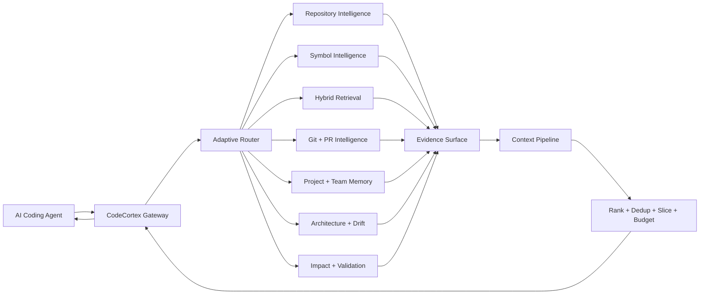
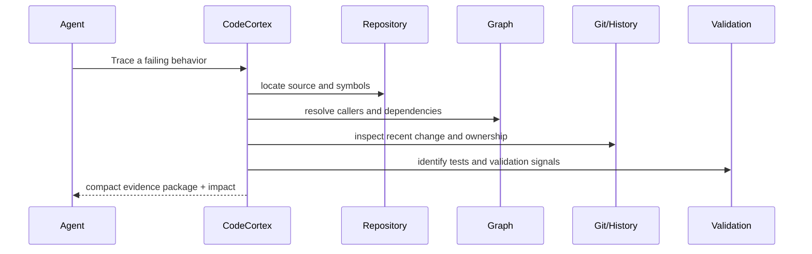
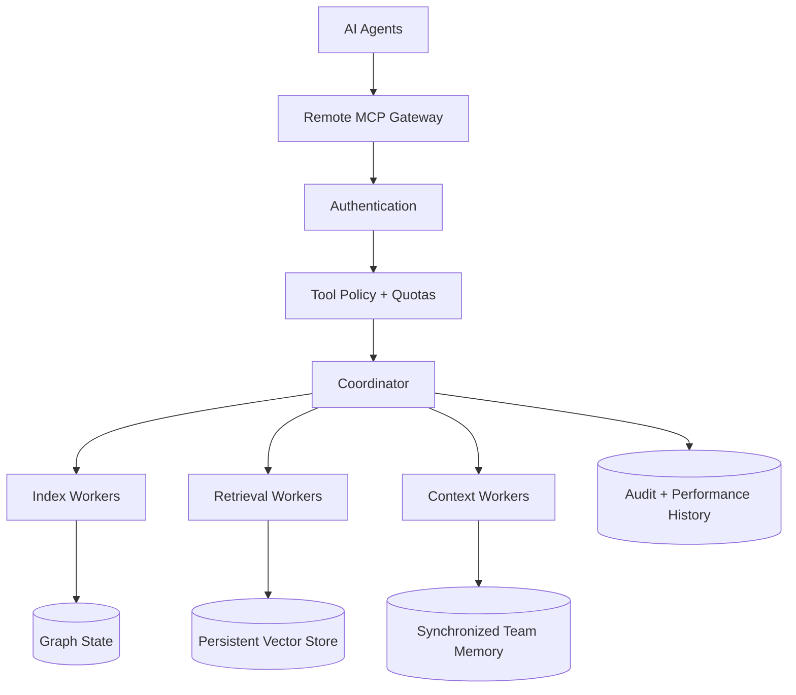
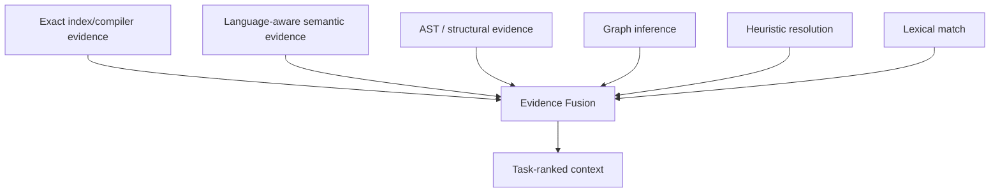
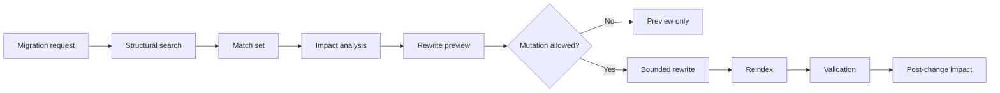

<div align="center">

# 🧠 CodeCortex Context Engine

### Open-source context intelligence infrastructure for AI coding agents

**Map the repository · resolve symbols · retrieve task-specific evidence · estimate impact · edit with guardrails**

[](https://pypi.org/project/codecortex-context-engine/)
[](https://pypi.org/project/codecortex-context-engine/)
[](https://github.com/BehnamJalaliCo/CodeCortex/actions/workflows/ci.yml)
[](https://github.com/BehnamJalaliCo/CodeCortex/actions/workflows/codeql.yml)
[](https://codecov.io/gh/BehnamJalaliCo/CodeCortex)
[](https://www.bestpractices.dev/projects/14379)
[](https://securityscorecards.dev/viewer/?uri=github.com/BehnamJalaliCo/CodeCortex)
[](LICENSE)

[**Documentation**](https://behnamjalalico.github.io/CodeCortex/) · [**Latest Release**](https://github.com/BehnamJalaliCo/CodeCortex/releases/latest) · [**PyPI**](https://pypi.org/project/codecortex-context-engine/) · [**Report a Bug**](https://github.com/BehnamJalaliCo/CodeCortex/issues/new?template=bug.yml) · [**Contribute**](CONTRIBUTING.md)

[🇬🇧 English](#english) · [🇮🇷 فارسی](#فارسی)

</div>

---

## Why CodeCortex?

A coding agent can read code. The harder problem is deciding **what matters, what is connected, what can break, and how much context is actually worth sending to the model**.

CodeCortex turns a repository into a query-specific evidence system for coding agents:

- **Repository + symbol intelligence** — structure, definitions, references, dependencies, and call relationships.
- **Evidence-aware retrieval** — lexical, semantic, structural, graph, Git, architecture, and memory signals are ranked together.
- **Impact before edits** — reverse dependencies, affected tests, ownership, and change risk are inspectable before mutation.
- **Guarded changes** — semantic edits and structural rewrite previews keep source boundaries and review steps explicit.
- **Persistent project context** — architecture, history, project/team memory, traces, and multi-repo workspaces survive beyond one chat.

> **Core rule: retrieve evidence before generating confidence.**

## 60-second start

Requires Python 3.11–3.13.

```bash
python -m pip install --upgrade codecortex-context-engine
cortex init .
cortex index
cortex doctor
```

Then ask the repository useful questions:

```bash
cortex architecture
cortex semantic "authentication and session lifecycle"
cortex impact AuthService
```

Or expose the repository to an MCP-capable coding agent:

```bash
cortex mcp --path .
```

## Works with coding agents

CodeCortex includes merge-safe project configuration for **Claude Code, Codex, Cursor, Gemini CLI, and OpenCode**.

```bash
cortex agents detect
cortex agents configure --dry-run
# or configure every supported target explicitly:
cortex agents configure --all
```

The configurator only manages CodeCortex-owned MCP entries and keeps user-owned configuration intact.

## See it work locally

The repository ships a deterministic demo project and demo runner:

```bash
python scripts/demo.py
```

The demo indexes the fixture repository, analyzes the blast radius of `AuthService`, routes an evidence request, and reports measured context/trace data. It does not fabricate benchmark values.

## Reproducible evidence snapshot

These are committed hardening measurements, not generalized performance promises:

| Evidence | Recorded result |
|---|---:|
| Hardening test suite | **711 passed, 28 skipped, 0 failed** |
| Coverage in hardening report | **91.74%** |
| Warm exact definition lookup | **0.19–0.23 ms median** |
| Freshness scan across 600 documents | **4.25 ms median** |

See [HARDENING_REPORT.md](HARDENING_REPORT.md) and [benchmarks/](benchmarks/) for scope, methodology, limitations, and reproducibility notes.

---

<a id="english"></a>

# 🇬🇧 English
<div align="center">

### Give the coding agent a map before asking it to navigate the codebase.

[](https://github.com/BehnamJalaliCo/CodeCortex)

</div>

## CodeCortex in one sentence

**CodeCortex turns a software repository into a query-specific evidence system for AI coding agents.**

It sits between an agent and a codebase. It builds durable intelligence about repository structure, symbols, relationships, Git history, ownership, architecture, team decisions, impact, and validation. For each task, it tries to return the smallest useful evidence package instead of forcing the model to reopen broad parts of the repository and reconstruct the same facts again.

CodeCortex is not another general chat UI. It is not a model provider. It does not claim that an agent becomes infallible. It is context infrastructure: a layer that improves what the agent gets to reason with.

> **Core rule: retrieve evidence before generating confidence.**

---

## Why this exists

A strong coding model can read code. The harder engineering problem is deciding **what deserves attention, what is connected to it, what changed, what is ambiguous, who owns the area, and what can break after a change**.

Without a context engine, the work often looks like this:

<pre>
search filenames
→ open broad files
→ rediscover architecture
→ guess symbol ownership
→ infer references
→ inspect Git manually
→ guess blast radius
→ consume a large context window
→ edit
→ discover a hidden dependency later
</pre>

CodeCortex changes the stream:

<pre>
task
→ classify intent
→ gather repository evidence
→ rank evidence for this task
→ preserve provenance and uncertainty
→ fit evidence into a context budget
→ expose one agent-facing surface
→ validate the proposed change
</pre>

The goal is not more context.

**The goal is higher-value evidence per token.**

---

# Architecture

## Live evidence stream



The repository remains the source of executable truth. Graphs, memory, semantic retrieval, architecture inference, and summaries help interpretation. They do not replace current source, configuration, and tests.

---

## Current capability map

| Layer | What it does | Why it matters |
|---|---|---|
| Repository map | indexes structure and files | gives the agent a bounded map |
| Multi-language symbols | extracts language-aware units | moves beyond filename search |
| Tree-aware parsing | preserves structural code units | improves code-level context |
| Dependency + call graph | records relationships | supports navigation and impact |
| Cross-file resolution | ranks ambiguous targets | keeps uncertainty visible |
| Incremental graph | reparses changed state | avoids blind rebuilds |
| Hybrid retrieval | combines lexical, semantic, structural signals | improves task-specific recall |
| Context pipeline | ranks, deduplicates, slices, budgets, compacts | spends tokens on useful evidence |
| Git intelligence | history, blame, churn, ownership | makes change history queryable |
| PR intelligence | maps diffs to symbols, tests, impact, risk | reviews behavior, not only lines |
| Impact analysis | walks reverse relationships | estimates blast radius |
| Architecture inference | infers observable structure with confidence | makes architecture inspectable |
| Architecture drift | compares structure with a baseline | exposes architectural movement |
| Project memory | stores durable decisions and facts | preserves rationale |
| Shared team memory | revisions + conflict-aware shared state | makes team knowledge durable |
| Multi-repo workspace | federates search and graph evidence | supports systems split across repos |
| Task traces | records bounded execution evidence | makes routing behavior inspectable |
| Guarded semantic editing | performs preflight-aware edits | reduces broad unsafe replacements |
| Native MCP | exposes one stable agent surface | integrates with coding agents |
| Remote MCP | authenticated remote operation | enables controlled shared use |
| Persistent vector providers | separates storage from retrieval contract | supports larger deployments |
| Distributed workers | capabilities + leases + retries | makes node failure explicit |
| Observatory | health, traces, drift, graph, benchmark, PR signals | makes the engine observable |
| Precision code intelligence | resolves definitions and references by symbol identity | distinguishes packages that export the same name |
| Dependency intelligence | separates declared constraints from resolved versions | answers which API the repository actually runs |
| Structural search and rewrite | matches syntax, previews guarded migrations | finds calls, not comments that mention them |
| Platform API and console | HTTP surface, jobs, persistence, realtime events | drives CodeCortex from outside the CLI |
| Python and TypeScript SDKs | typed clients for the platform API | embeds CodeCortex in other tooling |
| Release evidence | scans, SBOM, signatures, provenance | ties release claims to artifacts |

---

# The CodeCortex Doctrine

These are engineering rules, not marketing slogans.

## Doctrine 01 — Evidence before confidence

A resolved symbol, a semantic match, an inferred edge, a memory entry, and a Git observation are different evidence classes. CodeCortex should not flatten them into one certainty level.

<pre>
exact evidence      → present as exact
strong inference    → preserve provenance
ambiguous inference → keep alternatives visible
missing evidence    → report missing
stale evidence      → report stale
</pre>

## Doctrine 02 — Smallest useful context

The best context package is not the largest package that fits. It is the smallest package that contains enough source, relationships, history, and validation evidence to reason about the current task.

## Doctrine 03 — Source remains source

Memory can explain intent. Git can explain history. Graphs can explain relationships. Retrieval can suggest relevance. Current source, configuration, tests, and reproducible artifacts remain authoritative for executable behavior.

## Doctrine 04 — Uncertainty is information

If two symbols are plausible targets, that ambiguity matters. If architecture is inferred, missing signals matter. If an optional integration cannot run, “unavailable” is more useful than a fabricated success.

## Doctrine 05 — Every change has a blast radius

A small diff can be high risk. A large diff can be mechanical. The useful questions are: which symbols changed, who depends on them, which tests exercise them, who owns the area, and what evidence supports the risk.

## Doctrine 06 — Local-first is a trust decision

Core repository intelligence works locally. Any network boundary, credential, remote tool, quota, policy, and data transfer must remain explicit.

## Doctrine 07 — Reproducibility beats impressive numbers

A benchmark claim without a reproducible specification, pinned revision, environment, measured output, and artifact is not strong evidence.

## Doctrine 08 — Scale through explicit coordination

Workers have identity, capability, leases, failure, retry, and state. Shared memory has synchronization and conflict behavior. Remote tools have authentication and policy.

---

# Quick Start

## Install

CodeCortex supports Python 3.11, 3.12, and 3.13.

<pre>
python -m pip install --upgrade codecortex-context-engine
</pre>

Optional parser support:

<pre>
python -m pip install "codecortex-context-engine[parsers]"
</pre>

Optional local neural semantic embeddings:

<pre>
python -m pip install "codecortex-context-engine[semantic]"
</pre>

## Start inside a repository

<pre>
cortex init .
cortex index
cortex doctor

cortex architecture
cortex semantic "authentication and session lifecycle"
cortex impact AuthService
cortex symbol-history src/auth.py 10 80

cortex mcp --path .
</pre>

---

# A 30-second mental model

<pre>
          ┌────────────────────────────┐
          │       Coding Agent         │
          └─────────────┬──────────────┘
                        │ task
          ┌─────────────▼──────────────┐
          │        CodeCortex          │
          │ map · symbols · history    │
          │ graph · retrieval · memory │
          │ impact · architecture      │
          │ validation · policy        │
          └─────────────┬──────────────┘
                        │ bounded evidence
          ┌─────────────▼──────────────┐
          │       Coding Agent         │
          │ reasons with a better map  │
          └────────────────────────────┘
</pre>

The agent still reasons. CodeCortex changes what it gets to reason **with**.

---

# Task streams

## Bug investigation



A useful investigation should answer:

1. Where is the behavior implemented?
2. What callers and references participate?
3. What changed recently?
4. Which alternate path can invalidate the hypothesis?
5. Which test would fail if the explanation is wrong?
6. What is the smallest safe change?

## Pull-request review

<pre>
diff
→ changed files
→ changed symbols
→ downstream impact
→ affected tests
→ churn / ownership
→ architecture movement
→ risk evidence
→ review context
</pre>

PR size is only one signal.

## Multi-repository work

<pre>
frontend repo ───────┐
backend repo ────────┼── federated evidence ──→ task context
contracts repo ──────┘
</pre>

The repositories keep their identity. CodeCortex federates evidence instead of pretending they are one physical codebase.

---

# Intelligence surfaces

<details>
<summary><b>Repository Intelligence</b> — structure before speculation</summary>

Incremental indexing turns files and program units into durable repository state. Retrieval, architecture inference, impact analysis, and MCP tools can reuse that state instead of rediscovering the whole repository for every request.

</details>

<details>
<summary><b>Symbol Intelligence</b> — names, containers, signatures, references</summary>

Language-aware parsing extracts program units and keeps container identity where possible. Cross-file resolution intentionally preserves ambiguity and candidate reasons instead of silently choosing a same-name symbol.

</details>

<details>
<summary><b>Hybrid Retrieval</b> — lexical + semantic + structural</summary>

Code is not ordinary prose. CodeCortex combines lexical evidence, semantic similarity, symbol metadata, and structural context. Context slicing favors meaningful structural units and bounded windows instead of uncontrolled file dumps.

</details>

<details>
<summary><b>Git & PR Intelligence</b> — code has history</summary>

Current source answers what the code does now. Git explains how it arrived there. History, blame, ownership, churn, and PR analysis add change evidence to the static code model.

</details>

<details>
<summary><b>Memory</b> — durable rationale, not a truth replacement</summary>

Project memory stores reusable facts and decisions. Team memory adds revisions, actor/source metadata, optimistic concurrency, and conflict behavior. Memory can explain “why,” but current source and tests remain authoritative.

</details>

<details>
<summary><b>Architecture Intelligence</b> — make structural movement visible</summary>

Architecture inference returns evidence and confidence. A saved fingerprint can be compared with the current graph so new dependency directions, coupling growth, and structural drift become inspectable.

</details>

<details>
<summary><b>Impact & Validation</b> — reason about blast radius</summary>

Impact analysis walks reverse relationships and affected tests. Validation challenges a proposed change against repository evidence. A risk score is useful only when the evidence behind it stays visible.

</details>

---

# Guarded editing

Current semantic edit operations include:

<pre>
cortex edit rename src/auth.py AuthService SessionService
cortex edit replace src/auth.py AuthService/refresh --body-file ./replacement.txt
cortex edit insert-before src/auth.py AuthService --body-file ./imports.txt
cortex edit insert-after src/auth.py AuthService --body-file ./helper.txt
</pre>

The intended change discipline is:

<pre>
read enough to understand
→ estimate impact
→ mutate narrowly
→ validate
</pre>

Not:

<pre>
replace text everywhere
→ hope tests catch it
</pre>

---

# MCP: one agent-facing surface

<pre>
cortex mcp --path /path/to/repository
</pre>

The MCP surface exposes repository mapping, symbol search, references, dependency graph inspection, impact analysis, hybrid retrieval, compact context, architecture intelligence, Git history, PR intelligence, memory, workspace search, traces, validation, and statistics.

| Category | Agent can request |
|---|---|
| Repository | map, matching nodes, graph counts |
| Symbols | program units and locations |
| References | relationships around a target |
| Dependencies | local call/import relationships |
| Impact | direct, indirect, affected-test evidence |
| Retrieval | semantic/lexical/structural hits |
| Context | compact evidence under an explicit budget |
| Architecture | inferred structure and drift |
| History | Git history, blame, ownership |
| Pull requests | changed symbols, impact, tests, risk |
| Memory | project and team knowledge |
| Workspace | multi-repository search |
| Traces | execution summaries |
| Validation | validation evidence |
| Stats | repository, graph, Git, runtime state |

---

# Distributed operation



Workers advertise capabilities. Work is leased. Expired work can be requeued. Remote operation adds authentication, TLS support, quotas, tool policy, organization/workspace policy, and audit evidence.

The dashboard is an observability surface, not an authorization boundary.

---

# Observatory

<pre>
cortex dashboard -p /path/to/repository
</pre>

The local observatory can surface:

<pre>
backend health
routing distribution
context use
engine latency
graph hotspots
task traces
architecture drift
benchmark history
pull-request risk
</pre>

A context engine should be able to explain its own routing, evidence sources, and failure states.

---

# Security model

| Boundary | Control direction |
|---|---|
| Source paths | constrain operations to project root |
| Semantic edits | preflight + bounded path handling |
| Task traces | bounded attributes + redaction |
| Optional backends | process isolation |
| Remote MCP | authentication before dispatch |
| Remote tools | policy + allow lists + quotas |
| Organizations | roles + workspace policy + audit retention |
| Dependencies | audit + dependency review |
| Source | static analysis + CodeQL |
| Releases | checksums + SBOM + signatures + provenance |

Security badges are evidence, not a proof that every deployment is secure. A deployment-specific threat model still matters.

---

# Quality, release, and benchmark doctrine

<pre>
exact commit
→ quality matrix
→ security checks
→ build
→ smoke test
→ checksums
→ SBOM
→ signing / attestations
→ release
</pre>

A credential-gated integration that cannot run is reported as skipped. It is not counted as success.

Benchmark command:

<pre>
python scripts/run_production_benchmark.py
</pre>

A public performance claim should map to a reproducible spec, pinned revision, environment, measured result, and artifact. CodeCortex does not invent token savings, speedups, task-success gains, or accuracy percentages.

---

# Evidence Fusion Layer

> **Status: shipped.** Implementation, tests, benchmarks, documentation, and provenance records are in the repository. All three layers are optional: CodeCortex Core runs with none of them installed and no network access.

CodeCortex fuses several kinds of evidence and tells the agent, for every result, **how that result was established**. Each record carries a categorical trust tier — `exact`, `near_exact`, `structural`, `inferred_high`, `inferred`, `weak` — plus a provenance label. Two properties are enforced in code, not merely documented: evidence cannot claim the `exact` tier unless it is fresh, and stale exact evidence never outranks fresh structural evidence.

See `docs/EVIDENCE_FUSION.md` for the full model, fallback behavior, and security boundaries.

## 1 — Precision Code Intelligence

The Precision Code Intelligence layer consumes compiler/indexer-grade occurrence evidence when available and distinguishes:

<pre>
exact definition/reference
        vs
structural relationship
        vs
heuristic candidate
        vs
lexical coincidence
</pre>

Current capabilities:

- precise definition lookup;
- precise references;
- implementation relationships;
- symbol occurrences;
- stale-index detection;
- graph fusion with exact/inferred provenance;
- graceful fallback to current intelligence.



The engine should know not only what it found, but how strongly it knows it.

## 2 — Version-Aware Dependency Intelligence

The Dependency Intelligence layer joins:

<pre>
manifest
+ lockfile
+ declared version
+ resolved version
+ repository usage
+ version-relevant documentation evidence
</pre>

Questions this layer answers:

- Which version is actually resolved?
- Is the requested API valid for that version?
- Is the current pattern outdated?
- Which migration guidance applies?
- Which local files and symbols use the dependency?

External documentation remains optional, minimal-data, credential-aware, cached, and explicit. Core repository intelligence must continue to work offline. Repository source should not leave the system by default just to answer a dependency question.

## 3 — Structural Search & Guarded Rewrite

The Structural Search & Guarded Rewrite layer handles syntax-aware patterns:

<pre>
find calls shaped like old_api($X)
find constructors using a legacy option shape
find handlers that swallow a particular exception form
find all structural usages before a framework migration
</pre>

Mutation lifecycle:



A rewrite should be previewed, bounded, content-hash checked, policy-authorized, reindexed, and validated.

## Evidence fusion in practice

Example, covered end to end by an acceptance test:

> Migrate authentication middleware to the supported API for the version used by this repository.

Stream:

<pre>
dependency manifest
→ resolved version
→ current middleware
→ precise references
→ version-relevant documentation
→ structural occurrences
→ affected symbols and tests
→ guarded rewrite preview
→ mutation policy
→ validation
→ post-change impact
</pre>

The value is not three disconnected tools. The value is one context engine joining **local code truth, precise relationships, dependency-version evidence, structural patterns, history, and validation** for one task.

Measured on fixture repositories (`cortex evidence-benchmark`; strategies that cannot be measured are reported as skipped, never estimated):

| Case | Heuristic baseline | Evidence-backed |
|---|---|---|
| Duplicate symbol names | precision 0.50 | precision **1.00** |
| Resolved dependency version | precision 0.00 | precision **1.00** |
| Mechanical migration | precision 0.50 | precision **1.00** |

---

# Shipped capabilities and fallback behavior

| Capability | Shipped | Fallback when the optional layer is absent |
|---|---|---|
| Symbols | language-aware parsing + exact occurrence fusion | structural and heuristic resolution |
| References | exact/inferred provenance hierarchy | graph + semantic intelligence |
| Dependencies | resolved version + optional documentation evidence | local manifest facts, explicit docs-unavailable state |
| Search | lexical + semantic + structural + AST-pattern search | lexical and symbol search |
| Editing | guarded semantic edits + preview-first structural migrations | guarded semantic edits only |
| Impact | evidence-quality-aware impact | graph walk + affected tests |
| Context | unified cross-provider evidence ranking | ranked, deduplicated, budgeted chunks |
| Confidence | provenance + trust tiers | explicit ambiguity |
| Offline behavior | local-first | unchanged; no network is ever required |

---

# Operating profiles

| Profile | Typical shape |
|---|---|
| Solo | local repository → local index → local memory → MCP agent |
| Team | shared conventions → team memory → workspace → PR intelligence |
| Large workspace | many repos → federated evidence → remote authenticated surface |
| Distributed | gateway → policy → coordinator → workers → persistent stores |

---

# What CodeCortex is not

| It is not | Why |
|---|---|
| a general chat application | its job is repository context intelligence |
| a model provider | it improves evidence available to models |
| a magic correctness layer | models and humans can still be wrong |
| a replacement for tests | validation needs executable evidence |
| a replacement for Git | it makes history useful to context |
| a vector database product | storage is a replaceable boundary |
| a source-truth replacement | source remains authoritative |
| a benchmark marketing page | claims require reproducible artifacts |

---

# Design rules

1. **Typed boundaries.**
2. **Replaceable intelligence.**
3. **Local operation first.**
4. **Explicit context budgets.**
5. **Project-scoped state by default.**
6. **Provenance survives summarization.**
7. **Mutation is a separate privilege.**
8. **Distributed state is explicit.**
9. **Missing evidence stays missing.**
10. **Release claims map to evidence.**

---

# Command map

<pre>
cortex init .
cortex index
cortex architecture
cortex architecture-drift
cortex semantic "authentication refresh"
cortex impact AuthService
cortex symbol-history src/auth.py 10 80
cortex pr main --head HEAD
cortex workspace-add backend ../backend
cortex workspace-search "payment service"
cortex definition src/auth.py 12 7
cortex references src/auth.py 12 7
cortex implementations src/auth.py 12 7
cortex precision-status
cortex dependency next
cortex dependency-docs next "middleware authentication"
cortex structural-search --lang python --pattern 'old_api($X)'
cortex rewrite-preview --lang python --pattern 'old_api($X)' --replacement 'new_api($X)'
cortex rewrite-apply &lt;preview-id&gt;
cortex benchmark
cortex evidence-benchmark
cortex dashboard
cortex doctor
cortex mcp --path .
</pre>

---

# Docker

<pre>
docker build --target core -t codecortex:core .
docker build --target full -t codecortex:full .
docker compose up dashboard
</pre>

Containerization does not replace authentication, TLS, policy, secret management, or an appropriate deployment threat model.

---

# Project status

CodeCortex is currently **alpha**.

Public interfaces are still evolving. Breaking changes can occur before 1.0. Evaluate the project by what the current code, tests, CI, documentation, and reproducible artifacts demonstrate.

---

# Engineering use cases

| Mission | Start with | Verify with |
|---|---|---|
| Onboarding | architecture + repository map | source + execution paths |
| Bug investigation | semantic + symbols + history | targeted tests |
| Feature work | existing pattern + dependencies | architecture + tests |
| Refactor | references + impact | staged edits + contract tests |
| Dependency migration | imports + usage + assumptions | compatibility checks |
| Security review | trust boundaries + call paths | negative/adversarial tests |
| PR review | changed symbols + impact | affected tests + drift |
| Release readiness | CI + security + benchmark evidence | exact release artifacts |

---

# Documentation

- [Architecture](docs/ARCHITECTURE.md)
- [Distributed operation](docs/DISTRIBUTED.md)
- [Advanced intelligence](docs/ADVANCED_INTELLIGENCE.md)
- [Evidence fusion](docs/EVIDENCE_FUSION.md)
- [Provenance records](docs/provenance/)
- [Integrations](docs/INTEGRATIONS.md)
- [Quality](docs/QUALITY.md)
- [Testing](docs/TESTING.md)
- [Release](docs/RELEASE.md)
- [Licensing](docs/LICENSING.md)
- [Security](SECURITY.md)
- [Contributing](CONTRIBUTING.md)
- [Governance](GOVERNANCE.md)
- [Roadmap](ROADMAP.md)

Third-party license and provenance obligations remain in the repository's legal/provenance files. Product-facing documentation uses CodeCortex-native capability names.

---

# FAQ

<details><summary><b>Does CodeCortex replace the coding model?</b></summary>
No. The model still reasons and generates. CodeCortex improves the evidence environment.
</details>

<details><summary><b>Does Core require a remote service?</b></summary>
No. Core is local-first. Optional providers can introduce explicit remote boundaries.
</details>

<details><summary><b>Does a huge context window make this unnecessary?</b></summary>
No. Window size and evidence quality are different problems.
</details>

<details><summary><b>Is every relationship exact?</b></summary>
No. Inferred relationships preserve ambiguity. Precision Code Intelligence adds exact compiler/indexer evidence when available and falls back conservatively when it is not.
</details>

<details><summary><b>Can it work across repositories?</b></summary>
Yes. Workspaces federate evidence while preserving repository identity.
</details>

<details><summary><b>Can it edit code?</b></summary>
Guarded semantic editing is available through the appropriate backend surface. Read intelligence and mutation remain separate privileges.
</details>

---

# Maintainer, contribution, and license

CodeCortex is built and maintained by **Behnam Jalali**.

<pre>
python -m pip install -e ".[dev]"
ruff check .
mypy src/codecortex
pytest
</pre>

CodeCortex-owned material is licensed under Apache License 2.0. Third-party material remains subject to the license and attribution records kept in the repository.

See [LICENSE](LICENSE), [NOTICE](NOTICE), [SECURITY.md](SECURITY.md), and [CONTRIBUTING.md](CONTRIBUTING.md).

<div align="center">

### CodeCortex Context Engine

**Give the agent a map before asking it to navigate the codebase.**

**Less noise. More evidence. Inspectable change.**

</div>


---


<a id="فارسی"></a>

<div dir="rtl">

# 🇮🇷 فارسی

<div align="center">

## 🧠 موتور کانتکست CodeCortex

### قبل از اینکه ایجنت حدس بزند، ریپو باید بتواند خودش را توضیح بدهد.

[](https://github.com/BehnamJalaliCo/CodeCortex)

</div>

## CodeCortex در یک جمله

**CodeCortex یک ریپوی نرم‌افزاری را به یک سیستم شواهدِ مخصوص همان سؤال تبدیل می‌کند تا ایجنت برنامه‌نویسی به‌جای حدس زدن، با نقشه و مدرک جلو برود.**

CodeCortex بین ایجنت و کدبیس می‌ایستد. از ساختار ریپو، سیمبل‌ها، رابطه‌ها، تاریخچه Git، ownership، معماری، تصمیم‌های تیم، impact و validation یک لایه هوشمندی ماندگار می‌سازد. بعد برای هر تسک تلاش می‌کند کوچک‌ترین بسته evidence مفید را برگرداند، نه اینکه مدل را مجبور کند هر بار نصف ریپو را باز کند و همان واقعیت‌ها را دوباره از صفر بسازد.

این پروژه یک چت‌بات دیگر نیست. model provider هم نیست. قرار نیست ادعا کند ایجنت را بدون خطا می‌کند. CodeCortex زیرساخت کانتکست است؛ یعنی چیزی که کیفیت اطلاعات ورودی به reasoning ایجنت را بهتر می‌کند.

> **قاعده اصلی: اول evidence را پیدا کن، بعد با confidence حرف بزن.**

---

## چرا اصلاً به چنین چیزی نیاز داریم؟

مدل قوی می‌تواند کد بخواند. مسئله سخت مهندسی این است که بداند **کدام کد ارزش توجه دارد، چه چیزی به آن وصل است، چه چیزی عوض شده، کجا ambiguity داریم، مالک آن بخش کیست و اگر تغییر اشتباه باشد چه چیزی می‌شکند**.

بدون موتور کانتکست، جریان معمولاً این شکلی می‌شود:

<pre>
جست‌وجوی اسم فایل
→ باز کردن فایل‌های زیاد
→ کشف دوباره معماری
→ حدس زدن مالکیت سیمبل
→ حدس referenceها
→ بررسی دستی Git
→ حدس blast radius
→ مصرف کانتکست زیاد
→ ویرایش
→ کشف یک dependency پنهان در مرحله بعد
</pre>

CodeCortex جریان را عوض می‌کند:

<pre>
تسک
→ تشخیص intent
→ جمع‌آوری evidence ریپو
→ rank کردن برای همین تسک
→ حفظ provenance و uncertainty
→ جا دادن evidence داخل context budget
→ ارائه از یک سطح واحد به ایجنت
→ validation تغییر پیشنهادی
</pre>

هدف کانتکست بیشتر نیست.

**هدف evidence مفیدتر به ازای هر توکن است.**

---

# معماری سیستم

## استریم زنده Evidence


حقیقت اجرایی همچنان سورس فعلی، کانفیگ و تست است. Graph، memory، semantic retrieval، architecture inference و summary برای فهم بهتر هستند؛ جای source truth را نمی‌گیرند.

---

## نقشه قابلیت‌های فعلی

| لایه | چه کاری می‌کند | چرا مهم است |
|---|---|---|
| Repository map | ساختار و فایل‌ها را index می‌کند | به ایجنت نقشه محدود می‌دهد |
| سیمبل چندزبانه | program unit زبان‌آگاه استخراج می‌کند | از filename search جلوتر می‌رود |
| Tree-aware parsing | ساختار کد را حفظ می‌کند | context کدنویسی بهتر می‌شود |
| Dependency + call graph | رابطه کد را ثبت می‌کند | navigation و impact ممکن می‌شود |
| Cross-file resolution | target مبهم را rank می‌کند | uncertainty پنهان نمی‌شود |
| Incremental graph | فقط state تغییرکرده را parse می‌کند | rebuild کور کم می‌شود |
| Hybrid retrieval | lexical + semantic + structural | recall مربوط به تسک بهتر می‌شود |
| Context pipeline | rank + dedup + slice + budget + compact | توکن صرف evidence مفید می‌شود |
| Git intelligence | history + blame + churn + ownership | تغییرات queryable می‌شوند |
| PR intelligence | diff را به symbol + test + impact + risk وصل می‌کند | review رفتاری می‌شود |
| Impact analysis | reverse relationship را دنبال می‌کند | blast radius دیده می‌شود |
| Architecture inference | ساختار را با confidence می‌فهمد | معماری inspectable می‌شود |
| Architecture drift | current را با baseline مقایسه می‌کند | حرکت معماری دیده می‌شود |
| Project memory | fact و تصمیم ماندگار | rationale حفظ می‌شود |
| Shared team memory | revision + conflict-aware state | دانش تیم ماندگار می‌شود |
| Multi-repo workspace | search و graph را federate می‌کند | سیستم چندریپویی قابل فهم می‌شود |
| Task trace | execution evidence محدود | رفتار routing inspectable می‌شود |
| Guarded semantic editing | edit با preflight | replace ناامن کمتر می‌شود |
| Native MCP | یک سطح پایدار برای ایجنت | integration ساده‌تر می‌شود |
| Remote MCP | عملیات authenticated ریموت | استفاده اشتراکی کنترل می‌شود |
| Persistent vector providers | storage از contract retrieval جداست | deployment بزرگ‌تر scale می‌شود |
| Distributed workers | capability + lease + retry | failure نود واقعی مدل می‌شود |
| Observatory | health + trace + drift + graph + benchmark | خود engine observable می‌شود |
| Precision code intelligence | تعریف و ارجاع را با هویت سیمبل resolve می‌کند | پکیج‌هایی که نام یکسان export می‌کنند از هم جدا می‌شوند |
| Dependency intelligence | constraint اعلام‌شده را از نسخه resolve‌شده جدا می‌کند | مشخص می‌کند ریپو واقعاً کدام API را اجرا می‌کند |
| Structural search و rewrite | بر اساس syntax تطبیق می‌دهد و migration کنترل‌شده preview می‌کند | فراخوانی واقعی را پیدا می‌کند، نه کامنتی که اسمش را آورده |
| Platform API و کنسول | سطح HTTP، job، persistence و رویداد زنده | اجرای CodeCortex از بیرون CLI |
| SDK پایتون و TypeScript | کلاینت تایپ‌دار برای Platform API | جاسازی CodeCortex در ابزارهای دیگر |
| Release evidence | scan + SBOM + signature + provenance | claim به artifact وصل می‌شود |

---

# دکترین CodeCortex

این‌ها slogan نیستند؛ قانون مهندسی‌اند.

## دکترین ۰۱ — اول evidence، بعد confidence

سیمبل resolveشده، semantic match، edge استنباطی، memory و Git observation کیفیت یکسان ندارند. CodeCortex نباید همه را با یک certainty تحویل دهد.

<pre>
شاهد دقیق          → دقیق نمایش بده
استنباط قوی        → provenance را نگه دار
استنباط مبهم       → گزینه‌های دیگر را نگه دار
شاهد وجود ندارد    → missing گزارش کن
شاهد قدیمی است     → stale گزارش کن
</pre>

## دکترین ۰۲ — کوچک‌ترین کانتکستِ کافی

بهترین context package بزرگ‌ترین چیزی نیست که جا شود. بهترین package کم‌حجم‌ترین چیزی است که برای همان task سورس، رابطه، history و validation کافی داشته باشد.

## دکترین ۰۳ — Source همچنان Source است

Memory می‌تواند دلیل را توضیح دهد. Git تاریخچه را. Graph رابطه را. Retrieval ارتباط احتمالی را. اما رفتار اجرایی را سورس فعلی، کانفیگ، تست و artifact قابل بازتولید مشخص می‌کند.

## دکترین ۰۴ — ابهام خودش اطلاعات است

اگر دو سیمبل target محتمل‌اند، این ambiguity مهم است. اگر معماری inference است، missing signal مهم است. اگر integration اختیاری در دسترس نیست، unavailable بهتر از success ساختگی است.

## دکترین ۰۵ — هر تغییر Blast Radius دارد

diff کوچک می‌تواند پرریسک باشد و diff بزرگ می‌تواند مکانیکی باشد. سؤال درست این است: چه سیمبلی تغییر کرد، چه کسی به آن وابسته است، چه تستی مسیر را پوشش می‌دهد، مالک بخش کیست و risk بر چه evidenceای بنا شده.

## دکترین ۰۶ — Local-first یک تصمیم اعتماد است

Core intelligence local کار می‌کند. هر network boundary، credential، remote tool، quota، policy و data transfer باید صریح باشد.

## دکترین ۰۷ — Reproducibility از عدد جذاب مهم‌تر است

Benchmark بدون spec، revision، environment، measured output و artifact evidence قوی نیست.

## دکترین ۰۸ — Scale با Coordination صریح ساخته می‌شود

Worker هویت، capability، lease، failure، retry و state دارد. Shared memory sync و conflict دارد. ابزار remote auth و policy دارد.

---

# شروع سریع

## نصب

CodeCortex از Python 3.11، 3.12 و 3.13 پشتیبانی می‌کند.

<pre>
python -m pip install --upgrade codecortex-context-engine
</pre>

Parser اختیاری:

<pre>
python -m pip install "codecortex-context-engine[parsers]"
</pre>

Embedding معنایی local اختیاری:

<pre>
python -m pip install "codecortex-context-engine[semantic]"
</pre>

## داخل یک ریپو شروع کن

<pre>
cortex init .
cortex index
cortex doctor

cortex architecture
cortex semantic "authentication and session lifecycle"
cortex impact AuthService
cortex symbol-history src/auth.py 10 80

cortex mcp --path .
</pre>

---

# مدل ذهنی ۳۰ ثانیه‌ای

<pre>
          ┌────────────────────────────┐
          │       Coding Agent         │
          └─────────────┬──────────────┘
                        │ task
          ┌─────────────▼──────────────┐
          │        CodeCortex          │
          │ map · symbols · history    │
          │ graph · retrieval · memory │
          │ impact · architecture      │
          │ validation · policy        │
          └─────────────┬──────────────┘
                        │ evidence محدود
          ┌─────────────▼──────────────┐
          │       Coding Agent         │
          │  با نقشه بهتر reasoning می‌کند │
          └────────────────────────────┘
</pre>

ایجنت هنوز خودش reasoning می‌کند. CodeCortex چیزی را بهتر می‌کند که ایجنت **با آن** reasoning می‌کند.

---

# استریم‌های Task

## Bug Investigation


Investigation خوب باید جواب دهد:

1. رفتار کجا پیاده شده؟
2. چه caller و referenceهایی در مسیرند؟
3. اخیراً چه چیزی تغییر کرده؟
4. چه مسیر دیگری hypothesis را رد می‌کند؟
5. کدام test باید fail شود اگر توضیح اشتباه است؟
6. کوچک‌ترین تغییر امن چیست؟

## Pull Request Review

<pre>
diff
→ فایل تغییرکرده
→ سیمبل تغییرکرده
→ downstream impact
→ affected tests
→ churn / ownership
→ حرکت معماری
→ risk evidence
→ review context
</pre>

اندازه PR فقط یکی از signalهاست.

## Multi-Repository

<pre>
frontend repo ───────┐
backend repo ────────┼── federated evidence ──→ task context
contracts repo ──────┘
</pre>

هویت ریپوها حفظ می‌شود. Evidence federate می‌شود، نه اینکه وانمود کنیم همه یک codebase فیزیکی هستند.

---

# سطح‌های هوشمندی

<details>
<summary><b>Repository Intelligence</b> — قبل از حدس ساختار را ببین</summary>

Incremental indexing فایل‌ها و program unitها را به state ماندگار تبدیل می‌کند. Retrieval، معماری، impact و MCP می‌توانند همان state را دوباره استفاده کنند.

</details>

<details>
<summary><b>Symbol Intelligence</b> — اسم، container، signature و reference</summary>

Parsing زبان‌آگاه program unit را استخراج می‌کند. Cross-file resolution ambiguity و دلیل candidateها را نگه می‌دارد و same-name symbol را بی‌صدا یکی فرض نمی‌کند.

</details>

<details>
<summary><b>Hybrid Retrieval</b> — lexical + semantic + structural</summary>

کد prose معمولی نیست. CodeCortex semantic similarity را با lexical evidence، metadata سیمبل و structural context ترکیب می‌کند و به‌جای file dump، slicing محدود می‌دهد.

</details>

<details>
<summary><b>Git & PR Intelligence</b> — کد تاریخ دارد</summary>

Source می‌گوید الان چه اتفاقی می‌افتد. Git می‌گوید چطور به اینجا رسیده. History، blame، ownership، churn و PR analysis شواهد تغییر را به مدل static اضافه می‌کنند.

</details>

<details>
<summary><b>Memory</b> — rationale ماندگار، نه جایگزین Truth</summary>

Project memory fact و decision را نگه می‌دارد. Team memory revision، actor/source metadata و conflict behavior دارد. Memory «چرا» را نگه می‌دارد ولی از source و test معتبرتر فرض نمی‌شود.

</details>

<details>
<summary><b>Architecture Intelligence</b> — حرکت ساختاری را قابل دیدن کن</summary>

Architecture inference evidence و confidence برمی‌گرداند. Fingerprint ذخیره‌شده با graph فعلی مقایسه می‌شود تا dependency direction و coupling drift دیده شود.

</details>

<details>
<summary><b>Impact & Validation</b> — Blast Radius را بفهم</summary>

Impact relationship معکوس و affected test را دنبال می‌کند. Validation تغییر پیشنهادی را مقابل evidence ریپو challenge می‌کند.

</details>

---

# ویرایش کنترل‌شده

عملیات semantic فعلی:

<pre>
cortex edit rename src/auth.py AuthService SessionService
cortex edit replace src/auth.py AuthService/refresh --body-file ./replacement.txt
cortex edit insert-before src/auth.py AuthService --body-file ./imports.txt
cortex edit insert-after src/auth.py AuthService --body-file ./helper.txt
</pre>

دکترین تغییر:

<pre>
به‌اندازه کافی بخوان
→ impact را بفهم
→ محدود mutate کن
→ validate کن
</pre>

نه:

<pre>
همه‌جا replace کن
→ امیدوار باش testها بگیرند
</pre>

---

# MCP: یک سطح واحد برای ایجنت

<pre>
cortex mcp --path /path/to/repository
</pre>

MCP نقشه ریپو، symbol search، reference، dependency graph، impact، hybrid retrieval، compact context، architecture، Git، PR، memory، workspace، trace، validation و stats را ارائه می‌دهد.

| دسته | درخواست ایجنت |
|---|---|
| Repository | map، node، graph count |
| Symbols | program unit و location |
| References | رابطه اطراف target |
| Dependencies | call/import محلی |
| Impact | direct، indirect، affected test |
| Retrieval | semantic/lexical/structural hit |
| Context | evidence با budget صریح |
| Architecture | structure + drift |
| History | Git + blame + ownership |
| Pull requests | symbol + impact + test + risk |
| Memory | دانش پروژه و تیم |
| Workspace | search چندریپویی |
| Traces | execution summary |
| Validation | validation evidence |
| Stats | repo + graph + Git + runtime |

---

# عملیات توزیع‌شده


Worker capability اعلام می‌کند، work lease می‌شود و expired work می‌تواند requeue شود. Remote operation می‌تواند auth، TLS، quota، tool policy، organization/workspace policy و audit evidence داشته باشد.

Dashboard سطح observability است، نه authorization.

---

# Observatory

<pre>
cortex dashboard -p /path/to/repository
</pre>

Observatory می‌تواند این‌ها را نشان دهد:

<pre>
backend health
routing distribution
context use
engine latency
graph hotspots
task traces
architecture drift
benchmark history
pull-request risk
</pre>

موتور کانتکست باید بتواند routing، منبع evidence و failure state خودش را توضیح دهد.

---

# مدل امنیت

| مرز | کنترل |
|---|---|
| Source path | محدود به project root |
| Semantic edit | preflight + path boundary |
| Task trace | bounded attribute + redaction |
| Backend اختیاری | process isolation |
| Remote MCP | auth قبل از dispatch |
| Remote tools | policy + allow list + quota |
| Organization | role + workspace policy + audit retention |
| Dependency | audit + dependency review |
| Source | static analysis + CodeQL |
| Release | checksum + SBOM + signature + provenance |

Badge امنیتی evidence است، نه تضمین امنیت همه deploymentها. Threat model مخصوص محیط همچنان لازم است.

---

# دکترین Quality، Release و Benchmark

<pre>
commit دقیق
→ quality matrix
→ security checks
→ build
→ smoke test
→ checksum
→ SBOM
→ signature / attestation
→ release
</pre>

Integrationای که credential ندارد باید skipped گزارش شود، نه success.

Benchmark:

<pre>
python scripts/run_production_benchmark.py
</pre>

Claim performance باید به spec بازتولیدپذیر، revision پین‌شده، environment، measured result و artifact وصل باشد. CodeCortex نباید token saving، speedup، task success یا accuracy ساختگی منتشر کند.

---

# لایه Evidence Fusion

> **وضعیت: منتشر شده.** implementation، test، benchmark، documentation و سوابق provenance همگی داخل ریپو هستند. هر سه لایه اختیاری‌اند: هسته CodeCortex بدون هیچ‌کدام از آن‌ها و بدون دسترسی شبکه کار می‌کند.

CodeCortex چند نوع evidence را با هم ترکیب می‌کند و برای هر نتیجه می‌گوید **آن نتیجه چطور اثبات شده است**. هر رکورد یک trust tier مشخص دارد — `exact`، `near_exact`، `structural`، `inferred_high`، `inferred`، `weak` — به‌همراه برچسب provenance. دو قاعده در خودِ کد اجرا می‌شوند، نه فقط در مستندات: هیچ evidence‌ای تا وقتی تازه نباشد نمی‌تواند ادعای `exact` کند، و evidence قدیمی هرگز بالاتر از evidence ساختاری تازه رتبه نمی‌گیرد.

مدل کامل، رفتار fallback و مرزهای امنیتی در `docs/EVIDENCE_FUSION.md` آمده است.

## ۱ — Precision Code Intelligence

لایه Precision Code Intelligence در صورت وجود evidence دقیق compiler/indexer-grade تفاوت این سطوح را تشخیص می‌دهد:

<pre>
definition/reference دقیق
        با
relationship ساختاری
        با
candidate heuristic
        با
lexical coincidence
</pre>

قابلیت‌های فعلی:

- definition دقیق؛
- reference دقیق؛
- implementation relationship؛
- occurrence سیمبل؛
- stale-index detection؛
- fusion گراف با provenance دقیق/استنباطی؛
- fallback به intelligence فعلی.


سیستم باید فقط نداند چه پیدا کرده؛ باید بداند **چقدر دقیق می‌داند**.

## ۲ — Dependency Intelligence با آگاهی از نسخه

لایه Dependency Intelligence این اطلاعات را کنار هم قرار می‌دهد:

<pre>
manifest
+ lockfile
+ نسخه declared
+ نسخه resolved
+ usage داخل repository
+ documentation مربوط به همان نسخه
</pre>

سؤال‌هایی که این لایه پاسخ می‌دهد:

- نسخه واقعی resolveشده چیست؟
- API پیشنهادی برای همین نسخه معتبر است؟
- pattern فعلی قدیمی است؟
- migration guidance مرتبط چیست؟
- کدام file و symbol از dependency استفاده می‌کند؟

Documentation بیرونی باید optional، minimal-data، credential-aware، cacheشده و explicit باشد. Core باید offline هم کار کند. سورس ریپو نباید برای جواب dependency question به‌صورت پیش‌فرض از سیستم خارج شود.

## ۳ — Structural Search و Guarded Rewrite

لایه Structural Search و Guarded Rewrite برای patternهای syntax-aware:

<pre>
callهایی با شکل old_api($X)
constructor با option قدیمی
handler با exception pattern خاص
همه usageهای ساختاری قبل از migration
</pre>

جریان mutation:


Rewrite باید preview، bound، content-hash check، policy authorization، reindex و validation داشته باشد.

## مقصد واقعی: Evidence Fusion

مثال task آینده:

> Middleware احراز هویت را به API درست برای نسخه‌ای که همین پروژه استفاده می‌کند migrate کن.

استریم مطلوب:

<pre>
dependency manifest
→ نسخه resolved
→ middleware فعلی
→ reference دقیق
→ documentation مربوط به نسخه
→ structural occurrence
→ symbol و test متاثر
→ guarded rewrite preview
→ mutation policy
→ validation
→ impact بعد از تغییر
</pre>

ارزش اصلی سه ابزار جدا نیست. ارزش اصلی یک context engine است که **حقیقت محلی کد، رابطه دقیق، نسخه dependency، pattern ساختاری، history و validation** را برای یک task به یک package تبدیل کند.

---

# وضعیت فعلی و رفتار fallback

| قابلیت | منتشر شده | fallback وقتی لایه اختیاری نصب نیست |
|---|---|---|
| Symbol | parsing زبان‌آگاه + exact occurrence fusion | resolution ساختاری و heuristic |
| Reference | hierarchy دقیق/استنباطی | graph + semantic intelligence |
| Dependency | resolved version + مستندات اختیاری | فقط اطلاعات manifest محلی + وضعیت صریح «مستندات در دسترس نیست» |
| Search | lexical + semantic + structural + AST-pattern | جست‌وجوی lexical و symbol |
| Editing | ویرایش کنترل‌شده + migration مبتنی بر preview | فقط ویرایش semantic کنترل‌شده |
| Impact | impact آگاه از کیفیت evidence | graph walk + affected test |
| Context | رتبه‌بندی یکپارچه بین provider‌ها | ranked + dedup + budget |
| Confidence | provenance + trust tier | ambiguity صریح |
| Offline | local-first | بدون تغییر؛ شبکه هرگز الزامی نیست |

---

# پروفایل‌های استفاده

| پروفایل | شکل معمول |
|---|---|
| Solo | local repo → local index → local memory → MCP agent |
| Team | convention مشترک → team memory → workspace → PR intelligence |
| Large workspace | چند repo → federated evidence → remote authenticated surface |
| Distributed | gateway → policy → coordinator → worker → persistent store |

---

# CodeCortex چه چیزی نیست؟

| نیست | دلیل |
|---|---|
| چت عمومی | کارش repository context intelligence است |
| model provider | evidence مدل را بهتر می‌کند |
| لایه جادویی correctness | مدل و انسان هنوز اشتباه می‌کنند |
| جای test | validation evidence اجرایی می‌خواهد |
| جای Git | history را به context تبدیل می‌کند |
| vector database product | storage قابل تعویض است |
| جای source truth | source authoritative می‌ماند |
| صفحه تبلیغ benchmark | claim artifact می‌خواهد |

---

# قوانین طراحی

1. **Boundary typed.**
2. **Intelligence قابل تعویض.**
3. **Local-first.**
4. **Context budget صریح.**
5. **State پروژه‌ای به‌صورت پیش‌فرض.**
6. **Provenance بعد از summary هم باقی می‌ماند.**
7. **Mutation privilege جداست.**
8. **Distributed state صریح است.**
9. **Evidence گمشده ساخته نمی‌شود.**
10. **Claim انتشار evidence می‌خواهد.**

---

# نقشه دستورات

<pre>
cortex init .
cortex index
cortex architecture
cortex architecture-drift
cortex semantic "authentication refresh"
cortex impact AuthService
cortex symbol-history src/auth.py 10 80
cortex pr main --head HEAD
cortex workspace-add backend ../backend
cortex workspace-search "payment service"
cortex definition src/auth.py 12 7
cortex references src/auth.py 12 7
cortex precision-status
cortex dependency next
cortex dependency-docs next "middleware authentication"
cortex structural-search --lang python --pattern 'old_api($X)'
cortex rewrite-preview --lang python --pattern 'old_api($X)' --replacement 'new_api($X)'
cortex rewrite-apply &lt;preview-id&gt;
cortex benchmark
cortex evidence-benchmark
cortex dashboard
cortex doctor
cortex mcp --path .
</pre>

---

# Docker

<pre>
docker build --target core -t codecortex:core .
docker build --target full -t codecortex:full .
docker compose up dashboard
</pre>

Containerization جای auth، TLS، policy، secret management و threat model مناسب را نمی‌گیرد.

---

# وضعیت پروژه

CodeCortex فعلاً **Alpha** است.

interfaceهای عمومی هنوز تکامل پیدا می‌کنند و قبل از 1.0 breaking change ممکن است. پروژه را باید با چیزی سنجید که code، test، CI، documentation و artifact قابل بازتولید واقعاً نشان می‌دهند.

---

# سناریوهای مهندسی

| مأموریت | شروع | Verify |
|---|---|---|
| Onboarding | architecture + repository map | source + execution path |
| Bug investigation | semantic + symbol + history | targeted test |
| Feature | pattern موجود + dependency | architecture + test |
| Refactor | reference + impact | staged edit + contract test |
| Dependency migration | import + usage + assumption | compatibility check |
| Security review | trust boundary + call path | negative/adversarial test |
| PR review | changed symbol + impact | affected test + drift |
| Release readiness | CI + security + benchmark | artifact commit دقیق |

---

# مستندات

- [Architecture](docs/ARCHITECTURE.md)
- [Distributed](docs/DISTRIBUTED.md)
- [Advanced Intelligence](docs/ADVANCED_INTELLIGENCE.md)
- [Evidence Fusion](docs/EVIDENCE_FUSION.md)
- [Provenance](docs/provenance/)
- [Integrations](docs/INTEGRATIONS.md)
- [Quality](docs/QUALITY.md)
- [Testing](docs/TESTING.md)
- [Release](docs/RELEASE.md)
- [Licensing](docs/LICENSING.md)
- [Security](SECURITY.md)
- [Contributing](CONTRIBUTING.md)
- [Governance](GOVERNANCE.md)
- [Roadmap](ROADMAP.md)

تعهدات legal و provenance اجزای ثالث در فایل‌های حقوقی ریپو باقی می‌مانند. متن product-facing قابلیت‌ها را با زبان خود CodeCortex توضیح می‌دهد.

---

# سؤال‌های پرتکرار

<details><summary><b>آیا CodeCortex جای مدل را می‌گیرد؟</b></summary>
نه. مدل reasoning و generation را انجام می‌دهد. CodeCortex محیط evidence را بهتر می‌کند.
</details>

<details><summary><b>Core به سرویس remote نیاز دارد؟</b></summary>
نه. Core local-first است. provider اختیاری می‌تواند boundary ریموت صریح داشته باشد.
</details>

<details><summary><b>Context window خیلی بزرگ این پروژه را بی‌نیاز می‌کند؟</b></summary>
نه. اندازه window و کیفیت evidence دو مسئله متفاوت‌اند.
</details>

<details><summary><b>همه relationshipها دقیق‌اند؟</b></summary>
نه. رابطه‌های استنباطی ambiguity را نگه می‌دارند. Precision Code Intelligence در صورت وجود، evidence دقیق compiler/indexer را اضافه می‌کند و در نبود آن محافظه‌کارانه fallback می‌کند.
</details>

<details><summary><b>چند ریپو را پشتیبانی می‌کند؟</b></summary>
بله. Workspace evidence را federate می‌کند و هویت repository را نگه می‌دارد.
</details>

<details><summary><b>می‌تواند کد را edit کند؟</b></summary>
Semantic editing کنترل‌شده از backend مناسب در دسترس است. Read intelligence و mutation privilege جدا هستند.
</details>

---

# نگهداری، مشارکت و License

CodeCortex توسط **Behnam Jalali** ساخته و نگهداری می‌شود.

<pre>
python -m pip install -e ".[dev]"
ruff check .
mypy src/codecortex
pytest
</pre>

بخش‌های متعلق به CodeCortex تحت Apache License 2.0 منتشر می‌شوند. اجزای ثالث تابع license و attribution ثبت‌شده در خود ریپو هستند.

فایل‌های [LICENSE](LICENSE)، [NOTICE](NOTICE)، [SECURITY.md](SECURITY.md) و [CONTRIBUTING.md](CONTRIBUTING.md) را ببینید.

<div align="center">

### CodeCortex Context Engine

**قبل از اینکه از ایجنت بخواهی داخل کدبیس حرکت کند، به آن نقشه بده.**

**نویز کمتر. Evidence بیشتر. تغییر قابل بررسی.**

[⬆️ English](#english)

</div>

</div>
