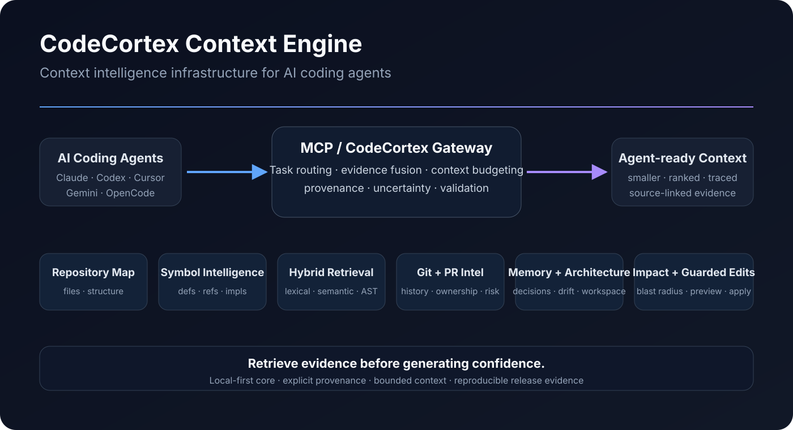

# CodeCortex Context Engine

**Open-source context intelligence infrastructure for AI coding agents.**

CodeCortex turns a software repository into a query-specific evidence system. It combines repository structure, symbols and references, dependencies, Git/PR intelligence, impact analysis, architecture, memory, structural search, and context budgeting behind one agent-facing surface.

> **Retrieve evidence before generating confidence.**



## Start in one minute

```bash
python -m pip install --upgrade codecortex-context-engine
cortex init .
cortex index
cortex doctor
```

Then inspect the repository:

```bash
cortex architecture
cortex semantic "authentication and session lifecycle"
cortex impact AuthService
```

Or expose it over MCP:

```bash
cortex mcp --path .
```

See the full [Getting Started guide](GETTING_STARTED.md) for supported coding-agent configuration and the deterministic demo.

## What it provides

- Repository maps, multi-language symbols, dependencies, and call relationships
- Precision definition/reference/implementation evidence when an index is available
- Hybrid lexical, semantic, structural, graph, Git, and memory retrieval
- Context ranking, deduplication, slicing, budgeting, and provenance
- Git, PR, impact, ownership, architecture, and drift intelligence
- Project/team memory and multi-repository workspace search
- MCP integration and merge-safe configuration for supported coding agents
- Guarded semantic editing and structural rewrite preview/apply flows
- Remote/distributed operation, platform API, SDKs, and observability
- Reproducible quality, security, benchmark, SBOM, signing, and release evidence

## Navigate the docs

- [Getting Started](GETTING_STARTED.md)
- [Architecture](ARCHITECTURE.md)
- [Integrations](INTEGRATIONS.md)
- [Evidence Fusion](EVIDENCE_FUSION.md)
- [Advanced Intelligence](ADVANCED_INTELLIGENCE.md)
- [Distributed operation](DISTRIBUTED.md)
- [Platform](platform/README.md)
- [Quality](QUALITY.md)
- [Testing](TESTING.md)
- [Licensing](LICENSING.md)
- [Release](RELEASE.md)

The GitHub repository remains the source of truth for code, issues, security policy, releases, and contribution workflow.
